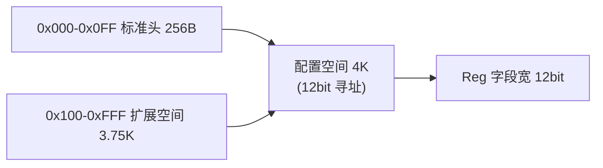
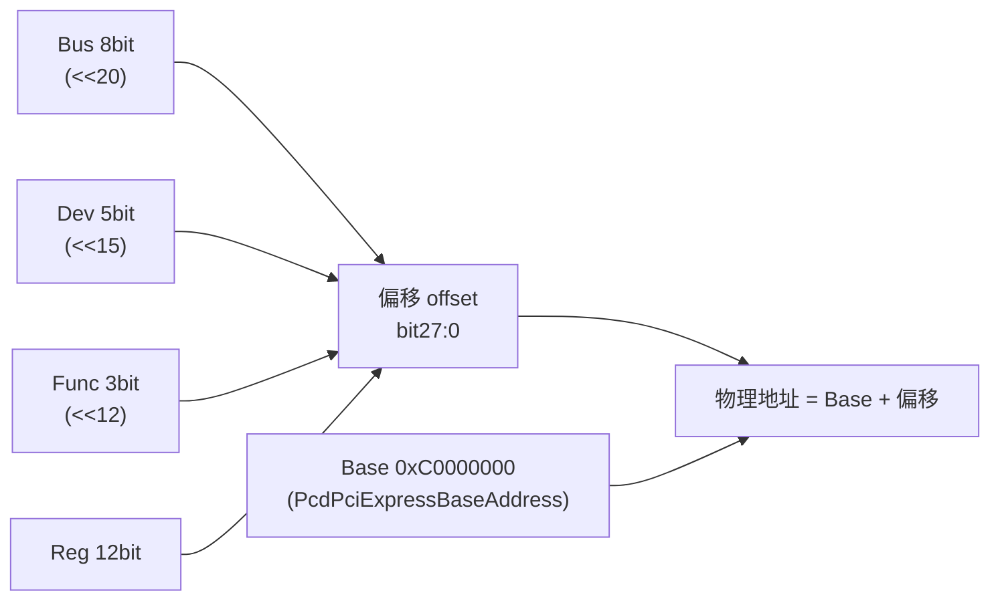

---
### ECAM 定义

**ECAM = Enhanced Configuration Access Mechanism（增强配置访问机制）**，PCIe 规范定义的配置空间访问方式。要理解它必须对照传统 PCI 的机制：

**PCI（并行总线）时代——IO 端口方式：**

- 配置空间只有 256B，通过两个 IO 端口访问（Configuration Mechanism #1）：
  - 向 `0xCF8` 写地址寄存器：编码总线号/设备号/功能号/寄存器偏移
  - 从 `0xCFC` 读写数据寄存器
- 读一个寄存器要两步 IO 操作，256B 之外无扩展空间

**PCIe（串行点对点）时代，两个变化：**

1. **配置空间扩大到 4K**：0x000-0x0FF 保留兼容 PCI 的 256B 标准头，0x100-0xFFF 新增扩展配置空间（AER、SR-IOV、LTR 等都在这里）
2. **拓扑变了**：PCIe 是点对点链路 + Root Complex 内部路由，继续用 IO 端口逐寄存器访问低效且繁琐

**ECAM 的做法**：把"总线:设备:功能:寄存器"这个三维空间整体线性映射到一段系统内存——配置空间变成内存映射 IO（MMIO），读配置寄存器就是普通 load 指令，一条指令完成。

**MCFG 表**负责告诉固件和 OS 映射在哪：基址、起始总线号、总线数。注意本工程基址源头是 PCD（`PcdPciExpressBaseAddress = 0xC0000000`），MCFG 表反而是 AMI 代码从 PCD 生成并安装的。

### 为什么每设备 4K → Reg 占 12 bit

PCIe 规范规定每设备配置空间 = 4KB（0x000-0xFFF），所以寄存器偏移要 **12 位**寻址，这是 `Func<<12` 里 12 的来源——每个功能号左移 12 位 = 每功能独占 4K。



### 公式推导：三维数组线性化

把整个配置空间看成 C 数组 `cfg[Bus][Dev][Func][Reg]`，按行优先连续存放，偏移就是标准数组寻址：

```
offset = ((Bus × 32 + Dev) × 8 + Func) × 0x1000 + Reg
```

- `× 32`：每总线最多 32 个设备（Dev 5 bit）
- `× 8`：每设备最多 8 个功能（Func 3 bit）
- `× 0x1000`：每功能 4K

前半部分把 Bus/Dev/Func 编码成一个整数，`× 0x1000`（4K）后得到该设备配置空间的起始地址。它的粒度是"4K 块"，只能访问到设备，访问不了设备里指定的寄存器

设备配置空间里有 4096 个字节（0x000~0xFFF），每个寄存器占其中一段——读 VID:DID 要 Reg=0x00，读能力指针要 Reg=0x34，读 LinkCap 要 Reg=0x0C。不加 Reg只能访问到块起点 0x00 一个字节，其余 4095 个字节都无法访问

VID:DID 位于配置空间偏移 0x00 的 32 位字段：低 16 位是 **VID（Vendor ID，厂商 ID）**，高 16 位是 **DID（Device ID，设备 ID）**。

32、8、4096 全是 2 的幂，乘法即左移：

```
offset = (Bus×256 + Dev×8 + Func) × 4096
       = Bus×256×4096 + Dev×8×4096 + Func×4096
       = Bus<<20  |  Dev<<15  |  Func<<12
```



| 字段 | 位数 | 左移 | 地址位 | 对应容量 |
|---|---|---|---|---|
| Reg | 12 bit | — | bit11:0 | 4K（1 个功能） |
| Func | 3 bit | 12 | bit14:12 | 32K（1 个设备） |
| Dev | 5 bit | 15 | bit19:15 | 1MB（1 条总线） |
| Bus | 8 bit | 20 | bit27:20 | 256MB（1 个段） |


PCI 规范规定了一套**枚举（Enumeration）流程**，由固件在启动时执行：

1. 从 bus 0（Root 总线，Host Bridge 所在）开始扫描
2. 依次探测每个 Dev/Func 位置：读配置空间 0x00，VID ≠ 0xFFFF 说明有设备
3. **发现 PCI-PCI Bridge（或 PCIe Root Port）就分配一个新的总线号**（递增），把 Secondary/Subordinate 写入桥的配置空间（0x18/0x19/0x1A）
4. 递归进新总线继续扫描，直到整棵树扫完


