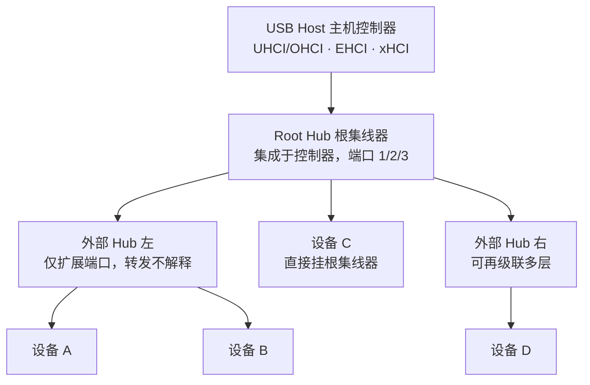
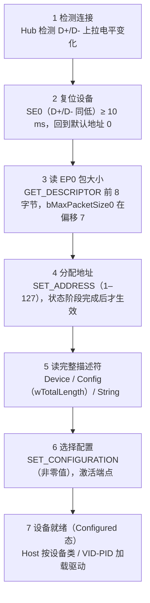
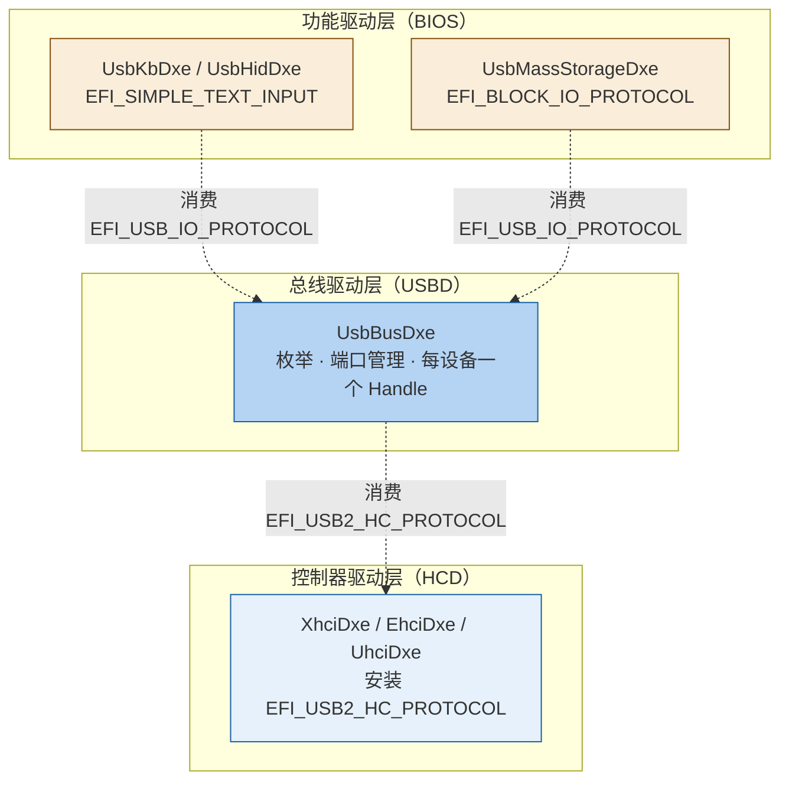
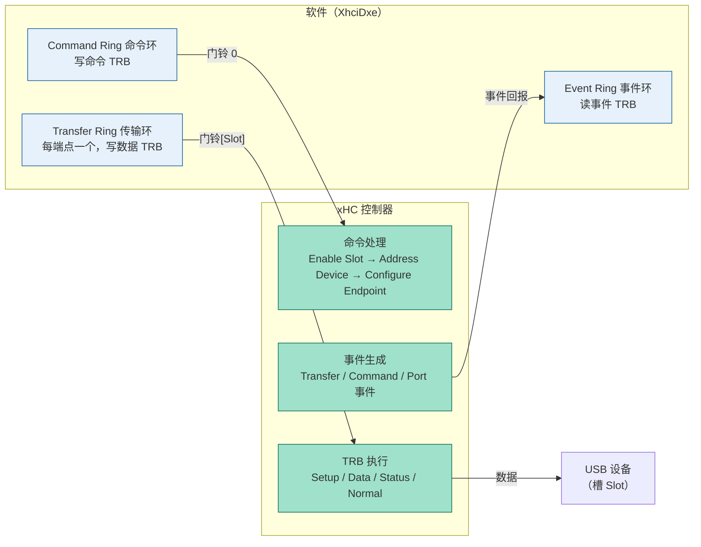
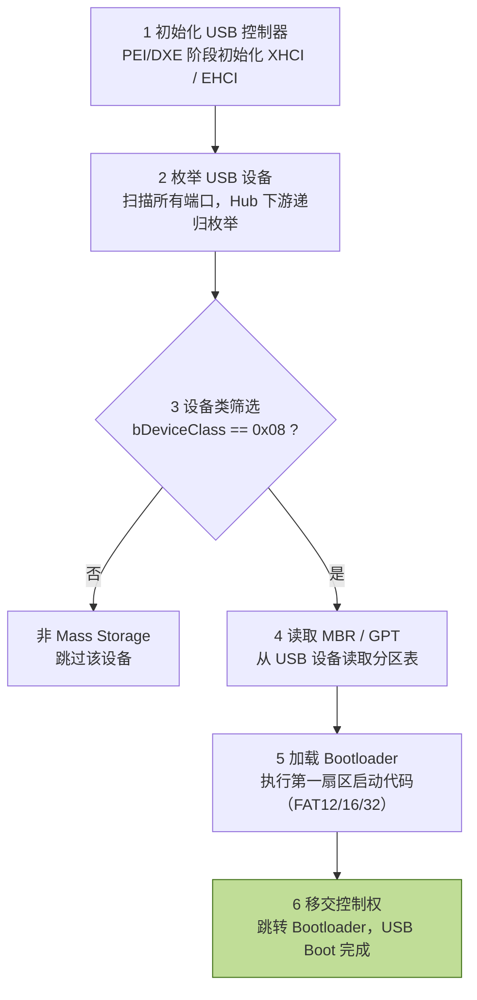

# USB 协议：从枚举流程到 EDK2 协议栈的固件视角

USB（Universal Serial Bus）是 PC 上最普遍的对外总线，BIOS 工程师接触它的场景集中在三处：Setup 界面里的键盘/鼠标（HID）、从 U 盘启动（Mass Storage）、以及调试用的串口/网卡。对做过 MCU 的人，USB 的 Host-Device 模型并不陌生——Host 永远主动发包，Device 被动应答，类似于 I2C 主机与从机的时序关系；只不过 USB 的"从机寻址"更复杂：设备枚举时先以默认地址 0 通信，再由 Host 分配 1–127 的新地址，本质上是把 I2C 静态硬件地址换成了软件分配。

---
## 一、USB 架构与版本演进：Host 主导的总线拓扑

USB 采用严格的星形拓扑：**一个 Host（主机控制器）**、**若干层 Hub**、**叶子节点上的设备**。总线上的所有通信都由 Host 发起，设备之间不能直接通信；Hub 只负责端口扩展与转发，不解释协议内容。



主机控制器经历了 UHCI/OHCI（USB 1.x）→ EHCI（USB 2.0）→ xHCI（USB 3.x，统一管理）的演进。xHCI 是当前平台的标准控制器，向下兼容 USB 2.0/1.x 设备。

| 规范版本       | 原始命名                   | 现行官方命名                 | 速率                 | 编码        | 备注                     |
| ---------- | ---------------------- | ---------------------- | ------------------ | --------- | ---------------------- |
| USB 1.1    | Full Speed / Low Speed | USB 2.0 Full/Low Speed | 12 Mbps / 1.5 Mbps | NRZI      | 低速设备 D- 上拉             |
| USB 2.0    | Hi-Speed               | USB 2.0 Hi-Speed       | 480 Mbps           | NRZI      | 高速设备需 Chirp 握手         |
| USB 3.0    | SuperSpeed             | USB 3.2 Gen 1×1        | 5 Gbps             | 8b/10b    | 2013 年改名 USB 3.1 Gen 1 |
| USB 3.1    | SuperSpeed+            | USB 3.2 Gen 2×1        | 10 Gbps            | 128b/130b | 2017 年并入 USB 3.2       |
| USB 3.2 新增 | —                      | USB 3.2 Gen 1×2        | 10 Gbps（2×5）       | 8b/10b    | 双通道，仅 Type-C           |
| USB 3.2 新增 | —                      | USB 3.2 Gen 2×2        | 20 Gbps（2×10）      | 128b/130b | 双通道，仅 Type-C           |

> [!warning]
> USB-IF 的改名史是调试时的常见坑：USB 3.0、USB 3.1 Gen 1、USB 3.2 Gen 1×1 是同一个东西（5 Gbps）；USB 3.1 Gen 2 与 USB 3.2 Gen 2×1 是同一个东西（10 Gbps）。Gen a×b 中 a 是代次（决定速率与编码），b 是通道数；只有 ×2 的型号必须用 Type-C 口（24 pin 全功能线），Type-A 物理上只有一对差分线，永远达不到 20 Gbps。判断设备真实能力要看描述符里的 **bcdUSB** 字段，不是看端口颜色。

设备描述符中的 bcdUSB 字段编码：USB 2.0 = 0x0200，USB 3.0 = 0x0300，USB 3.1 = 0x0310，USB 3.2 = 0x0320。BIOS 判断设备"是不是 3.0"读的就是这个字段。

## 二、端点、管道与四种传输类型

**Endpoint（端点）**是设备内部的数据缓冲区，每个设备最多 32 个（0–15，每个方向各一）。端点 0（EP0）是保留的控制端点，枚举阶段的所有通信都走它，无需配置即可用。**Pipe（管道）**是 Host 与端点之间的逻辑连接，方向固定。

| 传输类型 | 可靠性 | 带宽 | BIOS 关注 | 典型设备 |
| --- | --- | --- | --- | --- |
| Control（控制） | 必须送达 | 低 | ✅ 枚举必须 | 所有设备（EP0） |
| Bulk（批量） | 必须送达 | 高 | ✅ USB Boot | U 盘、硬盘 |
| Interrupt（中断） | 必须送达 | 中低 | ✅ HID | 鼠标、键盘 |
| Isochronous（等时） | 可丢包 | 高 | ❌ | 音频、视频 |

USB 没有"发送一串字节"这种裸操作，**每一次通信都是完整的事务（Transaction）**，控制传输由三个阶段组成：

1. **Setup 阶段**：Host 发 SETUP 令牌包 + 8 字节请求（bmRequestType/bRequest/wValue/wIndex/wLength）；
2. **Data 阶段（可选）**：按方向传数据，数据包用 DATA0/DATA1 交替，帮助双方校验同步；
3. **Status 阶段**：反向回一个零长度包 + 握手，确认整笔事务成功。

> [!note]
> 帧与微帧：USB 1.x/2.0 总线按 1 ms 帧（Frame）划分时间，高速模式细分 8 个 125 µs 微帧（Microframe）。等时与中断传输按帧预留带宽（保留比例上限 90%），所以 EP 描述符里的 bInterval（轮询间隔）直接决定 Host 调度开销——BIOS 阶段键盘轮询频率过高会拖慢枚举。

## 三、描述符体系：Device → Config → Interface → Endpoint

描述符是设备的"自我介绍"，按层次组织，Host 通过控制传输逐个读取：

| 层级 | 描述符 | 关键字段 | 作用 |
| --- | --- | --- | --- |
| 1 | Device（设备） | idVendor/idProduct、bDeviceClass、bMaxPacketSize0、bcdUSB、bNumConfigurations | 设备整体信息，18 字节 |
| 2 | Configuration（配置） | bNumInterfaces、bMaxPower、wTotalLength | 一个设备可多个配置，含全部子描述符总长 |
| 3 | Interface（接口） | bInterfaceClass/SubClass/Protocol、bNumEndpoints | 功能划分，如键盘是 HID 接口 |
| 4 | Endpoint（端点） | bEndpointAddress、bmAttributes（传输类型）、wMaxPacketSize、bInterval | 数据通道参数 |

关键字段的调试含义：

- **idVendor (VID)**：USB-IF 分配给厂商的 ID，如 0x8087 = Intel，0x046D = Logitech；
- **idProduct (PID)**：厂商自定义的产品 ID；
- **bDeviceClass**：设备类。0x03 = HID，0x08 = Mass Storage，0x09 = Hub，0xFF = 厂商自定义；**0x00 表示类信息在接口描述符里定义**（复合设备），PPT 将其解释为"复合设备"即此意；
- **bMaxPacketSize0**：EP0 最大包大小，只能是 8/16/32/64（USB 3.x 固定 64），直接影响枚举效率；
- **wTotalLength**：配置描述符 + 它下面所有接口、端点、厂商描述符的总长度，Host 按它一次读全。

USB 3.0 新增两类描述符：**BOS（Binary Device Object Store）**描述符（声明设备能力，如 SuperSpeed 能力、LPM、Bulk Streams）和 **SuperSpeed 端点伴侣描述符**（定义 bMaxBurst 突发数、wBytesPerInterval，供 SS 端点高速传输优化使用）。

## 四、设备枚举：7 步流程与底层机制

枚举是 Host 把"刚插入的未知设备"变成"可用的配置设备"的过程。PPT 的 7 步概括正确，这里补足每一步的底层机制。

| 步骤 | 动作 | 底层机制 |
| --- | --- | --- |
| 1 | 检测连接 | Hub 检测端口 D+/D- 上拉电平变化，产生中断/状态位 |
| 2 | 复位设备 | 发送 SE0（D+、D- 同低）≥ 10 ms，设备回到默认地址 0 |
| 3 | 读 EP0 包大小 | GET_DESCRIPTOR（Device）只取前 8 字节，bMaxPacketSize0 在偏移 7 |
| 4 | 分配地址 | SET_ADDRESS（1–127），状态阶段完成后新地址才生效 |
| 5 | 读完整描述符 | GET_DESCRIPTOR 取 Device/Config/String（含 wTotalLength） |
| 6 | 选择配置 | SET_CONFIGURATION（非零值），激活端点，进入 Configured 态 |
| 7 | 设备就绪 | Host 按设备类/VID-PID 加载驱动 |



**速度检测（步骤 1–2 之间）**：USB 1.x/2.0 用 D+/D- 的静态上拉电阻标识速度——低速设备在 D- 上拉 1.5 kΩ，全速/高速设备在 D+ 上拉。全速设备插入后 Host 先复位，若设备是高速（Hi-Speed）则通过 Chirp K-J 握手告知 Host，随后总线切换为高速模式。**USB 3.0 的 SS 端口不靠 D+/D-，而是靠 SuperSpeed 链路的电气训练（LFPS 握手）进入 U0 状态**，因此 USB 3.0 与 USB 2.0 的"连接检测"路径是独立的。

**为什么先读 8 字节（步骤 3）**：此时 Host 还不知道 EP0 最大包长，若按 64 字节请求而设备只支持 8 字节，设备按规范必须回短包，Host 反而拿不全。bMaxPacketSize0 恰好位于设备描述符偏移 7，所以 Host 只请求前 8 字节，读出包长后，后续所有 EP0 事务都按此包长进行。若设备此字段填错（如高速设备填 16），后续通信会静默失败——这是固件开发中最隐蔽的枚举失败原因。

> [!note]
> SET_ADDRESS 的生效时机：设备收到 SET_ADDRESS 后，**先完成本笔控制传输的 Status 阶段，再切换内部地址寄存器**。Host 侧同样要等 Status 完成确认后才用新地址通信，双方以事务为界同步。整个枚举过程中，同一时刻总线上只能有一个设备使用默认地址 0，所以 Hub 端口逐个枚举、依次分配地址。

**设备状态机**：USB 规范定义 6 种设备状态——Attached（连接）→ Powered（上电）→ Default（复位完成，地址 0）→ Address（已分配地址）→ Configured（已选择配置）→ Suspend（挂起）。枚举过程就是驱动设备沿 Powered → Default → Address → Configured 前进；3 ms 总线上无活动则自动挂起。

**USB 3.0 枚举的差异**：SuperSpeed 链路训练完成后，**控制传输（描述符读取、地址分配、配置）仍走 USB 2.0 通路**，SS 通路只承担高速数据；地址分配完成后两条通路同步切换使用新地址。这也是调试时"USB 3.0 设备在 BIOS 里被识别成 USB 2.0"现象的一个来源——枚举本身就在 2.0 通路上完成。

## 五、设备类与 BIOS 的支持范围

| Class Code | 名称 | 中文名 | BIOS 关注 |
| --- | --- | --- | --- |
| 0x00 | Interface-defined | 复合设备（类在接口描述符） | 按接口逐个判断 |
| 0x03 | HID | 人机接口 | ✅ Setup 输入必须 |
| 0x08 | Mass Storage | 存储设备 | ✅ USB Boot 必须 |
| 0x09 | Hub | 集线器 | ✅ 端口扩展必须 |
| 0x0E | Video | 视频设备 | ❌ OS 处理 |
| 0xE0 | Wireless | 无线设备 | ❌ OS 处理 |
| 0xFF | Vendor Specific | 厂商自定义 | ⚠️ 需专用驱动 |

BIOS 只需要支持三类设备：**HID**（Setup 键盘/鼠标，走 Boot Protocol 时不需要 OS 驱动也能用）、**Mass Storage**（U 盘启动，BOT 批量传输 + SCSI 命令集）、**Hub**（端口递归枚举）。U 盘内部实际上是一个"Mass Storage 类 + Bulk-Only Transport 协议 + SCSI 子集命令"的复合体，BIOS 侧只需实现对 Block 的读写，由 FAT 驱动解析文件系统。

## 六、UEFI USB 协议栈：三层结构与驱动模型

UEFI 的 USB 栈分三层，与 Linux USB 栈的结构一一对应：

| 层次 | 角色 | UEFI 接口 | 标准 EDK2 模块 | 类比 Linux |
| --- | --- | --- | --- | --- |
| 控制器驱动（HCD） | 直接操作主机控制器寄存器 | `EFI_USB2_HC_PROTOCOL` | `MdeModulePkg/Bus/Pci/XhciDxe/` | ehci-hcd/xhci-hcd |
| 总线驱动（USBD） | 枚举设备、管理端口，为每台设备创建子 Handle | `EFI_USB_IO_PROTOCOL` + 设备路径 | `MdeModulePkg/Bus/Usb/UsbBusDxe/` | usbcore |
| 功能驱动 | 消费 USB IO 协议，提供高层接口 | `EFI_BLOCK_IO` / `EFI_SIMPLE_TEXT_INPUT` | `UsbMassStorageDxe/`、`UsbKbDxe/` | usb-storage / usbhid |

驱动绑定关系：XhciDxe 是 PCI 驱动（`EFI_DRIVER_BINDING_PROTOCOL` 绑定 Class 0x0C0330 的 PCI 设备），Start() 时初始化控制器并安装 `EFI_USB2_HC_PROTOCOL`；UsbBusDxe 同样是驱动，绑定"已安装 USB2 HC 协议"的 Handle，在其上枚举设备：`UsbRootHubInit → UsbEnumerateNewDev → UsbSelectConfig → UsbCreateInterface`，每识别出一台设备就安装 `EFI_USB_IO_PROTOCOL` 和 USB 设备路径；UsbKbDxe/UsbMassStorageDxe 再绑定这些设备 Handle。



```c
// MdeModulePkg/Bus/Usb/UsbBusDxe/UsbEnumer.c —— 标准 EDK2 枚举主流程（PPT 引用）
EFI_STATUS
UsbEnumerateDevice (IN USB_DEVICE *Dev)
{
  // Step 1: 读设备描述符前 8 字节（含 bMaxPacketSize0）
  UsbGetDeviceDescriptor (Dev, &PartialDesc);
  // Step 2: 分配地址
  UsbSetAddress (Dev, NewAddress);
  // Step 3: 读完整描述符 + 配置描述符
  UsbGetDeviceDescriptor (Dev, &FullDesc);
  UsbGetConfigDescriptor (Dev, &ConfigDesc);
  // Step 4: 选择配置
  UsbSetConfig (Dev, ConfigDesc.ConfigurationValue);
  return EFI_SUCCESS;
}
```

EDK2 中控制传输的构造（PPT 提到的 `UsbCtrlTransfer` 最终落到 `Dev->UsbIo->UsbControlTransfer`），在 XHCI 驱动层变成 8 字节 Setup TRB：

```c
// MdeModulePkg/Bus/Pci/XhciDxe/XhciSched.c —— XhcCreateTransferTrb 中控制传输分支
TrbStart->TrbCtrSetup.bmRequestType = Urb->Request->RequestType;
TrbStart->TrbCtrSetup.bRequest     = Urb->Request->Request;
TrbStart->TrbCtrSetup.wValue       = Urb->Request->Value;
TrbStart->TrbCtrSetup.wIndex       = Urb->Request->Index;
TrbStart->TrbCtrSetup.wLength      = Urb->Request->Length;
TrbStart->TrbCtrSetup.Lenth        = 8;          // Setup 阶段固定 8 字节
TrbStart->TrbCtrSetup.IOC          = 1;          // 完成时中断
TrbStart->TrbCtrSetup.IDT          = 1;          // 数据内联在 TRB 中
TrbStart->TrbCtrSetup.Type         = TRB_TYPE_SETUP_STAGE;
```

EDK2 各层协议的接口定义位置：`MdePkg/Include/Protocol/Usb2Hc.h`（HC 协议）、`MdePkg/Include/Protocol/UsbIo.h`（USB IO 协议）、`MdePkg/Include/Protocol/UsbHostController.h`（旧 UsbHc 协议）、`MdePkg/Include/IndustryStandard/Usb.h`（描述符与请求结构体）。

## 七、XHCI：寄存器模型与 TRB 机制

xHCI 在 PCI 配置空间中的位置：**Class 0x0C（串行总线）、Subclass 0x03（USB）、Interface 0x30（xHCI）**，BAR0+BAR1 组成 64 位 MMIO 基址（AlderLake 平台通常映射在 0xFE... 高位）。MMIO 空间分四个区：**能力寄存器（Capability）→ 操作寄存器（Operational）→ 端口寄存器（Port）→ 运行时寄存器（Runtime）→ 门铃寄存器（Doorbell）**，各区偏移由 CAPLENGTH/DBOFF/RTSOFF 字段给出。

|     | 寄存器                                                        | 作用                                  |
| --- | ---------------------------------------------------------- | ----------------------------------- |
| 能力  | CAPLENGTH、HCSPARAMS1/2、HCCPARAMS1                          | 结构参数：端口数、槽位数、64 位寻址能力、Event Ring 支持 |
| 操作  | USBCMD（R/S 启动位、RESET）、CRCR（命令环控制）、DCBAAP（设备上下文数组指针）、CONFIG | 控制器全局状态与命令环                         |
| 端口  | PORTSC（连接/复位/速度/Link 状态）                                   | 每个 Root Hub 端口一组（Offset 0x400 起）    |
| 运行时 | MFINDEX、IMAN/IMOD、ERSTBA/ERSTSZ/ERDP                       | 微帧时钟与事件环（中断源）                       |
| 门铃  | Doorbell[slot]                                             | 软件写一次 = 通知控制器"该槽有活要干"               |

xHCI 用**槽（Slot）**管理设备：每台连接上的设备占一个槽，槽内是 Device Context（设备上下文，含 Slot Context 与最多 31 个 Endpoint Context）。**DCBAA（Device Context Base Address Array）**是槽号 → 设备上下文地址的查找表，基址写入 DCBAAP 寄存器；其中 **Slot 0 保留给 Scratchpad Buffer**（控制器内部状态用，数量由 HCSPARAMS1 给出）。

**TRB（Transfer Request Block）**是 xHCI 与内存通信的最小单元，固定 16 字节，靠 **Cycle bit** 区分环上新旧条目（生产者翻转 Cycle bit，消费者按 Cycle 位判断有效性）。三类环：

- **Command Ring（命令环）**：软件提交控制器命令。设备枚举的关键命令序列是 `Enable Slot → Address Device → Configure Endpoint`——分别完成槽分配、地址分配（内部执行 SET_ADDRESS 语义）、端点上下文配置；
- **Transfer Ring（传输环）**：每个端点一个，提交数据传输。TRB 类型：Setup/Data/Status（控制传输三阶段）、Normal（普通数据）、Isoch（等时）、Link（环段链接）；
- **Event Ring（事件环）**：控制器回报事件。Transfer Event（传输完成/错误）、Command Completion Event（命令完成）、Port Status Change Event（设备插拔）——枚举的起点正是这个端口状态事件。

软件侧流程：**使能控制器（USBCMD.R/S=1）→ 初始化 DCBAA 与三个环 → 收到 Port Status Change 事件 → 发 Enable Slot 命令 → 发 Address Device 命令 → 控制传输读描述符 → 发 Configure Endpoint 命令 → 往对应端点的传输环挂 TRB → 敲该端点的门铃 → 等 Transfer Event**。PPT 把门铃类比成"敲门铃通知控制器有新任务"，对应关系是：TRB 是任务描述，门铃是任务就绪信号。



> [!note]
> 标准 EDK2 的 XhciDxe 模块文件分工：`Xhci.c`（入口与 HC 协议实现）、`XhciReg.c`（寄存器读写）、`XhciSched.c`（URB/TRB/环管理，核心调度）、`UsbHcMem.c`（DMA 内存管理）。URB 结构体（XhcCreateUrb）把一次传输的端点、方向、数据、回调封装成统一对象，与 Linux 的 urb 概念一致。

## 八、USB Boot 与 PEI 阶段的特殊性

USB Boot 的完整链路：**初始化控制器 → 枚举设备 → 筛选 Mass Storage（bDeviceClass == 0x08）→ 读 MBR/GPT → 加载 Bootloader → 跳转**。工程上注意三点：Hub 下的设备必须**递归枚举**；U 盘要求 FAT12/16/32 文件系统；NTFS 需要额外驱动。



> [!warning]
> PPT 称"支持 FAT32/exFAT"，这一点在标准 EDK2 中不成立：EDK2 的 `FatPkg`（FatPei/FatDxe）只支持 **FAT12/16/32**，exFAT 需要额外的 ExFat 驱动（如本工程的 `AmiModulePkg/Recovery/FsRecovery/ExFatRecovery`）。FAT32 是 BIOS 阶段最稳妥的启动盘格式。

**PEI 阶段没有中断**（也没有完整的 DMA 映射与内存保护体系），USB 栈的形态与 DXE 完全不同：

| 阶段 | 控制器初始化 | 枚举/传输 | 存储接口 | 生产者 |
| --- | --- | --- | --- | --- |
| PEI | PPI 提供者初始化 XHCI/EHCI | 纯轮询（Polling），无事件环中断 | `EFI_BLOCK_IO_PPI` | XhciPei / UsbPeim、UsbBotPeim |
| DXE | XhciDxe 安装 `EFI_USB2_HC_PROTOCOL` | 中断驱动（MSI/MSI-X） | `EFI_BLOCK_IO_PROTOCOL` | UsbBusDxe、UsbMassStorageDxe |

PEI 侧关键 PPI：`EFI_PEI_USB2_HOST_CONTROLLER_PPI`（XhciPei 生产，等价 DXE 的 USB2 HC 协议）、`EFI_USB_BOT_PPI`（UsbBotPeim 生产，实现 Bulk-Only Transport 的 CBI/BBB 命令）、`EFI_BLOCK_IO_PPI`（向文件系统 PPI 提供块设备）。PEI 阶段只需要"把启动镜像读进内存"，所以只实现 Mass Storage，不实现键盘。

> [!note]
> BOT（Bulk-Only Transport）是 Mass Storage 的主流传输协议：控制管道发 CBW（Command Block Wrapper，31 字节命令块），Bulk 管道传数据，CSW（Command Status Wrapper）回报状态，内部命令是 SCSI 子集（READ(10)/INQUIRY/CAPACITY 等）。U 盘在 BIOS 里就是"SCSI 磁盘 + BOT 传输 + FAT 文件系统"三层拼出来的。本工程 `EfiUsbMass.c` 里 `Desc.InterfaceProtocol == PROTOCOL_BOT` 的判据正是 UEFI 规范里 BOT 的接口协议号 0x50。

## 九、本工程（AlderLake）对照：AMI 自研 USB 栈

与 PCIe 笔记中的发现一致，本工程（`C:\TEST\ib.iw68.xa03`）**移除了 MdeModulePkg 的标准 USB 栈**：`MdeModulePkg/Bus/Usb/` 目录整体不存在（标准 UsbBusDxe/UsbKbDxe/UsbMassStorageDxe），`MdeModulePkg/Bus/Pci/` 下也只剩 `UfsPciHcDxe`（XhciDxe/EhciDxe/UhciDxe 均不在）。

USB 功能由 AMI 自研的 `AmiModulePkg/Usb/` 提供：

| 文件/目录 | 角色 |
| --- | --- |
| `Rt/Xhci.c`、`Rt/Xhci.h` | AMI 版 XHCI 控制器驱动。采用 **HC_STRUC（Host Controller 结构）抽象**，导出 `Xhci_Start/Xhci_Stop/Xhci_EnumeratePorts/Xhci_ProcessInterrupt/Xhci_GetRootHubStatus` 等函数——与 EDK2 标准 XhciDxe 面向 `EFI_USB2_HC_PROTOCOL` 的实现风格完全不同 |
| `Pei/` | PEI 阶段栈：`PeiEhci.c`（默认）、`PeiXhci.c`、`PeiOhci.c`、`BotPeim.c`、`HubPeim.c`、`PeiAtapi.c` |
| `UsbBus.c`、`UsbPort.c`/`UsbPort2.c` | 总线管理与端口控制（对应标准 UsbBusDxe） |
| `EfiUsbKb.c`、`EfiUsbHid.c`、`EfiUsbPoint.c` | 键盘/HID/鼠标功能驱动（对应 UsbKbDxe） |
| `EfiUsbMass.c`、`EfiUsbMs.c` | Mass Storage 驱动，安装 `EFI_BLOCK_IO_PROTOCOL`，按 `PROTOCOL_BOT` 判据绑定（对应 UsbMassStorageDxe + UsbMassBot.c） |
| `Uhcd.c` | UHCI 控制器驱动（USB 1.1 兼容，对应 UhciDxe） |
| `AmiUsbLib/DxeAmiUsbHcdLib/DxeXhci.c` | DXE 阶段 HCD 访问库 |
| `AmiUsbLib/SmmAmiUsbHcdLib/SmmXhci.c` | **SMM 阶段 XHCI 访问**——S3 恢复（Resume from S3）时需要用它操作 USB 设备恢复现场 |

`Usb.sdl` 中与 XHCI 相关的 Token 值得注意：

- **XHCI_SUPPORT**：xHCI 控制器总开关；
- **XHCI_EVENT_SERVICE_MODE**：XHCI 事件服务模式——0 = 周期定时器 SMI，1 = xHCI 硬件 SMI，2 = 两者同时。BIOS 阶段 XHCI 的中断/事件处理经 SMI（System Management Interrupt）路由，由 SMM 代码处理传输完成事件，这是 AMI 栈与"DXE 轮询/普通中断"路线的关键差异；
- **DEFAULT_XHCI_HANDOFF_OPTION**：XHCI Hand-off（BIOS 移交给 OS 前，是否将控制器置于 OS 可接管状态）默认选项；
- `AmiPcdUsbPeiXhciSupport` 默认 **FALSE**：PEI 阶段默认走 **EHCI**（USB 2.0）而非 XHCI，与 `Pei/` 下 `PeiEhci.c` 为主、`PeiXhci.c` 为辅的代码布局一致——这解释了为什么 BIOS 早期 USB 识别比 OS 慢、以及部分 USB 3.0 设备在 BIOS 里按 2.0 工作。

## 十、调试方法与常见问题

BIOS 阶段的 USB 调试手段按信息量排序：

1. **串口 DEBUG 日志**：USB 控制器初始化、枚举每一步（UsbGetDeviceDescriptor/UsbSetAddress 的返回值）、超时错误。PPT 建议"枚举卡在哪步看对应 Control Transfer 失败原因"，具体到代码就是 `UsbEnumerateDevice` 内各调用的返回值；
2. **UEFI Shell**：`devices` 查看设备 Handle 树（含 USB 设备路径）、`devtree` 看 Hub 层级、`dh` 查 Handle 上挂的协议、`map` 看块设备文件系统映射（对应 FAT 驱动是否挂载成功）；
3. **Linux 实测**：`lsusb`（VID/PID 列表）、`lsusb -t`（拓扑树，Hub 层级一目了然）、`lsusb -v -s <bus>:<dev>`（完整描述符）、`dmesg | grep usb`（内核枚举日志）、`usbmon`（总线抓包）；
4. **USB 分析仪**：协议级抓包，定位 Setup/Data/Status 各阶段超时或 NAK/STALL 握手，适合查电气与协议边界的疑难问题。


# **常见问题排查对照：**

| 现象 | 排查方向 |
| --- | --- |
| 设备无法识别 | VBUS 供电 → 控制器初始化 → Hub 端口使能，按这个顺序分层定位 |
| 传输速度慢 | 是否降级到 USB 2.0（PEI 默认 EHCI 即为诱因之一）→ 线缆质量 → SS 端口链路训练是否成功 |
| 枚举失败 | 串口 log 定位卡在 7 步中哪一步；重点关注 bMaxPacketSize0 与 SET_ADDRESS 是否完成 |
| USB 3.0 设备在 BIOS 看不到 | XHCI 未初始化 / 需要专用驱动的设备类（如 USB 网卡 0xE0）/ 设备类不被 BIOS 支持 |
| USB 2.0 设备插 3.0 口 | 自动降级走 USB 2.0 兼容路径（xHCI 统一管理，无需额外配置） |

## 术语表

| 术语 | 含义 |
| --- | --- |
| Host / Root Hub | 主机控制器及其内置根集线器，总线唯一主设备 |
| Endpoint | 设备端数据缓冲区，EP0 为控制端点 |
| Pipe | Host 与 Endpoint 的逻辑通道，类型决定传输方式 |
| SE0 | Single-Ended Zero，D+ 与 D- 同时为低，用于复位 |
| Chirp | 高速设备复位的 K-J 信号握手，协商 480 Mbps 模式 |
| bcdUSB | 设备描述的 USB 规范版本（0x0200/0x0300/0x0320） |
| BOS | Binary Device Object Store，USB 3.0 能力描述符容器 |
| BOT | Bulk-Only Transport，Mass Storage 主流传输协议 |
| CBW/CSW | BOT 的命令块封装/命令状态封装 |
| HCD / USBD | Host Controller Driver / USB Bus Driver 两层驱动 |
| URB | USB Request Block，一次传输请求的封装 |
| TRB | Transfer Request Block，xHCI 最小传输单元（16 字节） |
| DCBAA | Device Context Base Address Array，槽号→设备上下文查找表 |
| Doorbell | 门铃寄存器，写一次通知控制器有任务 |
| Slot | xHCI 管理设备的槽位，每设备一个 |
| PPI | PEI 阶段接口（PEIM-to-PEIM Interface），PEI 版"协议" |
| SMI | System Management Interrupt，BIOS 阶段事件处理通道 |
| Hand-off | BIOS 将控制器交接给 OS 的机制（XHCI 支持） |

