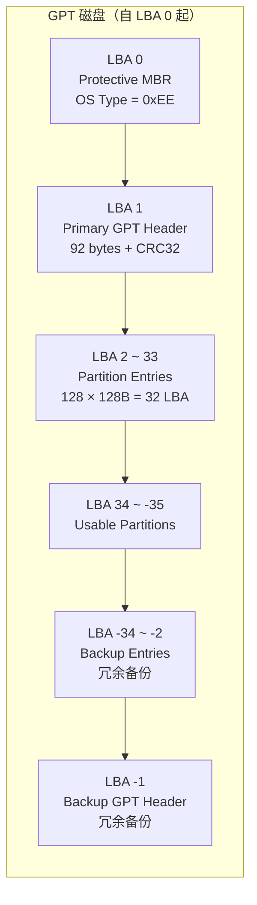
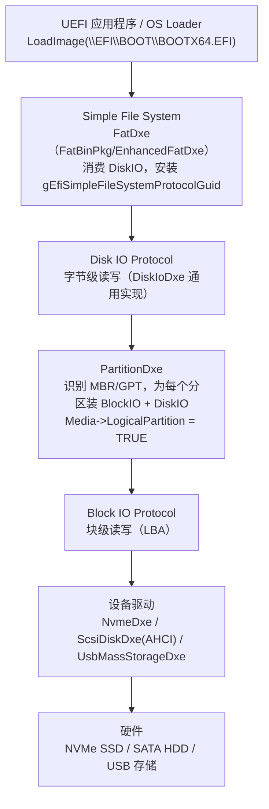
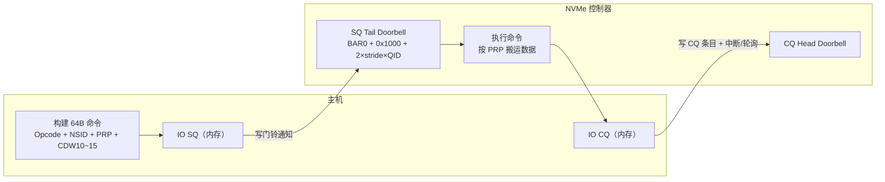
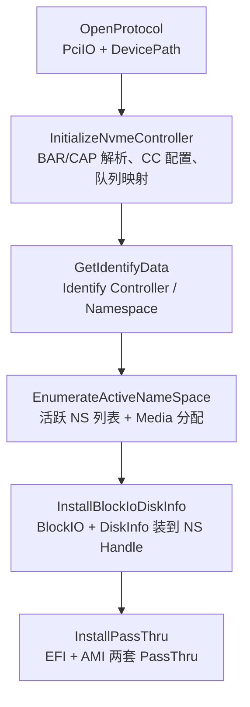
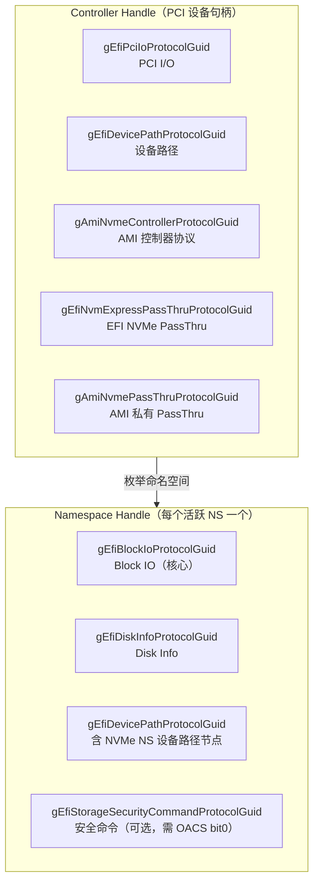
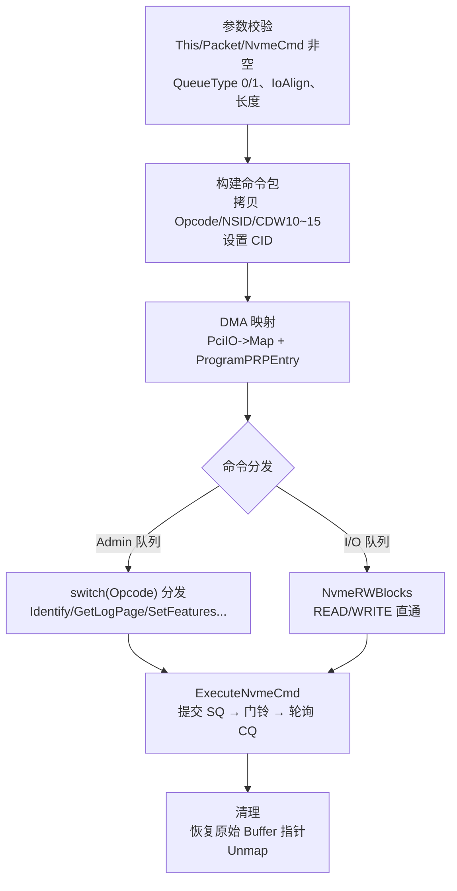

# Disk 存储协议：从 MBR/GPT 布局到 BlockIO 与 NVMe 的固件视角

磁盘是 BIOS 启动链的终点——OS Loader（bootmgfw.efi / BOOTX64.EFI）最终要从一块物理盘上被读出来执行。对做过 MCU 的人，磁盘的 LBA（Logical Block Address）寻址并不陌生：STM32 读 SD 卡时用的就是 LBA，主机只关心"第几个逻辑块"，不关心物理扇区在哪；UEFI 的存储协议栈把这一层抽象得更为彻底——BlockIO 管块、DiskIO 管字节、文件系统管文件，各层只消费自己下面的接口，互不越界。本课基于 `Disk.pptx`（28 页）整理，覆盖 MBR/GPT 布局、Block IO / Disk IO 协议、NVMe 驱动安装 BlockIO 的过程，以及 NVMe PassThru 透传机制。

---

## 一、磁盘布局：MBR 与 GPT（UEFI Spec 2.9 §5.3）

### 1.1 MBR：传统分区方案

MBR（Master Boot Record）位于 LBA 0，共 512 字节，由三部分组成：446 字节引导代码、64 字节分区表（4 × 16 字节）、2 字节签名 `0x55AA`（偏移 0x1FE）。

| 偏移 | 大小 | 字段 | 说明 |
| --- | --- | --- | --- |
| 0x00 | 1B | Boot Flag | 0x80 = 活动分区 |
| 0x01 | 3B | Start CHS | 起始柱面-磁头-扇区 |
| 0x04 | 1B | OS Type | 分区类型代码 |
| 0x05 | 3B | End CHS | 结束柱面-磁头-扇区 |
| 0x08 | 4B | Start LBA | 起始逻辑块地址 |
| 0x0C | 4B | Size | 分区大小（扇区数） |

常见 OS Type 代码：`0x07` = NTFS/exFAT，`0x0C` = FAT32 LBA，`0x0E` = FAT16 LBA，`0xEF` = EFI System Partition，`0x05`/`0x0F` = 扩展分区。

MBR 的局限是硬性的：分区表只有 4 个条目，想超过 4 个分区就要用扩展分区（EBR 链式记录）；`Start LBA` 只有 32 位，512B 扇区下最大寻址 2 TB；分区类型靠 1 字节代码标识，没有唯一性保证。Legacy BIOS 启动依赖 MBR（引导代码从活动分区加载 BootSector），这是它至今仍存在的原因。

### 1.2 GPT：UEFI 推荐方案

GPT（GUID Partition Table）用 128 字节的分区条目替代 16 字节的 MBR 条目，用 128-bit GUID 标识分区类型，主备双份 + CRC32 校验。布局如下：



> [!note]
> GPT 头部结构（92 字节）：`Signature`（固定 "EFI PART"，0x5452415020494645）、`Revision`（0x00010000）、`HeaderSize`（92）、`HeaderCRC32`、`Reserved`（4B，偏移 0x14，PPT 表格中未列出）、`MyLBA`、`AlternateLBA`（备份头位置）、`FirstUsableLBA`、`LastUsableLBA`、`DiskGUID`（16B）、`PartitionEntryLBA`、`NumberOfPartitionEntries`（128）、`SizeOfPartitionEntry`（128）、`PartitionEntryArrayCRC32`。

GPT 分区条目（128 字节）字段：`PartitionTypeGUID`（16B）、`UniquePartitionGUID`（16B）、`FirstLBA`（8B）、`LastLBA`（8B）、`Attributes`（8B）、`PartitionName`（72B，UTF-16LE，36 个字符）。`Attributes` 中固件关心的位：bit 0 RequiredToFunction、bit 1 NoBlockIOProtocol（固件不得为此分区安装 BlockIO）、bit 2 LegacyBIOSBootable、bit 60 ReadOnly、bit 62 Hidden、bit 63 NotAutomount。

常见分区类型 GUID：

| 分区类型 | GUID |
| --- | --- |
| EFI System Partition | `C12A7328-F81F-11D2-BA4B-00A0C93EC93B` |
| Microsoft Basic Data | `EBD0A0A2-B9E5-4433-87C0-68B6B72699C7` |
| Microsoft Reserved | `E3C9E316-0B5C-4DB8-817D-F92DF00215AE` |
| Linux filesystem | `0FC63DAF-8483-4772-8E79-3D69D8477DE4` |
| Linux swap | `0657FD6D-A4AB-43C4-84E5-0933C84B4F4F` |
| Apple APFS | `7C3457EF-0000-11AA-AA11-00306543ECAC` |
| Unused Entry | `00000000-0000-0000-0000-000000000000` |

### 1.3 Protective MBR 与固件的分区识别

UEFI 规范要求启动磁盘使用 GPT。GPT 磁盘的 LBA 0 仍保留一个 MBR 结构，但分区表只填一条记录，OS Type = `0xEE`，覆盖整块磁盘——这叫 Protective MBR，作用是让不认识 GPT 的旧工具（如老磁盘工具、Legacy BIOS）把整盘当作"已占用"，避免误格式化。

> [!tip]
> 固件判断磁盘用哪种分区方案，看两个签名：LBA 0 末尾是否 `0x55AA`（MBR），LBA 1 是否以 "EFI PART" 开头（GPT）。EDK2 的 `MdeModulePkg/Universal/Disk/PartitionDxe/Partition.c` 正是按这个顺序探测，先认 GPT 再退回 MBR。ESP（EFI System Partition，类型 GUID 为 C12A7328...）存放启动文件，Windows 的 `bootmgfw.efi`、Linux 的 `shimx64.efi` 都在其中，对应路径 `\EFI\BOOT\BOOTX64.EFI` 是 UEFI 的默认回退启动路径。

## 二、Block IO Protocol：块设备的统一抽象

### 2.1 协议定义

Block IO 把"整块设备"抽象成按 LBA 顺序寻址的介质，是存储驱动必须安装的核心协议（UEFI Spec 2.9，GUID `{0x964e5b21, 0x6459, 0x11d2, {0x8e, 0x39, 0x0, 0xa0, 0xc9, 0x69, 0x72, 0x3b}}`，定义于 EDK2 `MdePkg/Include/Protocol/BlockIo.h`）：

```c
struct _EFI_BLOCK_IO_PROTOCOL {
  UINT64              Revision;      // 协议版本，REVISION1/2/3
  EFI_BLOCK_IO_MEDIA  *Media;        // 介质属性（只读，由驱动内部维护）
  EFI_BLOCK_RESET     Reset;         // 重置设备
  EFI_BLOCK_READ      ReadBlocks;    // 读块
  EFI_BLOCK_WRITE     WriteBlocks;   // 写块
  EFI_BLOCK_FLUSH     FlushBlocks;   // 刷新写缓存
};
```

生产者包括硬盘/SSD（ScsiDiskDxe、NvmeDxe）、NVMe、DVD-ROM（CdDxe）、USB 存储（UsbMassStorageDxe）等所有块设备驱动；消费者是 PartitionDxe、FatDxe、Shell、Boot Manager。

### 2.2 EFI_BLOCK_IO_MEDIA：介质属性

| 字段 | 类型 | 说明 |
| --- | --- | --- |
| MediaId | UINT32 | 媒体 ID，媒体更换时变化（可移动媒体检测的依据） |
| RemovableMedia | BOOLEAN | TRUE = 可移动媒体 |
| MediaPresent | BOOLEAN | TRUE = 有媒体存在 |
| LogicalPartition | BOOLEAN | TRUE = LBA0 是分区首块（分区驱动装的 BlockIO 置 TRUE） |
| ReadOnly | BOOLEAN | TRUE = 只读媒体 |
| WriteCaching | BOOLEAN | TRUE = 支持写缓存 |
| BlockSize | UINT32 | 固有块大小（字节） |
| IoAlign | UINT32 | 缓冲区对齐要求（2 的幂，0/1 表示无要求） |
| LastBlock | EFI_LBA | 最后一个逻辑块地址（总块数 - 1） |
| LowestAlignedLba | EFI_LBA | 首个物理对齐 LBA（REVISION 2+） |
| LogicalBlocksPerPhysicalBlock | UINT32 | 每个物理块含逻辑块数（REVISION 2+，4K 盘为 8） |
| OptimalTransferLengthGranularity | UINT32 | 最优传输粒度（REVISION 3+） |

> [!warning]
> `Media` 指针由 BlockIO 协议持有，但字段只允许驱动内部更新。调用方读取 `MediaId` 后必须原样传回 `ReadBlocks`——如果媒体被更换（如 U 盘拔出换盘），驱动检测到 MediaId 不匹配会返回 `EFI_MEDIA_CHANGED`，上层据此重新枚举，而不是读到另一张盘的数据。

### 2.3 四个接口与返回值

| 接口 | 参数 | 说明 |
| --- | --- | --- |
| Reset | ExtendedVerification | 重置设备；TRUE 时执行扩展诊断 |
| ReadBlocks | MediaId, Lba, BufferSize, Buffer | 读块；BufferSize 必须是 BlockSize 整数倍 |
| WriteBlocks | MediaId, Lba, BufferSize, Buffer | 写块；同上 |
| FlushBlocks | — | 刷新写缓存到物理介质，仅 WriteCaching=TRUE 时有实际作用 |

返回值：`EFI_SUCCESS`（成功）、`EFI_DEVICE_ERROR`（设备错误）、`EFI_NO_MEDIA`（无媒体）、`EFI_MEDIA_CHANGED`（MediaId 不匹配）、`EFI_BAD_BUFFER_SIZE`（BufferSize 非 BlockSize 整数倍）、`EFI_INVALID_PARAMETER`（LBA 无效或缓冲区未对齐）、`EFI_WRITE_PROTECTED`（WriteBlocks 且设备只读）。

```c
// 读 LBA 0 一整块
Status = BlockIo->ReadBlocks (
             BlockIo,                    // This
             BlockIo->Media->MediaId,    // 原样回传的 MediaId
             0,                          // Lba
             BlockIo->Media->BlockSize,  // 512
             Buffer
             );
```

> [!note]
> BlockIO 2（`EFI_BLOCK_IO2_PROTOCOL`，UEFI 2.3+）提供异步版本：`ReadBlocksEx/WriteBlocksEx/FlushBlocksEx` 接受 `EFI_BLOCK_IO2_TOKEN`（含事件与完成状态），不阻塞调用者。EDK2 标准栈中只有支持非阻塞 I/O 的驱动才装 BlockIO2，NVMe 控制器天然支持异步队列，是最典型的 BlockIO2 生产者。

## 三、Disk IO Protocol：字节级访问层

`EFI_DISK_IO_PROTOCOL` 提供按字节偏移的读写，解决文件系统的需求：FAT 目录项、引导扇区都不是整块对齐的。定义于 `MdePkg/Include/Protocol/DiskIo.h`：

```c
struct _EFI_DISK_IO_PROTOCOL {
  UINT64         Revision;
  EFI_DISK_READ  ReadDisk;    // ReadDisk (This, MediaId, Offset, BufferSize, Buffer)
  EFI_DISK_WRITE WriteDisk;   // WriteDisk(This, MediaId, Offset, BufferSize, Buffer)
};
```

**Offset 是字节偏移量，不是 LBA**——这是两个协议最本质的区别。

| 特性 | Block IO | Disk IO |
| --- | --- | --- |
| 寻址方式 | LBA（逻辑块） | Byte Offset（字节） |
| 缓冲区大小 | BlockSize 整数倍 | 任意大小 |
| 对齐要求 | IoAlign 对齐 | 无特殊要求 |
| 适用场景 | 底层驱动、设备抽象 | 文件系统、上层应用 |

Disk IO 的实现（`MdeModulePkg/Universal/Disk/DiskIoDxe/DiskIo.c`）内部仍是按块搬运，只是帮调用方做了对齐拆解：

1. **首部非对齐**：读整块，拷贝偏移起所需的字节；
2. **中部对齐块**：直接调用 `ReadBlocks`，整块搬移；
3. **尾部非对齐**：读最后一块，截取所需部分。

> [!tip]
> 这个"三段式"是理解 DiskIoDxe 源码的钥匙：`DiskIoReadWriteDisk` 先用 `BlockIo->Media->BlockSize` 把字节偏移换算成 `Lba` 与块内偏移，再处理头尾两块的非对齐读写。自研存储工具（如分区备份 APP）在字节流层读写时，直接复用 DiskIO 比自行拼 BlockIO 调用简单得多。

## 四、存储协议栈：从设备驱动到文件系统

PPT 给出的四层简化模型，放到 EDK2 完整栈里是六层——中间还有分区层和文件系统层，它们才是 BlockIO/DiskIO 的消费大户：



链路要点：

- **设备驱动**（NvmeDxe、ScsiDiskDxe、UsbMassStorageDxe）消费 PCI/USB 协议，安装整盘级别的 BlockIO；
- **PartitionDxe** 消费 BlockIO，探测 GPT/MBR 分区表，为**每个分区**创建子 Handle，安装分区级 BlockIO（`LogicalPartition=TRUE`）与 DiskIO，并给设备路径追加分区节点（GPT/MBR Hard Drive Media Device Path）；
- **FatDxe**（`FatPkg/EnhancedFatDxe`）消费 DiskIO，安装 `EFI_SIMPLE_FILE_SYSTEM_PROTOCOL`，向上提供 `OpenVolume → EFI_FILE_PROTOCOL` 的文件操作；
- **Boot Manager**（BdsDxe）在 BDS 阶段连接设备、按 BootOrder 遍历启动项，通过 `LoadImage/StartImage` 从文件系统读入 OS Loader——完整启动流程见 [[BDS]]，Shell 里 `map` 看到的 `FS0:` 正是这一层链路的终端。

> [!note]
> 这条链路上一个 Handle 一套协议、驱动之间只靠协议耦合，正是 UEFI Driver Model（[[DXE]] 驱动的 Connect/Disconnect 机制）的典型体现：断开某层驱动（`disconnect`）时，其上所有依赖层一起失效，Shell 里 `devices`/`devtree`/`dh` 可逐层查看这条链（见 [[UEFI shell调试命令和APP]]）。

## 五、NVMe 基础：队列、命令与 PRP

NVMe 与 SATA/AHCI 是两套完全不同的软件模型。AHCI 用寄存器模拟磁盘（Port 寄存器 + HBA 命令表），NVMe 则彻底"命令化"——主机把命令写入内存队列，用门铃（Doorbell）寄存器通知控制器取走执行，完成后再写回完成队列。物理层差异见 [[PCIe]]（NVMe 走 PCIe，SATA 走 AHCI 专用控制器）。

| 维度 | SATA/AHCI | NVMe |
| --- | --- | --- |
| 传输协议 | AHCI 寄存器模型 | PCIe + 内存队列 |
| 队列 | 每端口 1 个命令槽（NCQ 32） | 多队列，每队列 64K 条目 |
| 单命令开销 | 高（寄存器/中断开销） | 低（纯内存写 + 门铃） |
| 数据描述 | PRDT 表 | PRP / SGL |

### 5.1 控制器寄存器与队列

NVMe 控制器寄存器映射在 PCIe BAR0：

| 寄存器 | 偏移 | 关键字段 |
| --- | --- | --- |
| CAP | 0x00 | MPSMIN/MPSMAX（内存页大小范围）、DSTRD（门铃步长 2^DSTRD）、TO、MDTS[47:44] |
| VS | 0x08 | 控制器版本 |
| CC | 0x14 | EN、IOCQES[16:12]（CQ 条目 2^n）、IOSQES[20:16]（SQ 条目 2^n）、MPS、SHN |
| CSTS | 0x1C | RDY（就绪）、CFS、SHST |
| AQA | 0x24 | Admin 队列大小 |
| ASQ / ACQ | 0x28 / 0x30 | Admin SQ/CQ 基地址 |
| Doorbell | 0x1000+ | 每队列一对：SQ Tail + CQ Head，按 2×2^DSTRD 步长排布 |

队列模型：**Admin Queue**（1 对，控制类命令）在控制器初始化时建立；**I/O Queue**（多对，数据命令）通过 `Set Features`（FID = 0x07，Number of Queues）协商数量后创建。



命令提交与完成的基本循环：写 SQ 队尾条目 → 写对应 SQ Tail Doorbell → 控制器取走命令、执行（DMA 按 PRP 读写数据）→ 写 CQ 队头条目（含状态字段）→ 更新 CQ Head Doorbell / 发中断。BIOS 阶段驱动通常禁用中断、轮询 CQ Tail 以简化时序。

### 5.2 PRP：数据搬运的描述符

NVMe 不用虚拟地址，主机必须把物理内存以 **PRP（Physical Region Page）** 形式告诉控制器。PRP Entry 是 8 字节（页内偏移 + 物理地址高 32 位）：

- 单页内的数据：`PRP1` 指向起始页；
- 跨页数据：`PRP1` 指向首页，`PRP2` 指向下一页或 PRP List（多页时）；
- 数据 > 2 页：`PRP2` 指向一个 PRP List（页内连续存放的 PRP Entry 数组）。

> [!warning]
> **PRP Entry 的 bit 1:0 是保留位，必须为 0**——这是 NVMe 硬件规范要求，决定了传输缓冲区必须至少 DWORD（4 字节）对齐。这就是 PPT 第 20 页 `Media->IoAlign = 4` 的出处：驱动自己构造命令时，DMA 缓冲区按 4 字节对齐即可；但若是 4KB 内存页粒度场景，PRP 首页还要求页对齐（`CAP.MPSMIN` 定义）。此外 `CAP.MDTS` 以 2^MDTS 个内存页为单位限制单命令最大传输量，0 表示无限制——PassThru 执行前必须按此拆分或校验（见第七章）。

### 5.3 Identify Namespace：块大小的来源

PPT 第 20 页的 `BlockSize = 1 << LBADS`，其数据来自 Identify Namespace 命令返回的 4096 字节结构：

| 偏移 | 字段 | 说明 |
| --- | --- | --- |
| 0x00 | NSZE | 命名空间总大小（逻辑块数），`LastBlock = NSZE - 1` |
| 0x08 | NCAP | 容量（可能小于 NSZE，瘦供给） |
| 0x10 | NUSE | 已用逻辑块数 |
| 0x19 | NLBAF | 支持的 LBA 格式数 - 1 |
| 0x1A | FLBAS | [3:0] = 当前 LBAF 索引（驱动用 `FLBAS & 0xF` 取） |
| 0x80 | LBAF[0..15] | 每项 4B：[15:0] MS 元数据大小、[23:16] **LBADS**、[31:24] RP |

`LBADS` 是 2 的幂次：9 → 512 B，12 → 4096 B（4K 盘）。主机读一次 Identify 就拿到"这块盘多大、块多大、有没有元数据/端到端保护"——LBA 契约是问出来的，不是猜出来的，这是 NVMe 相对 ATA 的代际进步。

## 六、NVMe 驱动模型：Driver Binding 安装 BlockIO

### 6.1 绑定与生命周期

NVMe 驱动遵循 UEFI Driver Model，`EFI_DRIVER_BINDING_PROTOCOL` 三回调（对应代码见 PPT 第 17 页）：

```c
EFI_DRIVER_BINDING_PROTOCOL gNvmeBusDriverBinding = {
    NvmeBusSupported,    // 设备检测：PCI Class Code 0x01/0x08/0x02
    NvmeBusStart,        // 初始化控制器 + 安装协议
    NvmeBusStop,         // 卸载协议 + 释放资源
};
```

- **Supported**：检查 PCI Class Code——Base = Mass Storage（0x01）、Sub = Solid State（0x08）、PI = NVMHCI（0x02），匹配返回 `EFI_SUCCESS`；
- **Start**：初始化控制器 → 枚举活跃命名空间 → 为每个命名空间安装 BlockIO/DiskInfo → 安装 PassThru；
- **Stop**：按逆序卸载 BlockIO、DiskInfo、PassThru，释放队列缓冲区，关闭 PCI 设备。

### 6.2 控制器初始化（13 步）



| 步骤 | 操作 | 说明 |
| --- | --- | --- |
| 1 | AllocatePool | 分配 `AMI_NVME_CONTROLLER_PROTOCOL` 结构体 |
| 2 | PCI Enable | 启用 Bus Master + Memory Space（PciIo） |
| 3 | Read BAR | 读取 NVMe BAR 偏移（寄存器基址） |
| 4 | Parse Capabilities | 解析 MaxQueueEntry、TimeOut、MPS、DoorbellStride |
| 5 | Check NVM CmdSet | `CmdSetsSupported & 0x1` 必须支持 NVM 命令集 |
| 6 | Check MPS | 当前驱动仅支持 4KB 内存页（MPS=0） |
| 7 | Stop Controller | CC.EN=0，等待 CSTS.RDY=0（先停后配） |
| 8 | Configure CC | IOSQES=6（64B SQ）、IOCQES=4（16B CQ）、MPS=0 |
| 9 | Map Queues | PciIO->Map Admin/IO Submission & Completion 缓冲区 |
| 10 | Program AQA/ASQ/ACQ | 写 Admin 队列大小与物理地址 |
| 11 | Enable Controller | CC.EN=1，等待 CSTS.RDY=1 |
| 12 | SetNumberOfQueues | Set Features 协商 I/O 队列数量 |
| 13 | Install Protocol | 安装 `gAmiNvmeControllerProtocolGuid` |

> [!tip]
> 步骤 7→11 是 NVMe 的"先停后启"握手：控制器只有 `CSTS.RDY=0` 时才允许修改队列配置，配置完成后再置 `CC.EN=1` 等 `CSTS.RDY=1`。任何一步超时（CAP.TO 定义超时值）都说明控制器未正常复位，这是 NVMe 上电失败最常见的现场。

### 6.3 安装 BlockIO：核心代码解读

```c
// BlockSize = 2^LBADS（取自 Identify Namespace 的 LBAF[FLBAS & 0xF]）
BlockSize = LBAF[FLBAS & 0xF].LBADS;
Media->BlockSize = LShiftU64(1, BlockSize);

Media->MediaId        = 0;
Media->RemovableMedia = FALSE;   // NVMe 内部盘，不可移动
Media->MediaPresent   = TRUE;
Media->ReadOnly       = FALSE;
Media->IoAlign        = 4;       // PRP Entry bit1:0 保留 → DWORD 对齐
Media->LastBlock      = NSIZE - 1;

BlockIO.Revision    = REVISION3;   // 支持 LowestAlignedLba 等 R2/R3 字段
BlockIO.ReadBlocks  = NvmeReadBlocks;
BlockIO.WriteBlocks = NvmeWriteBlocks;
BlockIO.FlushBlocks = NvmeFlushBlocks;

InstallMultipleProtocolInterfaces (
    &NsHandle,
    &gEfiBlockIoProtocolGuid, &BlockIO,   // 协议 + 实例指针成对
    &gEfiDiskInfoProtocolGuid, &DiskInfo,
    NULL
    );
```

读写的内部实现（PPT 第 21 页）：`NvmeReadBlocks` 经 `ACTIVE_NAMESPACE_DATA_FROM_THIS(This)` 拿到命名空间上下文，调 `NvmeReadWriteBlocks()`（Opcode = READ 0x02 / WRITE 0x01），流程为 **DMA Map → 构建 NVMe 命令 → PRP 编程 → 提交到 SQ → 写门铃 → 轮询 CQ 完成 → Unmap**；`NvmeWriteBlocks` 多一步写保护检查（`gAmiBlkWriteProtection->BlockIoWriteProtectionCheck()`，被拒返回 `EFI_ACCESS_DENIED`）；`NvmeFlushBlocks` 构建 FLUSH 命令（Opcode = 0x00）提交执行。

> [!note]
> `PciIo->Map`/`Unmap` 是 UEFI DMA 的唯一正确姿势：设备用物理地址，处理器可能用虚拟/受限地址，Map 负责地址转换并保证一致性（`EfiPciIoOperationBusMasterRead/Write`）。BIOS 阶段未开分页时地址相同，但规范要求驱动仍必须走 Map——这是 OS 下 64 位地址能正常工作的前提。

### 6.4 协议安装关系：两个 Handle 各司其职



分层意图：**控制器层**管"这块卡怎么发命令"（PassThru、控制器状态），**命名空间层**管"这个盘是什么介质"（BlockIO、容量、安全）。`gAmiNvmeControllerProtocolGuid`、`gAmiNvmePassThruProtocolGuid` 是 AMI 私有协议，供 AMI 栈内部模块互调；`gEfiBlockIoProtocolGuid` 等才是 UEFI 规范协议，供标准上层（分区、文件系统）消费。

## 七、NVMe PassThru Protocol：原始命令透传

PassThru 允许上层应用绕过 BlockIO，直接把原始 NVMe 命令发给控制器。典型用途：

| 场景 | 命令 |
| --- | --- |
| 固件升级 | Firmware Image Download、Firmware Commit |
| 设备诊断 | Get Log Page、Device Self-Test、Identify |
| 安全管理 | Security Send/Receive、Sanitize |
| 命名空间管理 | NS Management、NS Attachment、Format NVM |

### 7.1 协议结构（UEFI 2.5 引入）

定义于 EDK2 `MdePkg/Include/Protocol/NvmExpressPassthru.h`，GUID `{0x52c78312, 0x8edc, 0x4233, {0x98, 0xf2, 0x1a, 0x1a, 0xa5, 0xe3, 0x88, 0xa5}}`：

```c
typedef struct {
  UINT32 Attributes;    // PHYSICAL(0x1) | CMD_SET_NVM(0x8) ...
  UINT32 IoAlign;       // 4，与 BlockIO 同理
  UINT32 NvmeVersion;   // 控制器版本
} EFI_NVM_EXPRESS_PASS_THRU_MODE;

typedef struct {
  NVME_CDW0  Cdw0;      // Opcode[7:0] + Fused[9:8] + CID[31:16]
  UINT8      Flags;     // CDW10_VALID(0x04) / CDW11_VALID(0x08) ... 有效位图
  UINT32     Nsid;      // 命名空间 ID（Admin 命令填 0xFFFFFFFF）
  UINT32     Cdw2; UINT32 Cdw3;      // 保留/厂商
  UINT32     Cdw10; ... UINT32 Cdw15; // 命令专用双字
} EFI_NVM_EXPRESS_COMMAND;

typedef struct {
  UINT32 DW0;           // 状态字段（SCT/SC 在 DW3）
  UINT32 DW1; UINT32 DW2; UINT32 DW3;
} EFI_NVM_EXPRESS_COMPLETION;

typedef struct {
  UINT64  CommandTimeout;     // 超时（100ns 单位，NVME_GENERIC_TIMEOUT=5000000）
  VOID    *TransferBuffer;    // 数据缓冲区
  UINT32  TransferLength;     // 长度
  VOID    *MetadataBuffer;    // 元数据缓冲区（可选）
  UINT32  MetadataLength;
  UINT8   QueueType;          // 0 = Admin Queue，1 = I/O Queue
  EFI_NVM_EXPRESS_COMMAND    NvmeCmd;
  EFI_NVM_EXPRESS_COMPLETION NvmeCompletion;
} EFI_NVM_EXPRESS_PASS_THRU_COMMAND_PACKET;

typedef struct {
  EFI_NVM_EXPRESS_PASS_THRU_MODE  *Mode;
  EFI_NVM_EXPRESS_PASS_THRU_PASSTHRU    PassThru;        // 核心：执行命令
  EFI_NVM_EXPRESS_PASS_THRU_GET_NEXT_NAMESPACE GetNextNamespace; // 0xFFFFFFFF 取首个
  EFI_NVM_EXPRESS_PASS_THRU_BUILD_DEVICE_PATH  BuildDevicePath;  // NSID → 设备路径
  EFI_NVM_EXPRESS_PASS_THRU_GET_NAMESPACE      GetNamespace;    // 设备路径 → NSID
} EFI_NVM_EXPRESS_PASS_THRU_PROTOCOL;
```

### 7.2 执行流程



> [!warning]
> 两个容易踩的坑：一是 **MDTS 限制**——单命令传输量超过 `CAP.MDTS` 允许值时控制器直接报错，驱动需在分发前校验 `TransferLength`；二是 **TransferBuffer 与 PRP 的关系**——PassThru 执行期间缓冲区被 Map 成设备地址，执行完必须恢复调用方的原始指针再返回，否则上层拿到的 Buffer 是"映射后"的地址，数据错位且后续 Unmap 泄漏。

### 7.3 Admin 命令分类（验证条件）

| 命令 | 验证条件 | 说明 |
| --- | --- | --- |
| IDENTIFY | CDW10_VALID | 控制器/命名空间信息 |
| GET_LOG_PAGE | CDW10_VALID | 日志页（SMART、Error、FW 槽位） |
| GET_FEATURES / SET_FEATURES | CDW10 + CDW11 | 读写设备特性（队列数、电源等） |
| FW_ACTIVATE（Firmware Commit） | OACS bit2 | 激活固件镜像 |
| FW_IMAGE_DOWNLOAD | OACS bit2 | 下载固件镜像 |
| SECURITY_SEND / RECEIVE | OACS bit0 + CDW10 + CDW11 | 安全协议（TCG OPAL） |
| FORMAT_NVM | CDW10_VALID | 格式化（销毁数据） |
| SANITIZE | SANICAP 位检查 | 擦除（Crypto/Block/Overwrite） |
| NS_MANAGEMENT / NS_ATTACHMENT | OACS bit3 | 创建/删除/挂载命名空间 |
| DEVICE_SELF_TEST | OACS bit4 | 设备自检 |
| Vendor Specific | AVSCC = 1 | 厂商自定义（0xC0~0xFF） |

OACS（Optional Admin Command Support）来自 Identify Controller 数据：bit0 Security Send/Receive、bit1 Format NVM、bit2 FW Commit and Download、bit3 NS Management and Attachment、bit4 Device Self-test。固件做升级/加密功能前必须先读 OACS，设备不支持的命令直接返回 `EFI_UNSUPPORTED`。

## 八、调试方法与常见问题

**UEFI Shell**（详见 [[UEFI shell调试命令和APP]]）：

| 命令 | 用途 |
| --- | --- |
| `map` | 列出块设备与文件系统映射（`FS0:`、`BLK0:`），看不到 FS 说明 FAT 驱动未挂上 |
| `devices` | 设备 Handle 与协议概览 |
| `devtree` | 设备树层级（PCI → NVMe 控制器 → NS → 分区） |
| `dh -p BlockIo` | 列出所有装了 BlockIO 的 Handle 及其 GUID |

**OS 侧验证**：

| 环境 | 命令 | 用途 |
| --- | --- | --- |
| Linux | `lsblk -o NAME,SIZE,PARTTYPENAME` | 查看分区与 GPT 类型 |
| Linux | `sudo nvme id-ctrl -H`、`sudo nvme id-ns -H` | Identify Controller/Namespace（OACS、LBAF） |
| Linux | `sudo nvme smart-log`、`nvme error-log` | SMART 与错误日志 |
| Linux | `sudo nvme fw-download / fw-commit` | 固件升级验证（对应 PassThru 场景） |
| Windows | `diskpart → list disk / detail disk` | 查看 GPT/MBR 属性 |

**常见问题排查：**

| 现象 | 排查方向 |
| --- | --- |
| 启动项里看不到 NVMe 盘 | PCIe 链路训练失败 → 控制器复位（CSTS.RDY 超时）→ Identify 超时 → BlockIO 未安装，按这条链分层定位 |
| 能枚举但读盘报 `EFI_MEDIA_CHANGED` | 上层缓存的 MediaId 与当前不符，多出现在可移动媒体 |
| PassThru 命令超时 | 命令包字段（CDW 有效性 Flags）、MDTS 超限、QueueType 选错（Admin 命令发到 IO 队列） |
| 4K 盘读写慢 | BlockIO 未用 `LogicalBlocksPerPhysicalBlock` 对齐，或 OptimalTransferLengthGranularity 未利用 |

## 术语表

| 术语 | 含义 |
| --- | --- |
| LBA | Logical Block Address，逻辑块地址，磁盘按块寻址 |
| CHS | Cylinder-Head-Sector，MBR 遗留的柱面/磁头/扇区寻址 |
| MBR | Master Boot Record，LBA0 的传统 512 字节分区表 |
| EBR | Extended Boot Record，扩展分区链式记录 |
| GPT | GUID Partition Table，UEFI 分区方案 |
| Protective MBR | GPT 盘 LBA0 的保护性 MBR（OS Type = 0xEE） |
| ESP | EFI System Partition，存放启动文件的 FAT 分区 |
| BlockIO | 块级读写协议，LBA 寻址，BlockSize 整数倍 |
| DiskIO | 字节级读写协议，Byte Offset 寻址 |
| MediaId | 媒体 ID，可移动媒体更换时变化 |
| IoAlign | 缓冲区对齐要求（2 的幂） |
| PRP | Physical Region Page，NVMe 物理内存描述符 |
| MDTS | Max Data Transfer Size，CAP 中定义的单命令传输上限 |
| SQ / CQ | Submission / Completion Queue，提交与完成队列 |
| Doorbell | 门铃寄存器，主机通知控制器有新命令 |
| NSID | Namespace ID，命名空间标识 |
| NSZE | Namespace Size，命名空间逻辑块总数 |
| FLBAS | Formatted LBA Size，当前 LBA 格式索引 |
| LBADS | LBA Data Size，2 的幂次（9→512B，12→4KB） |
| OACS | Optional Admin Command Support，可选命令支持位图 |
| Opcode | 命令操作码（Admin 与 I/O 各一套） |
| CDW | Command DWord，命令参数双字 |
| PassThru | 透传，直接向设备发送原始命令 |
| DMA Map | PciIo->Map，设备可访问缓冲区的映射 |
| AVSCC | Identify Controller 字段，厂商命令使能 |
| SANICAP | Sanitize Capabilities，擦除能力描述 |
