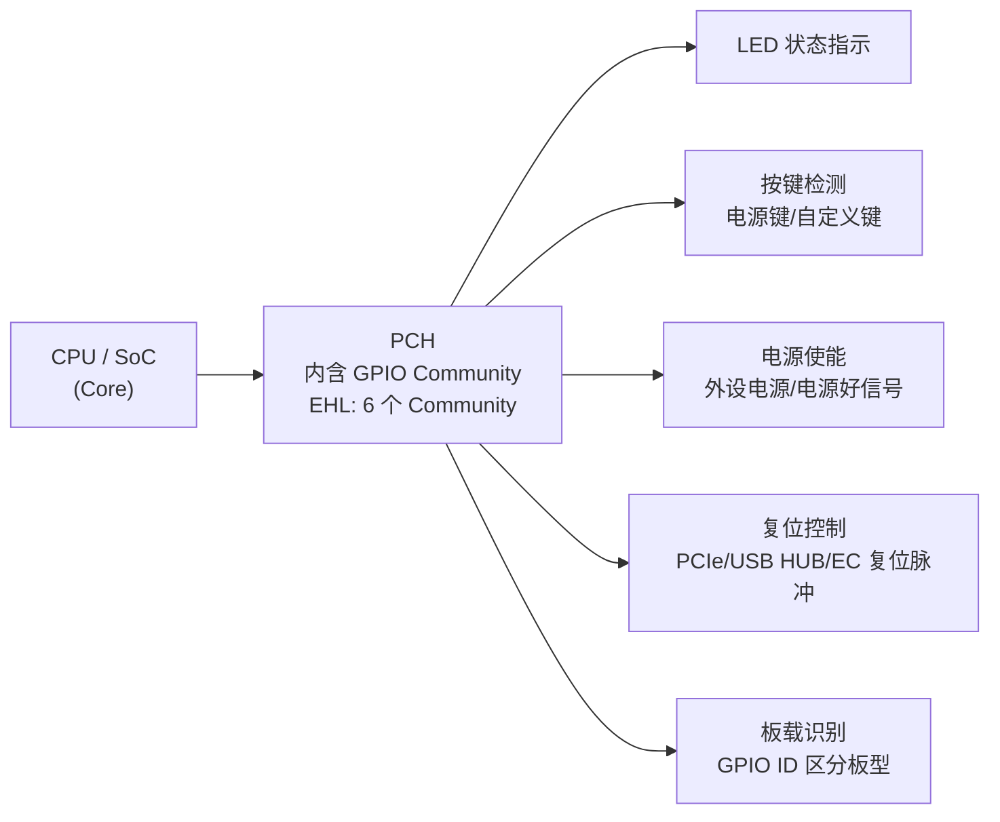
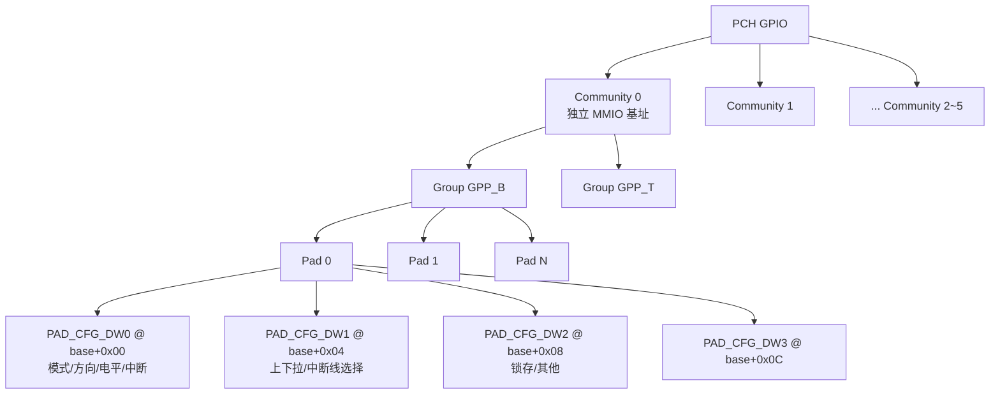
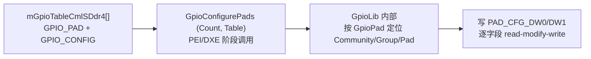
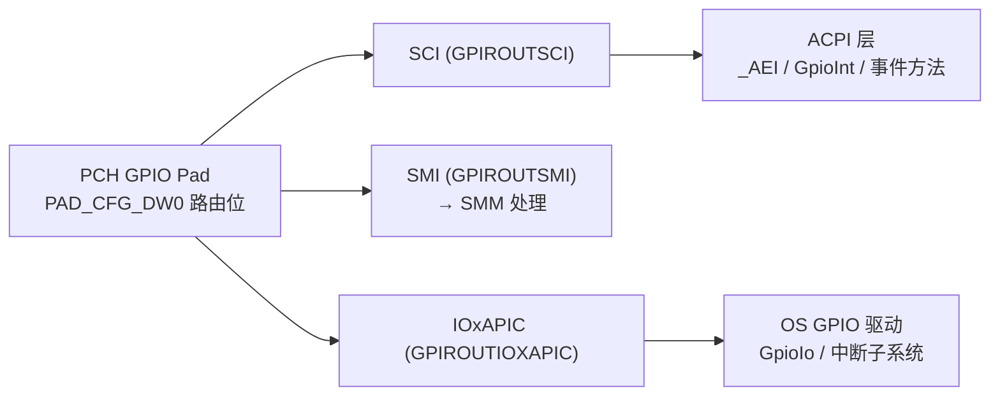

# PCH GPIO：从 PAD_CFG 寄存器到 EDKII GpioLib 配置表


---

## 一、GPIO 是什么：定义与关键属性

### 1.1 定义

GPIO 是芯片上可由软件自由控制的通用引脚，每根引脚可独立配置为输入、输出或复用功能（Native，如 UART/I2C/SPI）。核心特征：

- 方向可配：输入 / 输出 / 双向
- 电平可控：输出可写 0/1，输入可读回 0/1
- 可触发中断：电平 / 边沿触发
- 多路复用：一根引脚可切换多种功能
- 电气可配：上下拉、驱动强度等

BIOS 用它"点亮一颗 LED""读取一个按钮""给外部芯片发一个复位脉冲"——不需要专用控制器。本课程主要学习 **PCH GPIO**：Intel 平台芯片组（PCH）内置，MMIO 访问、数量多（EHL 六个 GPIO Community），BIOS 在 PEI/DXE 阶段通过 GpioLib 一次性初始化。

### 1.2 六项关键属性

| 属性 | 说明 | 典型配置值 |
| --- | --- | --- |
| Direction 方向 | 输入或输出 | GpioDirOut / GpioDirIn / GpioDirInInv |
| Level 电平 | 0 = 低，1 = 高 | GpioOutLow / GpioOutHigh |
| Pad Mode 复用 | GPIO 模式或原生功能 | GpioPadModeGpio / Native1~8 |
| Interrupt 中断 | 触发方式与路由 | 电平 / 边沿，SCI / SMI / NMI / IOxAPIC |
| Pull 上下拉 | 内部上拉 / 下拉电阻 | GpioTermNone / Wpu1K / Wpu20K 等 |
| Reset 复位域 | 受何种复位影响 | Platform / Deep / Resume / Powergood |

> [!note]
> 配置一根 GPIO 的顺序固定：选复用模式（PMODE=0）→ 选方向（GPIOTXDIS）→ 输出设电平（GPIOTXSTATE）/ 输入读电平（GPIORXSTATE）。中断与上下拉按需开启。这条顺序在寄存器层对应 PAD_CFG_DW0 的三个字段，后面第 3 章展开。

### 1.3 在系统中的位置与 BIOS 用途



典型用途：给外部芯片发复位脉冲（PCIe/USB HUB/EC）、控制外设电源使能脚、读取 GPIO ID 区分板型、驱动 LED 指示 BIOS 阶段或调试码、电源键/自定义按键检测、模块在位检测与热插拔事件。

## 二、PCH GPIO 的组织与寻址：Community / Group / Pad

### 2.1 三级组织架构

PCH 的 GPIO 按 **Community（社区）→ Group（组，GPP_x）→ Pad（引脚）** 三级组织。每个 Community 有独立的 MMIO 基址；Community 内含若干组（命名如 GPP_B / GPP_T / GPP_G）；组内 Pad 从 0 开始索引，每个 Pad 占 16 字节，即 4 个 32 位寄存器 DW0~DW3：



> [!tip]
> 一句话记地址换算：`PAD_CFG_DW0 = 社区基址 + PADBAR + Pad_Index × 0x10`。EDKII 里由 GpioLib 自动换算，代码里只需给出"社区 + 组 + Pad 索引"拼成的 `GPIO_PAD`（UINT32）。PADBAR 相对社区基址的偏移以及各社区基址由 PCH EDS 定义，BIOS 侧不需要自己算。

### 2.2 PAD_CFG_DW0 / DW1 位定义（补充）

PPT 只给了 DW0 的概要，这里补全 DW0 的完整位域（Intel SOC I/O Registers / EHL Datasheet Vol.2 Ch.20，机制与 EHL 一致）：

| Bit | 字段 | 属性 | 说明 |
| --- | --- | --- | --- |
| 0 | GPIOTXSTATE | RW | GPIO 输出电平，0=低 1=高 |
| 1 | GPIORXSTATE | RO/V | GPIO 输入状态（读回） |
| 8 | GPIOTXDIS | RW | 1=禁用输出缓冲（等效输入方向） |
| 9 | GPIORXDIS | RW | 1=禁用输入缓冲 |
| 12:10 | PMODE | RW | Pad Mode：0=GPIO，1~8=Native 功能 |
| 17 | GPIROUTNMI | RO | 输入路由到 NMI（GpioLib 写入） |
| 18 | GPIROUTSMI | RO | 输入路由到 SMI（写入后变 RO） |
| 19 | GPIROUTSCI | RW | 输入路由到 SCI |
| 20 | GPIROUTIOXAPIC | RW | 输入路由到 IOxAPIC 中断 |
| 22:21 | RXTXENCFG | RW | RX/TX 使能配置（驱动能力相关） |
| 23 | RXINV | RW | 输入反相（低有效检测用） |
| 26:25 | RXEVCFG | RW | 输入事件触发配置：电平/边沿 |
| 29 | RXPADSTSEL | RW | RX pad 状态选择（原始/滤波后） |
| 31:30 | PADRSTCFG | RW | Pad 复位域配置 |

DW1 的关键字段：

| Bit | 字段 | 说明 |
| --- | --- | --- |
| 7:0 | INTSEL | 中断线选择（0~255），决定路由到哪条社区中断线 |
| 13:10 | TERM | 终端电阻：0000=禁用，0010=5K 下拉，0100=20K 下拉，1001=1K 上拉，1010=5K 上拉，1100=20K 上拉，1111=由 Native 功能控制 |
| 17:14 | IOSSTATE | IO Standby 状态下引脚的停靠行为 |
| 9:8 | IOSTERM | IO Standby 状态下的终止行为 |

> [!warning]
> 修改方向前应先配好上下拉（TERM），否则输入悬空期间电平漂移，可能触发伪中断。这是 PCH GPIO 与 MCU GPIO 一致的一条硬件纪律：先定电气，再开方向。

### 2.3 GPIO_PAD 与 GpioLib 的封装

`GPIO_PAD` 与 `GPIO_GROUP` 都是 UINT32，含义由平台 GpioLib 实例内部解释（社区号、组号、Pad 索引打包在编码里）。库提供一组接口，BIOS 模块不需要碰裸地址：

- `GpioConfigurePads (Count, *Table)` —— 按配置表批量初始化
- `GpioSetOutputValue (Pad, Value)` —— 设输出电平
- `GpioGetInputValue (Pad, &Value)` —— 读输入电平
- `GpioSetPadConfig / GpioGetPadConfig` —— 读写单脚完整配置

源码位置（EDK2 生态）：Intel 参考代码在 `IntelSiliconPkg` / `MinPlatformPkg` 下的 `Library/GpioLib`（或 AMI 板级包的 `AmiGpioLib`），头文件为 `GpioLib.h`、`GpioConfig.h`（`GPIO_CONFIG` 结构定义处）。SlimBootloader 的 `Silicon/CommonSocPkg/Include/GpioConfig.h` 是同一结构的公开镜像，可直接对照阅读。

## 三、修改一个 GPIO：直写寄存器 vs GpioLib

### 3.1 三步操作与位级直写

PPT 给出的"改输出电平三步"（PMODE=0 → TXDIS=0 → TXSTATE=0/1），对应 DW0 的 read-modify-write：

```c
// 把 Pad 的 DW0 按位改好，再写回（read-modify-write）
Dw0 &= ~(BIT10 | BIT11 | BIT12);   // PMODE = 0   → 当普通 GPIO 用
Dw0 &= ~BIT8;                      // GPIOTXDIS = 0 → 打开输出缓冲
Dw0 |=  BIT0;                      // GPIOTXSTATE = 1 → 输出高电平（清 0 则输出低）
MmioWrite32 (Addr, Dw0);           // 写回 DW0
```

> [!warning]
> 直写只用于理解原理。工程上必须走 GpioLib 接口（`GpioSetOutputValue` / `GpioSetPadConfig`）：一是 GpioPad 到地址的换算因 PCH 型号而异，库封装了平台差异；二是库内部处理 PMODE/TXDIS 与上下拉的写顺序，避免悬空漂移；三是避免与 Silicon Code / CSME 对同一 pad 的编程冲突。

### 3.2 GpioLib 调用方式

```c
// 设 GPIO_CNL_H_GPP_H10 输出高电平
GpioSetOutputValue (GPIO_CNL_H_GPP_H10, 1);

// 读一个输入脚
UINT32 Value;
GpioGetInputValue (GPIO_CNL_H_GPP_K12, &Value);
```

引脚宏（如 `GPIO_CNL_H_GPP_H10`）由平台 GpioLib 头文件提供，内含社区/组/Pad 编码，是"原理图上的 GPP_H10 标签 ↔ 代码常量"的映射点。

## 四、GPIO 配置表：mGpioTableCmlSDdr4[]

### 4.1 配置表的作用与调用链

`mGpioTableCmlSDdr4[]` 是 CometLake-S DDR4 RVP（Q470 平台）的 PCH GPIO 一次性初始化清单，每条记录描述一个 pad：模式/方向/电平/中断/复位域/终端电阻/锁。BIOS 据此把每项写入 PAD_CFG_DW0/DW1。



文件定位：`GpioTableCmlSDdr4-Q470.h`，数组从第 52 行开始，第 239 行以 `{0x0}` 哨兵结尾。

> [!note]
> PPT 的标题写 EHL（嵌入式 SoC），配置表却是 CML/Q470（桌面芯片组）——两套材料机制一致，仅社区命名与引脚宏前缀不同。EHL 的引脚定义为 `GPIO_CNL_H_*` 同族（EHL 与 CNL 共用 GpioLib 接口），实际工程以目标平台 EDS 与板级 GpioTable 头文件为准。

### 4.2 GPIO_CONFIG 结构（补充自 GpioConfig.h）

```c
// 一条表项 = { 引脚编号, { 7 个必填值 + 1 个可选锁 } }
{ GPIO_CNL_H_GPP_H10,          // 引脚 (GPIO_PAD)
  { GpioPadModeGpio,           // 1 模式
    GpioHostOwnGpio,           // 2 所有权
    GpioDirOut,                // 3 方向
    GpioOutHigh,               // 4 输出电平
    GpioIntDis,                // 5 中断
    GpioPlatformReset,         // 6 复位域
    GpioTermNone } },          // 7 终端（可选第 8 个：锁）
```

| # | 字段 | 含义 | 常用取值（简） |
| --- | --- | --- | --- |
| 1 | PadMode 模式 | 当 GPIO 用 / 复用功能 | GpioPadModeGpio / Native1~8 |
| 2 | HostSoftPadOwn 所有权 | 谁拥有中断路由 | GpioHostOwnGpio / GpioHostOwnAcpi |
| 3 | Direction 方向 | 输入 / 输出 / 输入反相 | GpioDirOut / GpioDirIn / GpioDirInInv |
| 4 | OutputState 输出电平 | 初值高 / 低 | GpioOutHigh / GpioOutLow |
| 5 | InterruptConfig 中断 | 触发方式 + 路由 | GpioIntDis / GpioIntLevel\|GpioIntSci |
| 6 | PowerConfig 复位域 | 何种复位清除配置 | GpioPlatformReset / GpioResumeReset |
| 7 | ElectricalConfig 终端 | 上下拉电阻 | GpioTermNone / GpioTermWpu20K |
| 8 | LockConfig 锁（可选） | 是否锁存配置 | 默认锁；运行期改需显式 Unlock |

底层 `GPIO_CONFIG` 是位域结构（`GpioConfig.h`）：`PadMode:5, HostSoftPadOwn:2, Direction:6, OutputState:2, InterruptConfig:9, PowerConfig:8, ElectricalConfig:9, LockConfig:4, OtherSettings:9, RsvdBits:10`。库把每个位域翻译成 DW0/DW1 对应位后写回。

### 4.3 典型条目：一个输出、一个输入

```c
// 输出脚：GPIO · 仅输出 · 初值高 · 关中断 —— 最典型的"电源使能"配置
{ GPIO_CNL_H_GPP_H10, { GpioPadModeGpio, GpioHostOwnGpio, GpioDirOut,
  GpioOutHigh, GpioIntDis, GpioPlatformReset, GpioTermNone }}, // Audio_Pwren

// 输入脚：低有效检测 → DirInInv + OwnAcpi（归 ACPI）；运行期可能被 ACPI 改中断路由 → 显式 Unlock
{ GPIO_CNL_H_GPP_K12, { GpioPadModeGpio, GpioHostOwnAcpi, GpioDirInInv,
  GpioOutDefault, GpioIntDis, GpioPlatformReset, GpioTermNone, GpioPadConfigUnlock }}, // TBT_CIO_PLUG_EVENT_N
```

对比两例：用途不同 → 字段取值不同。输出使能脚不关心中断（GpioIntDis + HostOwnGpio）；低有效检测脚关心反相与 ACPI 中断路由（DirInInv + HostOwnAcpi + Unlock）。

## 五、GPIO 中断与事件路由：SCI / SMI / NMI / IOxAPIC

### 5.1 路由位与 Host Ownership 的关系

PAD_CFG_DW0 的 bit 17~20 决定输入事件路由到哪条路径，但路由要生效还依赖 **HostSoftPadOwn**：

- `GpioHostOwnAcpi`：中断状态写入 ACPI 侧寄存器，SCI/SMI/NMI 事件才能送达（**配中断的脚必须用它**）
- `GpioHostOwnGpio`：中断归 GPIO 驱动（OS GPIO 驱动经 ACPI `GpioIo`/`GpioInt` 描述符接管）

> [!warning]
> 唤醒脚必须 `GpioHostOwnAcpi`，否则 SCI/SMI 事件路由不过去——这是 PPT 反复强调的第一条坑，也是 4.3 中 TBT_CIO_PLUG_EVENT_N 用 OwnAcpi 的原因。

### 5.2 ACPI 侧：_AEI 与 GpioInt/GpioIo 描述符

BIOS 把 PCH GPIO 的中断/IO 能力通过 ACPI 暴露给 OS（ACPI 6.5 §4.1.1.1 GPIO-Signaled Events / §19.5.53 GpioInt 宏）：

- **GpioInt** 描述符：描述 GPIO 中断连接（引脚号、触发极性、唤醒能力），用于设备 `_CRS` 或控制器 `_AEI`
- **_AEI**（ACPI Event Information）：GPIO 控制器节点上列出所有作为 ACPI 事件源的 GpioInt 资源，OSPM 把它当作 SCI 对待，引脚事件触发时执行对应 `_Exx`（边沿）/`_Lxx`（电平）/`_EVT` 事件方法
- **GpioIo** 描述符：描述 GPIO IO 连接（方向限制、驱动强度、共享属性），OS 驱动据此申请/使用引脚
- **GeneralPurposeIO OpRegion**：ACPI 5.0 §5.5.2.4.4 定义的新 OpRegion 类型，允许 ASL 控制方法直接读写 GPIO



> [!note]
> 对应关系：GPIROUTSCI 是传统 ACPI 平台的主事件通道（OS 当作 SCI 处理）；GPIROUTSMI 把事件送进 SMM 处理（见 [[SMI]]）；IOxAPIC 走标准中断线给 OS 驱动。SMI/SCI 路由写寄存器后变只读，属于硬件级锁定，运行期改路由要走 ACPI 重新协商。

## 六、复位域与锁定机制

### 6.1 复位域（PowerConfig）

PAD_CFG_DW0 bit 31:30（PADRSTCFG）决定引脚配置在何种复位下被清除：

| 复位域 | 行为 | 适用场景 |
| --- | --- | --- |
| GpioPlatformReset | 平台复位（PLTRST#）清除配置 | 普通引脚，每次冷/暖复位重新初始化 |
| GpioDeepReset | 深度复位才清除 | 跨 S3/S4 保持配置 |
| GpioResumeReset | 仅在 S3 唤醒路径复位清除 | 睡眠时保持、唤醒时重新配置的脚 |
| GpioPowerGood | 电源好信号复位清除 | 需要尽早生效的脚 |

> [!warning]
> 跨睡眠（S3~S5）要保持状态的脚不能用 `GpioPlatformReset`——它在睡眠期间会被复位清掉，醒来后电平丢失。PPT 的"选复位域"步骤问的就是"是否跨 S3~S5"。

### 6.2 锁定：PADCFGLOCK 与 SmmReadyToLock

配置表默认会锁定引脚（LockConfig 字段），锁定后运行期写无效；确需运行期改动的脚显式 `GpioPadConfigUnlock`。硬件层面对应 PADCFGLOCK / PADCFGLOCKTX 寄存器组。

Intel 官方最佳实践（GPIO Configuration Best Practices）明确要求：**所有运行期不需要改的 GPIO 必须在执行不可信代码（第三方 Option ROM、OS Loader）之前锁定**，推荐在 `SmmReadyToLock` 事件的回调里完成；锁定后仅 SMM 代码可解锁，确保只有可信固件能改 GPIO 配置。

> [!note]
> 这一条的由来是真实安全漏洞：若 PLTRSTB# 引脚（平台复位输出）未被锁定，攻击者可在 OS 下把它改回 GPIO 模式并翻转，触发平台部分复位，进而干扰 TPM 时序、绕过 BitLocker 的 PCR 密封。锁定引脚是固件的安全底线，不是可选项。可用 RWEverything 之类的工具 dump PADCFGLOCK 寄存器验证锁定状态。

### 6.3 与 SMM 的关系

GPIO 事件进 SMM（GPIROUTSMI）后由 SMM 中断服务处理，处理完清中断状态位。锁定/解锁 GPIO 配置也是 SMM 的专属能力（见 [[SMI]] 与 [[ACPI]] 的交叉内容）。BIOS 在 DXE 阶段配 GPIO，在 ReadyToLock 时锁定，OS 阶段只有 SMM 能碰——这条链是 PCH GPIO 安全模型的骨架。

## 七、PCH GPIO vs Super I/O GPIO（对接 IT8786 任务）

当前项目正做 IT8786 的 GPIO60 输出拉高。注意这是 **Super I/O 的 GPIO**，与本章前述 PCH GPIO 是两条完全不同的访问路径：PCH GPIO 走 MMIO + GpioLib 配置表；SIO GPIO 走 LPC/eSPI 总线上的 Index/Data 端口 + 逻辑设备（LDN）机制（见 [[Super IO]] 笔记的 IT8613E 架构）。

| 维度 | PCH GPIO（本课） | Super I/O GPIO（IT8786） |
| --- | --- | --- |
| 访问通道 | MMIO（PAD_CFG 寄存器） | IO 端口 Index/Data（0x2E/0x2F）经 LPC/eSPI |
| 组织 | Community → Group → Pad | 逻辑设备 LDN = 0x07（GPIO 设备） |
| 配置入口 | GpioConfigurePads 配置表 | SIO 配置空间寄存器（索引寄存器方式） |
| 基址 | 社区 MMIO 基址 + PADBAR | GPIO Base 寄存器（0x62/0x63，16 位 IO 基址） |
| 方向控制 | DW0 bit 8 TXDIS | Output Enable 寄存器（IT87 系 0xC8 起始） |
| 输出电平 | DW0 bit 0 TXSTATE | GPIO Base + 组偏移（GP60 对应第 7 组） |
| 中断 | SCI/SMI/NMI/IOxAPIC 路由 | 部分引脚可触发 SMI（IT87 系） |
| 工程接口 | GpioLib | 直写 IO 端口（项目内先例驱动） |

IT8786 的 GPIO 访问流程（Linux `gpio-it87.c` 驱动为参照，项目内以既有 SIO 代码先例为准）：

```c
// 1. 进入 SIO 配置空间（0x2E = Index，0x2F = Data）
IoWrite8 (0x2E, 0x87); IoWrite8 (0x2E, 0x01);
IoWrite8 (0x2E, 0x55); IoWrite8 (0x2E, 0x55);
// 2. 选 GPIO 逻辑设备 LDN = 0x07
IoWrite8 (0x2E, 0x07); IoWrite8 (0x2F, 0x07);
// 3. 读 GPIO Base（0x62/0x63 组成 16 位 IO 基址）
// 4. 设方向：Output Enable 寄存器相应位（1 = 输出）
// 5. 设电平：GPIO Base + 组偏移 的相应位（1 = 高，0 = 低）
// 6. 退出配置空间
IoWrite8 (0x2E, 0x02); IoWrite8 (0x2F, 0x02);
```

> [!tip]
> 两套机制的共性在概念层：都要"选功能 → 定方向 → 设电平"，差的只是寄存器和访问通道。PCH GPIO 由 GpioLib 封装、数量多、中断路由丰富；SIO GPIO 引脚少、走低速总线、适合做电源使能/指示灯这类简单控制。IT8786 的 GPIO60 属第 7 组（GP60~GP67），输出寄存器地址 = GPIO Base + 组偏移，具体以 IT8786 datasheet 与项目先例为准。

## 八、实操要点与常见坑

定位一个 GPIO 的工程流程：

1. **找引脚**：原理图定位 GPP_xN 标签（PCH）或 GPIO 组号（SIO）
2. **定方向**：输入/输出？输出初值？
3. **选复位域**：是否跨 S3~S5？睡眠中要保持吗？
4. **配中断/上下拉**：唤醒？中断路由给谁？上下拉阻值？要锁吗？
5. **改表项**：调整 7~8 个字段，重新编译验证

四个常见坑（PPT 原话 + 机制解释）：

- **Native 脚不要在配置表里配 Native** —— 与 Silicon Code / soft strap 重复编程同一 pad，功能异常。配置表只配 `GpioPadModeGpio`，Native 交给参考代码或 CSME（FITc）处理
- **唤醒脚必须 GpioHostOwnAcpi** —— 否则 SCI/SMI 事件路由不过去
- **跨睡眠保持状态的脚不能用 GpioPlatformReset** —— 睡眠中会被复位清掉
- **运行期要改的脚需显式 Unlock** —— 上锁后写无效，且只有 SMM 能解锁

## 术语表

| 术语 | 含义 |
| --- | --- |
| GPIO_PAD | UINT32 引脚编码（社区+组+Pad 索引打包），GpioLib 据此换算地址 |
| Community | PCH GPIO 的一级分组，每个社区独立 MMIO 基址 |
| GPP_x | 组名（如 GPP_B / GPP_T / GPP_G），组内 Pad 0-based 索引 |
| PAD_CFG_DW0 | Pad 配置寄存器第 0 个双字：PMODE/TXDIS/TXSTATE/中断路由/复位域 |
| PAD_CFG_DW1 | Pad 配置寄存器第 1 个双字：TERM 上下拉/INTSEL 中断线选择 |
| PMODE | Pad Mode，0 = GPIO，1~8 = Native 复用功能 |
| GPIOTXDIS | 1 = 禁用输出缓冲（等效输入） |
| GPIOTXSTATE / GPIORXSTATE | 输出电平 / 输入状态 |
| HostSoftPadOwn | 引脚中断所有权：GpioHostOwnGpio（OS 驱动）/ GpioHostOwnAcpi（ACPI） |
| GpioInt / GpioIo | ACPI GPIO 连接资源描述符，OS 驱动与 ACPI 事件的接口 |
| _AEI | ACPI Event Information，GPIO 控制器上声明 ACPI 事件源引脚 |
| PADCFGLOCK | PCH 的 GPIO 配置锁存寄存器组，锁定后仅 SMM 可解锁 |
| SmmReadyToLock | DXE 阶段事件，Intel 推荐在此回调里锁定 GPIO 配置 |
| LDN | SIO 逻辑设备号，IT8786 的 GPIO 设备 LDN = 0x07 |
| SIO Index/Data | Super I/O 配置端口对（如 0x2E/0x2F），先写索引再读写数据 |
