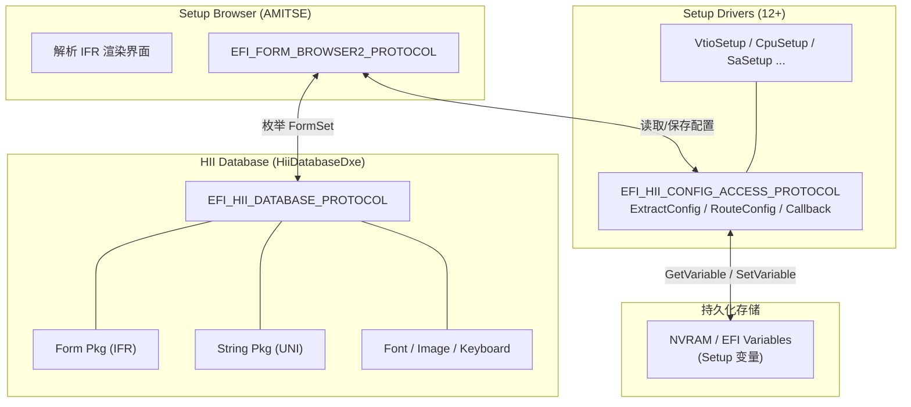
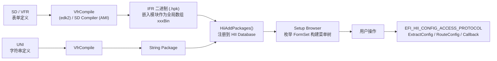
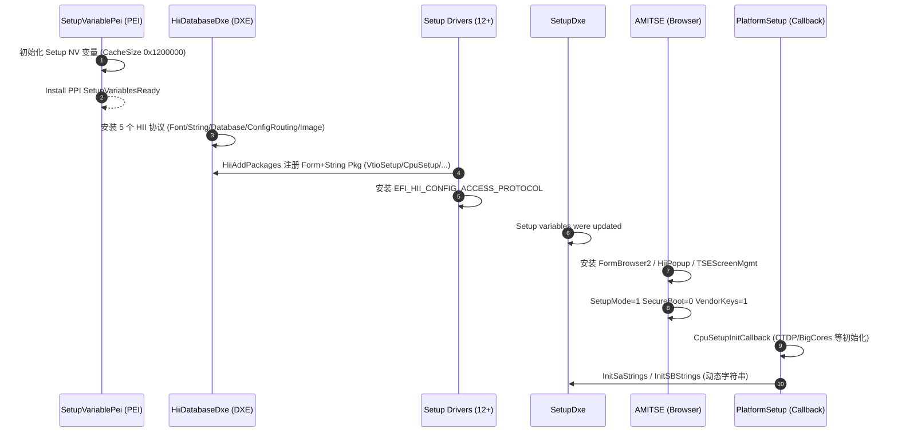
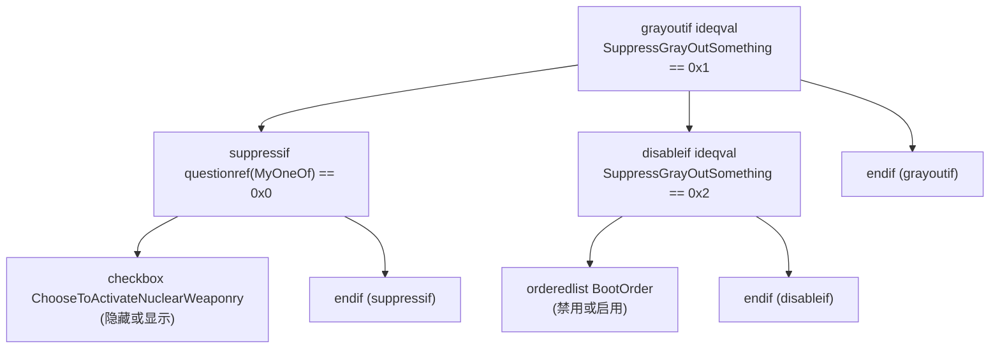
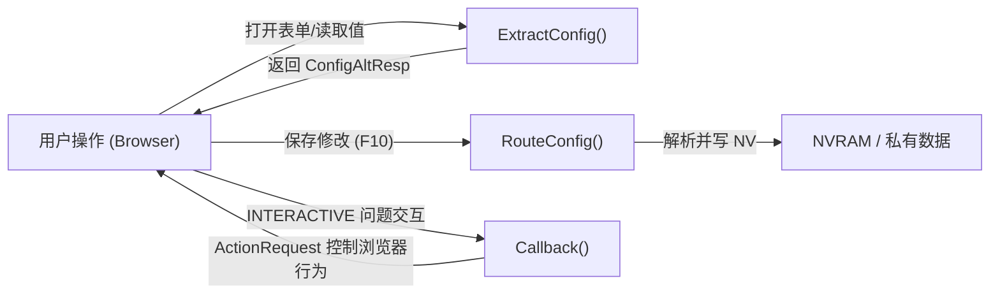

# UEFI Setup：从 VFR/SD 表单定义到 HII 配置回调

BIOS Setup 是用户与固件配置之间唯一的交互界面，但它的本质不是"一堆界面代码"，而是一套**声明式表单 + 解释执行**的框架：表单用 VFR/SD 语言描述，编译成 IFR 二进制包注册进 HII Database；运行时由 Setup Browser（TSE）解析 IFR 渲染界面；用户每次按键修改，经 `EFI_HII_CONFIG_ACCESS_PROTOCOL` 转发到驱动侧处理。

---

## 一、HII 与五类包

### 1.1 HII 是什么

HII（Human Interface Infrastructure，人机接口基础设施）是 UEFI 规范定义的固件级 UI 管理框架。它的设计核心是**资源与逻辑解耦**：界面资源（表单、字符串、字体、图片）与驱动业务逻辑彻底分离，驱动只负责把资源注册进 HII Database，渲染和交互由统一的 Browser 完成。

HII Database 管理五类包（Package）：

| 包类型 | 内容 | 数据来源 |
| --- | --- | --- |
| Form Package | IFR 二进制编码的表单定义 | .vfr / .sd 经 VfrCompiler 编译 |
| String Package | Unicode 字符串（多语言） | .uni 经 VfrCompiler 编译 |
| Font Package | 字体位图数据 | 固件内置 |
| Image Package | 图片资源（如 Logo） | JPEG/PNG 等 |
| Keyboard Layout | 键盘布局 | 固件内置 |

> [!note]
> 规范位置：UEFI 2.10 中 HII Database 协议定义在 **§34.8**（`EFI_HII_DATABASE_PROTOCOL`），配置处理与 Browser 协议在 **§35**（HII Configuration Processing and Browser Protocol）。HII 概念总览在 §27（Human Interface Infrastructure Overview）。EDK2 对应头文件：`MdePkg/Include/Protocol/HiiDatabase.h`、`HiiConfigAccess.h`、`HiiConfigRouting.h`、`FormBrowser2.h`，IFR 数据结构在 `MdePkg/Include/Uefi/UefiInternalFormRepresentation.h`。

### 1.2 HII 协议族

HII 不是单个协议，而是一族协议，各有分工：

| 协议 | 生产者 | 职责 |
| --- | --- | --- |
| `EFI_HII_DATABASE_PROTOCOL` | HiiDatabaseDxe | 管理所有包：NewPackageList / Remove / Update / List / Export / RegisterNotify 等 11 个接口 |
| `EFI_HII_STRING_PROTOCOL` | HiiDatabaseDxe | 多语言字符串的存储、检索、更新 |
| `EFI_HII_FONT_PROTOCOL` | HiiDatabaseDxe | 字体渲染与文本绘制 |
| `EFI_HII_IMAGE_PROTOCOL` | HiiDatabaseDxe | 图片资源管理 |
| `EFI_HII_CONFIG_ROUTING_PROTOCOL` | HiiDatabaseDxe | 配置数据路由与格式转换（ExtractConfig/RouteConfig/BlockToConfig/ConfigToBlock 等 6 个接口） |
| `EFI_HII_CONFIG_ACCESS_PROTOCOL` | **各 Setup 驱动** | 驱动侧配置读写接口（ExtractConfig/RouteConfig/Callback） |
| `EFI_FORM_BROWSER2_PROTOCOL` | Setup Browser（AMI 为 AMITSE） | 表单渲染与用户交互（SendForm/BrowserCallback） |
| `EFI_HII_POPUP_PROTOCOL` | Setup Browser | 弹出消息框（§35.7） |

关键分工：**ConfigRouting 是系统提供的"总路由"**，它收到浏览器/外部应用的配置请求后，按 GUID 找到对应驱动并转发；**ConfigAccess 是驱动提供的"分接口"**，由各 Setup 驱动自行实现，负责自己数据结构的读写。每个注册了 Form Package 的驱动都必须发布 ConfigAccess。



---

## 二、HII 数据流与真实启动序列

### 2.1 构建与注册流程

一个 Setup 模块的完整生命周期分两个阶段：**编译期**把声明文件变成二进制，**运行期**注册进数据库供 Browser 消费。



注册代码：

```c
// HII package registration
HiiHandle = HiiAddPackages (
  &gDriverSampleFormSetGuid,  // Formset GUID
  DriverHandle,                // Associated handle（含 Device Path）
  VfrBin,                      // Compiled VFR (IFR binary) 全局数组
  DriverSampleStrings,         // Compiled UNI strings
  NULL);

// Install ConfigAccess Protocol
InstallMultipleProtocolInterfaces (
  &DriverHandle, &gEfiHiiConfigAccessProtocolGuid,
  &mPrivateData->ConfigAccess, NULL);
```

> [!note]
> VfrCompile 的产物不是独立文件，而是**以全局数组变量形式嵌入模块镜像**：例如 `Inventory.vfr` 编译后生成 `InventoryBin[]` 数组，`VfrStrings.uni` 编译后生成 `DriverSampleStrings[]`。注册时直接传数组名。`.hpk`（HII Package List）是 AMI 工具链对打包后二进制文件的称呼。edk2 中 .vfr/.uni 只需列在 INF `[Sources]` 段，build 系统自动调 VfrCompile；AMI 平台则用 ELINK 把 SD/UNI/C 文件挂进 FormSet 模块（见第三章）。

### 2.2 真实 BIOS 启动序列

真实 BIOS 串口 log，把HII 初始化的完整时序：

```text
// ===== PEI Phase: Setup Variable Initialization =====
SetupVariablePei.Entry(FFFE5B7D)
[SetupVariablePei]: SetNvStorageCacheable - Begin
[SetupVariablePei]: CacheSize is 0x1200000
Install PPI: SetupVariablesReady

// ===== DXE Phase: HII Database Loads =====
HiiDatabase.Entry(598E33B4)
InstallProtocolInterface: EfiHiiFont / EfiHiiString / EfiHiiDatabase /
                          EfiHiiConfigRouting / EfiHiiImage

// ===== DXE: Drivers Register HII Packages =====
InstallProtocolInterface: EfiHiiPackageList
  VtioSetup (Form+String Pkg), SetupDxe, CpuSetup, ... (12+ drivers)

// ===== DXE: Setup Driver Entry =====
Setup.Entry(576C5500)
[Setup]: Setup variables were updated

// ===== DXE: AMITSE (Setup Browser) Loads =====
AMITSE.Entry(56F8B5A0)
InstallProtocolInterface: EfiFormBrowser2 / EfiHiiPopup / TSEScreenMgmt
[AMITSE]: SetupMode = 1, SecureBoot = 0, VendorKeys = 1

// ===== Real Callback Running =====
PlatformSetup.Entry(579204B0)
[PlatformSetup]: Running CpuSetupInitCallback...
[PlatformSetup]: CTDP: CtdpLevel1Supported = 1
[PlatformSetup]: BigCores = 4, SmallCoreCluster = 3

// ===== Dynamic String Initialization =====
[Setup]: <InitSaStrings> GetVariable 'SaSetup' Status = Success
[Setup]: <InitSBStrings> VolatileData.PciePortCfg[0]=3
```



> [!warning]
> 时序中值得注意的一点：**Setup NV 变量在 PEI 阶段就初始化了**（SetupVariablePei），而不是等到 DXE 的 SetupDxe 才创建。原因是 BDS 阶段要显示开机画面和 Setup 主菜单，而 PcdSetupVariableSize 决定的 NV 缓存区必须在变量协议可用前就绪；DXE 的 Setup 驱动只是"更新"而不是"创建"变量。这与 `gEfiVariableArchProtocolGuid` 的 Depex 依赖一起，决定了 Setup 驱动必须等变量架构协议装好才能跑（见第十章 DriverSampleDxe.inf 的 Depex）。

---

## 三、SD/VFR、UNI、C

每个 Setup 模块由三类文件协同完成：**SD/VFR 定义表单逻辑 → UNI 提供显示文字 → C 代码处理数据读写**。三者通过 FormSet GUID 和 STRING_TOKEN 关联。

### 3.1 SD 文件 Sections（AMI 特有）

edk2 的 VFR 文件是一个整体；AMI 的 SD 文件则通过 `#ifdef/#endif` 把不同职责拆成多个 Section，**一个 SD 文件可被多次 include，每次激活不同 Section**：

| Section 名                | 功能                  | 示例                                         |
| ------------------------ | ------------------- | ------------------------------------------ |
| `SETUP_DATA_DEFINITION`  | 定义 NV 数据结构体字段       | `UINT8 BootMode;` / `UINT16 MemorySize;`   |
| `CONTROL_DEFINITION`     | 定义控件 `#define` 宏    | `#define MY_CHECKBOX \ checkbox varid=...` |
| `CONTROLS_WITH_DEFAULTS` | 列出带默认值的控件宏          | `MY_CHECKBOX` / `MY_ONEOF`                 |
| `FORM_SET_TYPEDEF`       | FormSet 类型定义（C 结构体） | `typedef struct { ... } MyVariable;`       |
| `FORM_SET_GOTO`          | 跨 FormSet 跳转定义      | `goto FORMSET_GUID2, prompt=STR_ADVANCED;` |
| `FORM_SET_FORM`          | 表单内容和布局             | `form formid=1; MY_CHECKBOX endform;`      |

### 3.2 edk2 VFR vs AMI SD

| 特性 | edk2 VFR | AMI SD |
| --- | --- | --- |
| 文件扩展名 | .vfr | .sd |
| 数据结构定义 | NVDataStruc.h（C 头文件，#include） | SETUP_DATA_DEFINITION section（#ifdef） |
| 变量存储声明 | `varstore` / `efivarstore` / `namevaluevarstore` | 自动映射到 SETUP_DATA 结构 |
| 字符串引用 | `STRING_TOKEN(STR_xxx)` | STRING_TOKEN 或直接引用 |
| 编译工具 | VfrCompile（edk2 自带） | SD Compiler（AMI 扩展工具） |
| 模块链接 | .inf `[Sources]` 段 | ELINK（SETUP_DEFINITIONS 等 Parent） |
| 默认值管理 | `default` / `defaultstore` | CONTROLS_WITH_DEFAULTS section |
| 条件控制 | `suppressif` / `grayoutif` / `disableif` | 相同 + 额外 SD 层控制 |

> [!note]
> 两种体系最终都生成**同一套 IFR 二进制格式**（Internal Forms Representation），被 HII Database 统一处理——这正是 Browser 不用区分"驱动是 edk2 还是 AMI"的原因。IFR 由一串 opcode 组成（`EFI_IFR_OP_HEADER` + 各类 opcode），VFR 语法规范（含 BNF 文法）见 edk2 VFR Specification release 1.92，字符串规范见 UNI Spec 1.40。

### 3.3 ELINK 链接机制

ELINK 是 AMI 的模块化组装机制（详见 [[Aptio V eModule_oem & Elink]] 笔记），通过 Parent 关键字把散落的文件绑定进 FormSet 模块：

```
ELINK                            // 链接 SD 文件进 formset
  Name = "MyModule/MySetup.sd"
  Parent = "SETUP_DEFINITIONS"
  InvokeOrder = AfterParent
End

ELINK                            // 链接 UNI 字符串覆盖
  Name = "MyModule/MyStrings.uni"
  Parent = "SetupStringFiles"
  InvokeOrder = AfterParent
End

ELINK                            // 链接回调源文件
  Name = "MyModule/MyCallback.c"
  Parent = "SetupCallbackFiles"
  InvokeOrder = AfterParent
End

ELINK                            // 按问题项注册回调
  Name = "ITEM_CALLBACK(Class, SubClass, QId, Fn),"
  Parent = "SetupItemCallbacks"
End
```

edk2 不使用 ELINK：.vfr/.uni 直接列在 .inf `[Sources]` 段，build 系统自动收集编译。AMI ELINK 提供更细粒度的模块组装控制（顺序、优先级、条件 include）。

---

## 四、VarStore：三种存储绑定方式

`varid = MyIfrNVData.xxx` 中的 `MyIfrNVData` 就是 varstore 名称。VFR 支持三种存储方式：

| 类型 | 存储机制 | 读写方 | 适用场景 |
| --- | --- | --- | --- |
| `varstore` | C 结构体缓冲区 | 驱动自行管理（GetVariable/SetVariable 或私有数据） | 复杂的组合配置结构 |
| `efivarstore` | 直接映射 EFI Variable | HII 框架自动读写 NVRAM | 需独立持久化的配置 |
| `namevaluevarstore` | 键值对（每个变量独立） | HII 框架 | 少量独立配置项，无需定义结构体 |

```c
// varstore - 内存缓冲区（常用默认）
varstore DRIVER_SAMPLE_CONFIGURATION,
  name = MyIfrNVData,
  guid = FORMSET_GUID;

// efivarstore - 直接落 NVRAM
efivarstore MY_EFI_VARSTORE_DATA,
  attribute = NV | BS,
  name = MyEfiVar;

// namevaluevarstore - 键值对
namevaluevarstore MyNameValueVar,
  name = STRING_TOKEN(STR_NAME0),
  name = STRING_TOKEN(STR_NAME1);
```

NV 数据结构体（`NVDataStruc.h`）与问题的对应关系：

```c
#pragma pack(1)
typedef struct {
  UINT8   HowOldAreYouInYears;          // numeric question
  UINT8   ChooseToActivateNuclearWeaponry; // checkbox
  UINT8   SuppressGrayOutSomething;     // oneof
  UINT8   BootOrder[8];                 // orderedlist
  UINT16  MyStringData[40];             // string input
  EFI_HII_TIME  Time;                   // time question
  EFI_HII_REF   RefData;                // reference (goto)
  UINT8   BitCheckbox : 1;              // bit-level checkbox
  UINT8   ReservedBits : 7;
  UINT16  BitOneof : 6;                 // bit-level oneof
} DRIVER_SAMPLE_CONFIGURATION;
#pragma pack()
```

> [!tip]
> 位域字段（`:1`、`:6`）可让多个 checkbox/oneof 共用一个字节，这在 AMI Setup 的"Option ROM 开关"类紧凑配置里很常见。`pragma pack(1)` 保证结构体与 IFR 中 OFFSET 计算一致——IFR 里每个问题的 `varid` 编译时会换算成结构体的字节偏移，结构体若有 padding 会导致 OFFSET 错位、读写到错误字段。

---

## 五、问题类型与条件控制

### 5.1 问题类型总览

| SD 元素 | 语法关键字 | 用途 | NV 存储 |
| --- | --- | --- | --- |
| FormSet | `formset ... endformset` | 顶层容器（整个 Setup 模块） | — |
| Form | `form formid = N` | 单个页面 | — |
| VarStore | `varstore / efivarstore` | 数据存储绑定 | Structure / EFI Var |
| oneof | `oneof ... endoneof` | 单选（多选一） | UINT8/16 field |
| checkbox | `checkbox ... endcheckbox` | 布尔开关 | UINT8 bit field |
| numeric | `numeric ... endnumeric` | 数值输入 | UINT8/16/32 |
| string | `string ... endstring` | 字符串输入 | UINT16 array |
| orderedlist | `orderedlist ... endlist` | 排序列表 | UINT8 array |
| goto | `goto formid` | 页面跳转 | — |
| suppressif | `suppressif ... endif` | 条件隐藏 | — |
| grayoutif | `grayoutif ... endif` | 条件灰化 | — |

关键属性要点：

- **oneof**：`option ... value = N, flags = DEFAULT` 标记默认选项；每个 option 一个可选值。
- **checkbox**：`flags = CHECKBOX_DEFAULT | CHECKBOX_DEFAULT_MFG` 可分别指定标准/工厂默认；`default = 1, defaultstore = MyManufactureDefault` 指定不同默认方案下的值。
- **numeric**：`minimum/maximum/step`，`step = 0` 允许手动输入。
- **string**：`minsize/maxsize` 限制字符数；`flags = INTERACTIVE` 标记触发回调。
- **orderedlist**：varid 必须是 **UINT8 数组**（如 `BootOrder[8]`），用户可排序。
- **key** 属性：Callback 中通过 QuestionId 识别问题（key 值即 QuestionId）。
- **RESET_REQUIRED** flag：修改后需要重启才生效。

```c
// oneof 示例
oneof name = MyOneOf,
  varid = MyIfrNVData.SuppressGrayOutSomething,
  prompt = STRING_TOKEN(STR_ONE_OF_PROMPT),
  help   = STRING_TOKEN(STR_ONE_OF_HELP),
  option text = STRING_TOKEN(STR_ONE_OF_TEXT4), value = 0x0, flags = 0;
  option text = STRING_TOKEN(STR_ONE_OF_TEXT5), value = 0x1, flags = 0;
  option text = STRING_TOKEN(STR_ONE_OF_TEXT6), value = 0x2, flags = DEFAULT;
endoneof;
```

### 5.2 条件控制三件套

| 关键字 | 行为 | 用户视角 |
| --- | --- | --- |
| `suppressif` | 控件完全隐藏 | 看不到 |
| `grayoutif` | 控件变灰 | 可见但不可操作 |
| `disableif` | 控件禁用 | 功能类似 grayoutif |

支持嵌套与逻辑运算，表达式操作符完整列表：`ideqval`（等于常量）、`ideqid`（等于另一变量）、`questionref()`（引用问题值）、TRUE/FALSE、算术（+ - * / %）、比较（== != < > <= >=）、逻辑（AND OR NOT）。



### 5.3 Form、goto 与 label（动态更新锚点）

```c
form formid = 1, title = STRING_TOKEN(STR_FORM1_TITLE);
  subtitle text = STRING_TOKEN(STR_SUBTITLE_TEXT);

  text help = STR_TEXT_HELP, text = STR_CPU_STRING, text = STR_CPU_STRING2;

  goto 0x1234,                       // 目标 Form ID
    prompt = STRING_TOKEN(STR_GOTO_DYNAMIC),
    help   = STRING_TOKEN(STR_GOTO_HELP),
    flags  = INTERACTIVE,            // 跳转前触发 Callback
    key    = 0x1234;                 // Callback 识别用 QuestionId

  label LABEL_UPDATE_BBS;            // 动态插入锚点（anchor）
  // ... 运行时由 Callback 在此插入动态 opcode ...
  label LABEL_END;
endform;
```

> [!tip]
> label 机制是"动态表单"的基石：Callback 在 `EFI_BROWSER_ACTION_FORM_OPEN` 时用 `HiiAllocateOpCodeHandle()` + `HiiCreateGuidOpCode()`（`EFI_IFR_EXTEND_OP_LABEL` 扩展 opcode）定位 label 号，再 `HiiCreateActionOpCode()` / `HiiCreateOneOfOptionOpCode()` 生成控件，最后 `HiiUpdateForm()` 提交到 HII Database。典型应用：Boot Manager 里按实际存在的启动设备动态生成选项、CPU 配置页按检测到的核数动态生成条目。

---

## 六、默认值与校验

### 6.1 defaultstore：多套默认值方案

```c
defaultstore MyStandardDefault,
  prompt = STRING_TOKEN(STR_STANDARD_DEFAULT_PROMPT),
  attribute = 0x0000;    // Standard default

defaultstore MyManufactureDefault,
  prompt = STRING_TOKEN(STR_MANUFACTURE_DEFAULT_PROMPT),
  attribute = 0x0001;    // Manufacture default

// 在 question 中引用:
checkbox varid = MyIfrNVData.MyCheckbox,
  default = 1,                              // Standard default
  default = 0, defaultstore = MyManufactureDefault;  // Mfg default
endcheckbox;
```

attribute 值对应 Default ID：0x0000 Standard、0x0001 Manufacturing、0x0002 Safe，对应 UEFI 的 `EFI_BROWSER_ACTION_DEFAULT_STANDARD/MANUFACTURING/SAFE` 回调时机（见第九章）。AMI 的 `CONTROLS_WITH_DEFAULTS` section 确保即使 UI 上隐藏的控件也有正确默认值；`HpkTool` 用 defaultstore 生成默认 NVRAM 值。

### 6.2 inconsistentif / warningif

| 关键字 | 行为 | 用户视角 |
| --- | --- | --- |
| `inconsistentif` | 值不合法时**阻止提交**，弹出错误 | 必须修改后才能保存 |
| `warningif` | 弹出警告但**允许继续** | `timeout` 秒后自动关闭 |

```c
inconsistentif prompt = STRING_TOKEN(STR_ERROR_POPUP),
  ideqid MyIfrNVData.TestLateCheck == MyIfrNVData.TestLateCheck2
endif;  // 阻止提交, 弹出错误

warningif prompt = STR_WARNING_POPUP, timeout = 5,
  ideqval MyIfrNVData.TestLateCheck == 0
endif;  // 弹出警告, 5 秒超时后继续
```

---

## 七、UNI 字符串与多语言

### 7.1 UNI 文件格式

```c
/=#

#langdef en-US      "English"       // 注册语言 (BCP47)
#langdef fr-FR      "Francais"
#langdef x-UEFI-ns  "UefiNameSpace" // REST/Redfish 关键字命名空间

#string STR_ONE_OF_PROMPT
  #language en-US "My one-of prompt #1"
  #language fr-FR "Mi uno- de guia # 1"
```

结构要点：`/=#` 标记文件头结束；`#langdef` 注册支持语言；`#string` 定义字符串标识符；`#language` 为各语言提供翻译。UNI 编译为 String Package，Browser 按系统当前语言选择翻译，**缺少翻译时 fallback 到第一个定义的语言**（惯例是 en-US）。

### 7.2 多语言与 OEM 字符串覆盖

- Setup Browser 按系统语言（`PlatformLang` 变量）选择翻译；AMI 的 Mapping Language 功能可把一种语言映射到另一种。
- **AMI 字符串覆盖**：`SetupStringFiles` ELINK 允许 OEM 覆盖 IBV（Intel BIOS Vendor）默认字符串。优先级：**OEM UNI > IBV UNI > 默认**。步骤：创建项目 UNI 文件 → 重新定义要覆盖的字符串 → 通过 ELINK 追加到列表末尾。无需修改原始 SD 文件。

### 7.3 动态字符串初始化

静态字符串写死在 UNI 里，但 CPU 型号、BIOS 版本这类"运行时才知道"的文字必须动态生成：

```c
VOID ExampleStringInit (EFI_HII_HANDLE HiiHandle, UINT16 Class) {
  CHAR16 Buffer[40];
  CHAR8 *BiosVer = GetBiosVersionFromSmbiosData();
  if (BiosVer != NULL) {
    UnicodeSPrint(Buffer, sizeof(Buffer), "%S", BiosVer);
    HiiSetString(HiiHandle, STR_BIOS_VERSION_VALUE, Buffer, NULL);
  }
}
```

`HiiSetString()` 直接覆盖数据库里某个字符串 ID 的内容（对应 `EFI_HII_STRING_PROTOCOL.SetString`）。AMI 额外提供 `SetupStringInit` ELINK 和 `AmiSetupRegisterStringInitializer` 注册初始化器，在 Browser 加载时批量执行——第二章启动 log 里的 `<InitSaStrings>` / `<InitSBStrings>` 就是这类初始化器。

> [!note]
> STRING_TOKEN 使用规范：FormSet title / Form title / prompt / help / option text / 按钮文本 / subtitle / namevaluevarstore 变量名，全部通过 `STRING_TOKEN(STR_xxx)` 引用。命名约定 `STR_FORM_SET_TITLE`、`STR_XXX_PROMPT`、`STR_XXX_HELP`、`STR_XXX_TEXTn`。每个可见问题都应提供 PROMPT + HELP 两个字符串。

---

## 八、ConfigAccess 协议与配置路由

### 8.1 三个函数的分工

`EFI_HII_CONFIG_ACCESS_PROTOCOL`（GUID `{0x330d4706, 0xf2a0, 0x4e4f, {0xa3,0x69,0xb6,0x6f,0xa8,0xd5,0x43,0x85}}`，UEFI 2.1 引入，头文件 `MdePkg/Include/Protocol/HiiConfigAccess.h`）是每个 Setup 驱动必须实现的协议：



| 函数 | 调用方 | 职责 |
| --- | --- | --- |
| `ExtractConfig()` | ConfigRouting（浏览器发起读请求时） | 解析 Request 字符串 → 从 NV/私有数据读值 → 构建 Results（ConfigAltResp） |
| `RouteConfig()` | ConfigRouting（浏览器发起保存时） | 解析 Configuration 字符串 → 写回 NV/私有数据 |
| `Callback()` | Form Browser（用户与 INTERACTIVE 问题交互时） | 实时交互、值验证、动态 opcode、联动更新 |

### 8.2 ConfigResp/ConfigAltResp 字符串格式（PPT 之外的核心补充）

配置字符串是 UEFI 标准格式，由**路由头 + 数据体**组成：

```text
GUID=xxx&NAME=xxx&PATH=xxx&OFFSET=xxx&WIDTH=xxx&VALUE=xxx&...
|----- 路由元素 (routing elements) -----||-------- body elements --------|
```

- **路由元素**：`GUID`（FormSet GUID，转大写十六进制文本）、`NAME`（varstore 名称，ASCII 文本）、`PATH`（Device Path，十六进制文本）——三者合起来定位"哪个驱动的哪个存储"。
- **数据体**：`OFFSET=` 字段在结构体中的字节偏移 + `WIDTH=` 字段宽度 + `VALUE=` 当前值（十六进制），多个字段用 `&` 连接。
- **ALTCFG=**：标记替代配置（默认值方案），浏览器用 `GetAltCfg()` 从 ConfigResp 中提取某套默认值。

> [!tip]
> 举例（UEFI §35.4.6 官方示例）：假设块数据为 `00 01 02 03 04 05`，ConfigResp 为 `OFFSET=3&WIDTH=1&VALUE=7&OFFSET=0&WIDTH=2&VALUE=AA55`，`ConfigToBlock()` 处理结果是 `55 AA 02 07 04 05`——偏移 3 写入 0x07，偏移 0 起 2 字节写入 0xAA55。驱动自己解析 OFFSET/WIDTH/VALUE 很繁琐，规范提供 `EFI_HII_CONFIG_ROUTING_PROTOCOL` 的 `BlockToConfig()` / `ConfigToBlock()` 做块↔字符串互转。

### 8.3 ConfigRouting 协议：系统的总路由

`EFI_HII_CONFIG_ROUTING_PROTOCOL`（GUID `{0x587e72d7, 0xcc50, 0x4f79, {0x82,0x09,0xca,0x29,0x1f,0xc1,0xa1,0x0f}}`）全系统仅一份，由 HiiDatabaseDxe 提供，6 个接口：

| 接口 | 功能 |
| --- | --- |
| `ExtractConfig()` | 按 Request 串向各驱动收集配置，拼装 Results |
| `ExportConfig()` | 导出全系统所有配置 |
| `RouteConfig()` | 把 Configuration 串分发到对应驱动 |
| `BlockToConfig()` | 内存块 → 配置字符串（按 OFFSET/WIDTH 提取） |
| `ConfigToBlock()` | 配置字符串 → 内存块（按 OFFSET/WIDTH/VALUE 写回） |
| `GetAltCfg()` | 从 ConfigResp 提取指定 ALTCFG 的替代配置 |

> [!warning]
> 容易混淆的点：ConfigAccess 和 ConfigRouting 都有 `ExtractConfig`/`RouteConfig`，但角色不同——**Routing 负责"按 GUID 找到驱动并转发"**，**Access 负责"真正读写自己那份数据"**。浏览器只跟 Routing 打交道；Routing 内部把请求按路由头拆分后逐个调用对应驱动的 Access。驱动实现里常用 `HiiConstructConfigHdr()` 构造路由头、`HiiGetBrowserData()` / `HiiSetBrowserData()` 读写浏览器未提交数据（UefiHiiLib）。

---

## 九、Callback 机制深度

### 9.1 EFI_BROWSER_ACTION 全量定义

PPT 只讲了 FORM_OPEN / CHANGING / SUBMITTED 三个，规范里实际有 12 个（`HiiConfigAccess.h`）：

| 值 | 宏名 | 触发时机 |
| --- | --- | --- |
| 0 | `EFI_BROWSER_ACTION_CHANGING` | 用户改值后、浏览器更新显示前（可做验证/联动） |
| 1 | `EFI_BROWSER_ACTION_CHANGED` | 浏览器已更新显示后（返回的错误被忽略） |
| 2 | `EFI_BROWSER_ACTION_RETRIEVE` | 浏览器读取值后、显示前（可修正展示值） |
| 3 | `EFI_BROWSER_ACTION_FORM_OPEN` | 表单打开时，每个问题显示前（动态 opcode 插入点） |
| 4 | `EFI_BROWSER_ACTION_FORM_CLOSE` | 表单关闭时（资源清理） |
| 5 | `EFI_BROWSER_ACTION_SUBMITTED` | 浏览器提交修改后 |
| 0x1000 | `EFI_BROWSER_ACTION_DEFAULT_STANDARD` | 应用标准默认值（Default ID 0x0000） |
| 0x1001 | `EFI_BROWSER_ACTION_DEFAULT_MANUFACTURING` | 应用工厂默认值（Default ID 0x0001） |
| 0x1002 | `EFI_BROWSER_ACTION_DEFAULT_SAFE` | 应用安全默认值（Default ID 0x0002） |
| 0x2000 | `EFI_BROWSER_ACTION_DEFAULT_PLATFORM` | 平台默认值（0x4000-0x7FFF） |
| 0x3000 | `EFI_BROWSER_ACTION_DEFAULT_HARDWARE` | 硬件默认值（0x8000-0xBFFF） |
| 0x4000 | `EFI_BROWSER_ACTION_DEFAULT_FIRMWARE` | 固件默认值（0xC000-0xFFFF） |

### 9.2 ActionRequest：回调控制浏览器行为的九种指令

回调可通过 `*ActionRequest` 指示浏览器执行特定动作（UEFI 2.10 §35.5.4）：

| 值 | 宏名 | 浏览器行为 |
| --- | --- | --- |
| 0 | `NONE` | 无特殊行为 |
| 1 | `RESET` | 保存并请求平台复位 |
| 2 | `SUBMIT` | 保存所有修改并退出 |
| 3 | `EXIT` | 丢弃所有修改并退出 |
| 4 | `FORM_SUBMIT_EXIT` | 保存当前表单修改并退出该表单 |
| 5 | `FORM_DISCARD_EXIT` | 丢弃当前表单修改并退出 |
| 6 | `FORM_APPLY` | 保存当前表单修改（不退出） |
| 7 | `FORM_DISCARD` | 丢弃当前表单修改，恢复原值 |
| 8 | `RECONNECT` | 重连控制器（驱动需重新加载） |
| 9 | `QUESTION_APPLY` | 只应用当前问题 |

> [!warning]
> `RECONNECT` 是容易漏掉的坑：如果用户改动的是"影响驱动绑定关系"的配置（如某设备的 Enable/Disable），回调应返回 `RECONNECT`，浏览器退出后会自动执行 `DisconnectController()` + `ConnectController()` 让新配置生效。只改数据不返回该指令，配置不生效且无报错。

### 9.3 动态 opcode 更新的完整流程

```c
case EFI_BROWSER_ACTION_FORM_OPEN: {
  // 1. 分配 opcode 容器
  StartOpCodeHandle = HiiAllocateOpCodeHandle();

  // 2. 创建起始 label opcode（定位插入锚点）
  StartLabel = (EFI_IFR_GUID_LABEL *)
    HiiCreateGuidOpCode(StartOpCodeHandle, &gEfiIfrTianoGuid,
                        NULL, sizeof(EFI_IFR_GUID_LABEL));
  StartLabel->ExtendOpCode = EFI_IFR_EXTEND_OP_LABEL;
  StartLabel->Number = LABEL_UPDATE2;

  // 3. 生成动态控件（action / oneof option 等）
  HiiCreateActionOpCode(StartOpCodeHandle, 0x1237,
                        STRING_TOKEN(STR_EXIT_TEXT),
                        STRING_TOKEN(STR_EXIT_TEXT),
                        EFI_IFR_FLAG_CALLBACK, 0);

  // 4. 提交更新到 HII Database
  HiiUpdateForm(HiiHandle, &gDriverSampleFormSetGuid,
                FormId, StartOpCodeHandle, NULL);

  // 5. 释放容器
  HiiFreeOpCodeHandle(StartOpCodeHandle);
  break;
}
```

### 9.4 AMI 的三种回调机制对比

| 特性 | edk2 ConfigAccess（标准） | AMI Compatibility Callback | AMI AmiSetupLib |
| --- | --- | --- | --- |
| 注册方式 | InstallProtocol（标准 UEFI） | `SetupItemCallbacks` ELINK | `AmiSetupRegisterCallbackHandler()` |
| 回调粒度 | 整个 FormSet（所有 INTERACTIVE） | 单个 Question（ITEM_CALLBACK） | 全局（所有 FormSet） |
| 触发时机 | CHANGING / SUBMITTED / FORM_OPEN / CLOSE | Question display / change | 任意 HII action |
| 函数签名 | 标准 ConfigAccess（6 参数） | `EFI_STATUS Fn(HiiHandle, Class, SubClass, QuestionId)` | `EFI_STATUS Fn(HiiHandle)` |
| 适用场景 | 标准 edk2 驱动（跨平台兼容） | AMI 平台简单回调（快速集成） | AMI 平台高级定制（运行时注册/注销） |

> [!tip]
> 新项目优先用标准 ConfigAccess——跨平台、可移植、与 edk2 生态一致。Compatibility Callback 适合快速给既有 AMI 页面挂回调；AmiSetupLib 适合需要在运行时动态注册/注销回调的场景。

---

## 十、DriverSampleDxe 

源码位置：`MdeModulePkg/Universal/DriverSampleDxe/`

### 10.1 文件结构与注册流程

| 文件 | 职责 |
| --- | --- |
| `Vfr.vfr` / `Inventory.vfr` | 表单定义（formset + forms + questions） |
| `VfrStrings.uni` / `InventoryStrings.uni` | 字符串定义（多语言） |
| `NVDataStruc.h` | `DRIVER_SAMPLE_CONFIGURATION` 结构体 |
| `DriverSample.c` | ExtractConfig + RouteConfig + Callback 实现 |
| `DriverSample.h` | 私有数据结构 + 协议定义 |

注册流程（Entry Point 中）：

1. `AllocateZeroPool` 分配私有数据
2. 赋值 ConfigAccess 三个函数指针：`ExtractConfig` / `RouteConfig` / `DriverCallback`
3. `LocateProtocol` 获取 HII 相关协议（Database / ConfigRouting / FormBrowser2）
4. `HiiAddPackages` 注册 VFR + UNI 包（IFR binary + String Package）
5. `InstallMultipleProtocolInterfaces` 安装 ConfigAccess + Device Path

### 10.2 INF 关键段

```inf
[Sources]
  DriverSample.c
  InventoryStrings.uni
  NVDataStruc.h
  VfrStrings.uni
  DriverSample.h
  Inventory.vfr
  Vfr.vfr

[LibraryClasses]
  HiiLib
  UefiHiiServicesLib
  ...

[Depex]
  gEfiSimpleTextOutProtocolGuid AND
  gEfiHiiDatabaseProtocolGuid AND
  gEfiVariableArchProtocolGuid AND
  gEfiVariableWriteArchProtocolGuid
```

> [!warning]
> Depex 是 Setup 驱动最容易踩的坑：必须等 `gEfiHiiDatabaseProtocolGuid`（HII 库可用）和 `gEfiVariableArchProtocolGuid` + `gEfiVariableWriteArchProtocolGuid`（NV 变量读写可用）都就绪才能跑。UEFI 2.7+ 的 MdePkg 下 `LocateHandleBuffer` 走 5 参数版本（含 SearchKey），写此类驱动时留意。变量名 `MyIfrNVData` / `MyEfiVar` 都在 INF 的 [Guids] 段标注 PRODUCES/CONSUMES，供 build 工具做依赖分析。


---


## 术语表

| 术语 | 全称/含义 |
| --- | --- |
| HII | Human Interface Infrastructure，UEFI 人机接口基础设施 |
| VFR | Visual Forms Representation，edk2 表单声明语言（规范 V1.92） |
| SD | Setup Definition，AMI 扩展的表单声明文件（.sd） |
| IFR | Internal Forms Representation，VFR/SD 编译后的二进制表单格式 |
| UNI | Unicode 字符串文件（规范 V1.40），`#langdef` / `#string` / `#language` |
| Package | HII 数据库中的最小资源单位（Form/String/Font/Image/Keyboard） |
| Package List | 一组包的集合，由 `EFI_HII_PACKAGE_LIST_HEADER` 开头 |
| HiiHandle | Package List 在 HII Database 中的唯一标识 |
| FormSet | 整个 Setup 模块的顶层容器，以 GUID 标识 |
| Form | 单个页面，`formid` 标识 |
| VarStore | 变量存储绑定（varstore / efivarstore / namevaluevarstore） |
| QuestionId | 问题唯一标识，Callback 通过它识别是哪个问题触发（key 属性） |
| STRING_TOKEN | VFR 中引用 UNI 字符串的宏 |
| ConfigResp / ConfigAltResp | 配置字符串（GUID/NAME/PATH + OFFSET/WIDTH/VALUE + ALTCFG） |
| ConfigAccess | 驱动侧配置接口（ExtractConfig/RouteConfig/Callback） |
| ConfigRouting | 系统侧配置路由（6 个接口，全系统一份） |
| Opcode | IFR 的最小指令单元，`EFI_IFR_OP_HEADER` 开头 |
| Label | 表单中动态 opcode 的插入锚点 |
| Browser | 解析 IFR 渲染 Setup 界面的引擎（edk2: BrowserDxe；AMI: AMITSE） |
| TSE | Text Setup Environment，AMI 的 Setup Browser 实现 |
| ELINK | AMI 模块化链接机制，通过 Parent 关键字组装文件 |
| Default Store | 默认值方案（Standard 0x0000 / Manufacturing 0x0001 / Safe 0x0002） |
| ActionRequest | Callback 返回给浏览器的动作指令（RESET/SUBMIT/EXIT/RECONNECT 等） |
