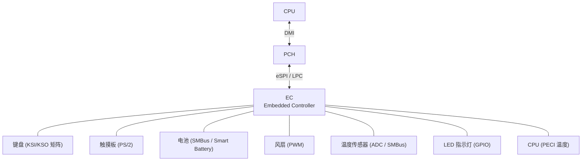
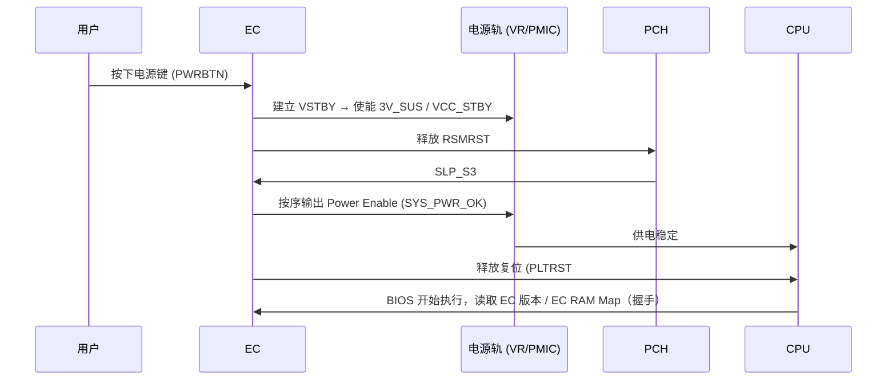
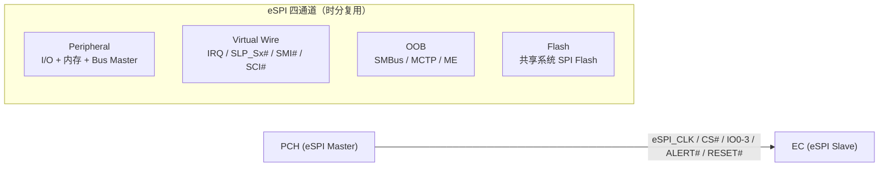
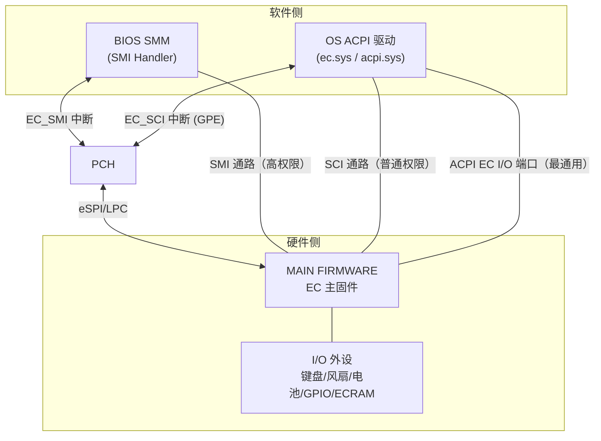
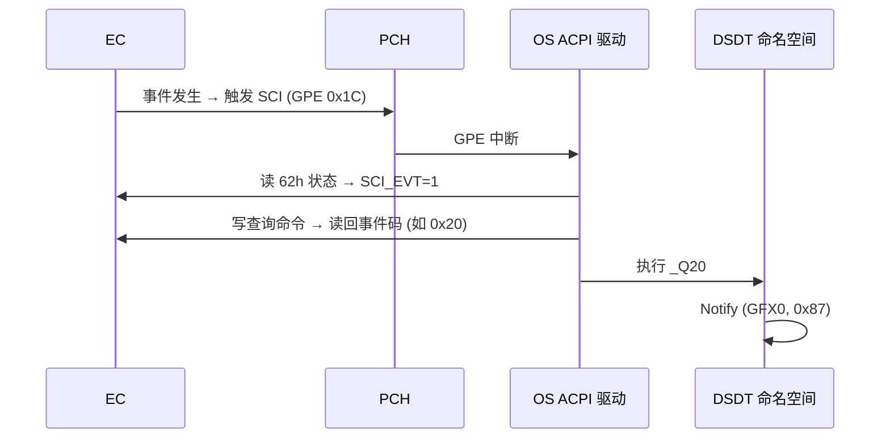
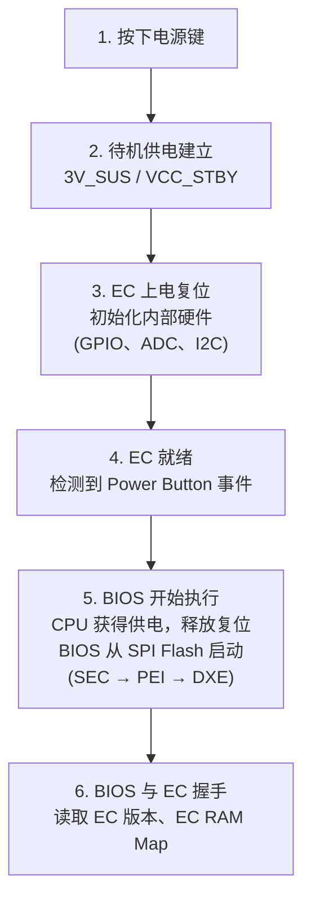
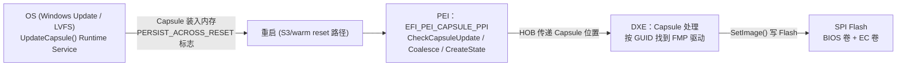

# EC（Embedded Controller）：系统中始终在线的低功耗小脑

EC（Embedded Controller，嵌入式控制器）是笔记本平台不可或缺的独立 MCU：只要有待机供电（VSTBY）它就保持运行，S5 关机状态下仍能响应电源键、RTC 唤醒等事件。它承接了 CPU 不参与的底层硬件管理——电源时序、键盘扫描、电池充放电、温度与风扇控制——并作为 ACPI 事件（SCI/SMI）的硬件来源，与 [[ACPI]]、[[SMI]] 体系深度绑定。

---

## 一、EC 的定位与硬件资源

### 1.1 EC 是什么

EC 是一颗独立于主 CPU 运行的微控制器，拥有自己的固件（存放在独立 Flash 或共享系统 SPI Flash 中）、RAM、ROM 和外设接口。它的存在基于一个工程事实：CPU 在电源管理、键盘扫描这类"慢速、低频、需常驻"的工作上既不高效也不可靠，而这些工作又必须在 CPU 尚未上电（S5/S3）时就绪。EC 由此承担"底层管家"角色。

| 特性 | 说明 |
| --- | --- |
| 独立性 | 独立于主 CPU 运行，不受 CPU 状态（复位、掉电）影响 |
| 常驻性 | 只要有 Standby Power（VSTBY）就保持工作 |
| 角色 | 电源管理、键盘控制、温度监控、电池管理、指示灯控制 |
| 存在场景 | 笔记本必备；部分高端台式机集成 EC 或等效的 Super I/O 芯片 |

> [!note]
> 台式机平台的 Super I/O 与笔记本平台的 EC 功能有重叠：Super I/O 侧重传统 I/O（串口/并口/软驱/硬件监控），EC 侧重电源时序与 KBC。ITE 同时提供两条产品线（IT8xxx 系列 EC 与 IT87xx 系列 SIO），见 [[Super IO]]。用户项目中的 IT8786 即 SIO，其 GPIO 机制与 EC 的 GPIO 扩展思路一致。

### 1.2 硬件资源清单

| 资源 | 规格 | 用途 |
| --- | --- | --- |
| ROM/Flash | 64KB ~ 512KB | 存放 EC 固件 |
| RAM | 4KB ~ 32KB | 数据区，部分映射为 EC RAM（供主机经 ACPI 访问） |
| 时钟 | 8MHz ~ 48MHz | 远低于主 CPU，够用即可 |
| GPIO | 数十 ~ 上百个 | 电源使能、LED、Lid Switch 等 |
| ADC | 8 ~ 16 通道 | 温度、电压采样 |
| PWM | 4 ~ 8 通道 | 风扇、背光控制 |
| I2C/SMBus | 约 5 组 | 电池（Smart Battery）、温度传感器、触摸板 |
| PECI | 1 组 | 读取 CPU 内核温度（Intel 专有单线接口） |
| Keyboard Scan | KSI/KSO | 键盘矩阵扫描 |
| FSPI | 1 ~ 2 | 连接 EC 专用 SPI Flash |
| eSPI/LPC | 1 组 | 与 PCH 通信的主干道 |

### 1.3 系统架构



EC 挂接的外设涵盖模拟（ADC/PWM）、低速数字（I2C/SMBus/PS/2）与系统管理（PECI）三类接口，是笔记本上"传感器-执行器"的汇聚点。

---

## 二、EC 厂商与市场格局

| 厂商 | 主流型号 | 内核/特点 | 市场 |
| --- | --- | --- | --- |
| ITE（联阳） | IT85xx、IT55xx | 台湾厂商，笔记本 EC 市场占有率最高 | 主流笔记本 |
| ENE（迅杰） | KB90xx | 台湾厂商，消费类笔记本常用；Chromebook 应用广泛，支持 eSPI/LPC | 消费类 |
| SMSC / Microchip | MEC 系列 | 欧美厂商，Super I/O 传统强者；MEC14xx/MEC17xx 是首批支持 eSPI 的 EC，Intel eSPI 验证合作伙伴 | 工业/服务器，企业级特性 |
| Nuvoton（新唐） | NPCX 系列 | 基于 ARM Cortex-M 内核，覆盖低中高端 | 笔记本/嵌入式 |
| 芯海（ChipSea） | CSC2E101 等 | 国产，信创领域应用广泛 | 信创 |
| 宏晶微 | MS851x | 国产，支持 eSPI/LPC | 国产替代 |
| 熠和微（IMAGE+） | FIC6288 | 国产 | 国产替代 |
| 凌思维（linkedsemi） | LS011EID | 国产，32 位 RISC-V 内核 | 国产替代 |

> [!note]
> EC 内核架构并无统一标准：Nuvoton NPCX 用 ARM Cortex-M，ITE 主流用 8051 兼容内核，国产凌思维 LS011EID 用 RISC-V。内核差异不影响主机侧抽象——主机看到的只是 60h/64h 端口与 eSPI/LPC 总线上的协议行为。

---

## 三、核心功能一：KBC 与电源管理

### 3.1 键盘控制器（KBC）

EC 通过键盘矩阵扫描（KSI/KSO）检测按键：逐行拉低 KSO，逐列读 KSI，命中后做消抖（debounce）与扫描码（scan code）转换，经 PS/2 模型交给主机。键盘矩阵的"行×列"规模由 GPIO 数量决定，典型为 8×16 左右。

EC 兼容经典 8042 键盘控制器模型，向主机暴露两个 I/O 端口：

| 端口 | 方向 | 内容 |
| --- | --- | --- |
| 60h | 数据 | 读：键盘扫描码、EC 返回数据；写：向 EC 发送数据/参数 |
| 64h | 命令/状态 | 读：状态寄存器；写：命令码 |

### 3.2 8042 交互与 IBF/OBF

主机与 EC 的字节级交互靠状态寄存器的两个标志位同步：

```text
状态寄存器 (64h 读)：
  Bit0  OBF (Output Buffer Full)   1 = EC 有数据等待主机读取
  Bit1  IBF (Input Buffer Full)    1 = 主机写入的数据等待 EC 处理
  Bit2  CMD/Data                   区分最后一次写入的是命令还是数据
```

交互规则（EDK2 中 `EcLib` / `KeyboardController` 驱动的轮询逻辑即如此实现）：

```c
// 主机向 EC 写数据：先等 IBF 清空（EC 取走上一字节），再写
while (IoRead8 (0x64) & BIT1) { /* 轮询等待 IBF == 0 */ }
IoWrite8 (0x64, 0x60);        // 命令：写 60h 端口地址（0x60 = Write to Output Port）
while (IoRead8 (0x64) & BIT1) { /* 轮询等待 IBF == 0 */ }
IoWrite8 (0x60, data);        // 数据写入

// 主机从 EC 读数据：先等 OBF 置位（EC 已放入数据），再读
while (!(IoRead8 (0x64) & BIT0)) { /* 轮询等待 OBF == 1 */ }
data = IoRead8 (0x60);
```

> [!warning]
> 轮询 IBF/OBF 期间不可中断重入：SMI 处理函数中若也访问 60h/64h，会与主路径竞争，造成状态错乱。BIOS 侧对 EC 端口访问需串行化（锁或 SMM 独占窗口）。这也是 ACPI 标准路径（第七章）让 OS 驱动统一管理同步的原因。

### 3.3 电源管理

EC 是电源管理的核心执行者，承担：

- **开关机时序控制（Power Sequence）**：按序发出/确认各路 Power Enable 信号（SYS_PWR_OK、PM_SLP_Sx#、ALL_SYS_PWRGD），等待电源轨稳定后释放 CPU 复位
- **电池管理**：电量检测、健康状态（通过 Smart Battery 的 SMBus 接口读电池内 EEPROM/燃气表）
- **充电控制**：快充、涓流充电策略
- **待机与唤醒管理**：S3/S4/S5 状态下的唤醒事件检测（电源键、RTC、Lid、AC 插入）
- **Fn 组合键**：Fn 键由 EC 捕获并转换，触发亮度/音量等



---

## 四、核心功能二：热管理与系统控制

### 4.1 温度与风扇

EC 通过 ADC 读取各温度传感器（热敏电阻分压），再根据热管理曲线（fan table：温度阈值 → 转速）调节风扇 PWM。典型策略分多档：安静 / 均衡 / 性能。过热保护由 EC 硬件级实现：降频请求（PROCHOT#/PECI）或强制关机。

### 4.2 PECI：CPU 温度的直达通道

PPT 仅列出 PECI 为 EC 的一项接口，其机制值得展开。PECI（Platform Environment Control Interface）是 Intel 专有单线串行接口：

- **拓扑**：客户端平台 CPU 是 PECI slave，EC/BMC 是 PECI master；服务器平台则由 PCH 作 master
- **速率**：2 kbit/s ~ 2 Mbit/s 可变
- **数据源**：片上数字温度传感器（DTS），出厂校准
- **读数语义**：PECI 不返回绝对温度，而是返回**当前温度与热节流点的差值（负值）**。例：CPU 热节流点为 85°C，当前 35°C，则 PECI 读回 -50°C。差值越接近 0 越危险，风扇转速可随差值线性调节，精度高于外部热敏电阻方案
- **Linux 支持**：内核 5.18（2022）起原生支持 PECI

> [!tip]
> EC 的 ADC 测温用于板级传感器（PCB、电池、充电 MOS），PECI 用于 CPU 内核温度——两者互补。BIOS 热策略通常综合两路数据。

### 4.3 杂项控制

| 功能 | 实现 |
| --- | --- |
| LED | 电源/电池/大小写/数字锁定指示灯，GPIO 直驱 |
| Fn 键 | 亮度/音量/飞行模式，EC 捕获并产生 SCI 事件（见第七章） |
| 键盘背光 | PWM 调光 |
| WDT | 看门狗定时器，防止系统挂死 |
| GPIO 扩展 | 主机经 EC 间接控制 PCH 没接出的信号 |
| SMBus 主设备 | 访问板载传感器、电池 |

---

## 五、省电模式：VSTBY 域与 ELPM

EC 自身也有功耗分级。PPT 给出 ITE EC 的 ELPM（Extreme Low Power Mode）时序：


关键点：

- **VSTBY 是 EC 域的电源**，即系统的待机电源；S4/S5 状态下 VSTBY 仍然供电，使 EC 能比其他部件更早唤醒
- **VSTBY0**：EC 内部的常供电域，由 PWRSW 或 AC_IN# 触发建立——即使系统深度掉电，只要有 AC 或电池，EC 核心就保持最小工作状态
- ELPM 下 EC 关闭大部分外设时钟，仅保留电源键检测与 RTC 唤醒逻辑

> [!note]
> 这条电源链与 [[CMOS、CPU、PCH 知识体系梳理]] 中 PCH 的 SUS 电源域逻辑呼应：S5 状态下 PCH 靠 VCCSUS 保持 RTC 与深度睡眠控制器（Deep Sx）工作，EC 同理靠 VSTBY 保持电源管理能力。

---

## 六、交互原理一：LPC → eSPI 总线演进

EC 与 PCH 之间走低速总线。演进方向为 LPC → eSPI，Intel 100 系列（Skylake 平台）起 eSPI 成为标配。

### 6.1 对比

| 特性 | LPC | eSPI |
| --- | --- | --- |
| 全称 | Low Pin Count | Enhanced Serial Peripheral Interface |
| 信号数 | 约 13 引脚（含边带信号） | 5~6 引脚（时钟/片选/IO0-3/ALERT#/RESET#） |
| 电平 | 3.3V | 1.8V |
| 时钟 | 33MHz 固定 | 最高 66MHz（20/25/33/50/66 可选） |
| 数据宽度 | 4 位复用 | 1/2/4 位串行 |
| 带宽 | 约 16MB/s | 最高约 66MB/s（四通道） |
| 运行状态 | 仅 S0 | S0~S5 均可 |
| Flash 共享 | 不支持 | 支持 |
| 虚拟线（边带信号） | 物理引脚 | 数据包内传输 |
| 定位 | Intel 替代 ISA 的过渡总线 | 替代 LPC + SPI + SMBus + 边带信号的统一总线 |

### 6.2 eSPI 四个通道

eSPI 是四通道复用的协议：

| 通道 | 用途 | 替代对象 |
| --- | --- | --- |
| Peripheral（外设） | I/O 周期与内存周期，访问 EC/SIO/BMC 内部寄存器、邮箱、UART、端口 80 等；支持 Bus Master（EC 直接读写系统 DRAM） | LPC 的 I/O/内存/DMA |
| Virtual Wire（虚拟线） | 以数据包传输边带信号：IRQ、SLP_Sx#、SMI#、SCI#、PLTRST# | 串行 IRQ、物理 GPIO 边带 |
| OOB（带外） | SMBus 流量隧道（MCTP 等），与 ME 通信 | PCH 温度/RTC 读取的 SMBus 端口、PECI 端口 |
| Flash（闪存） | 共享系统 SPI Flash（MAFS/SAF 模式），BIOS/ME/EC 共用一颗 Flash | 独立 SPI Flash 芯片 |



> [!note]
> 无论 LPC 还是 eSPI，**上层软件模型基本一致**：BIOS 代码通常只需更换底层驱动（如 AMI Aptio 的 `LpcLib` → `EspiLib`），ACPI 的 EC 操作区域、60h/64h 端口语义不变。这正是总线演进能保持生态兼容的原因。

---

## 七、交互原理二/三/四：60h/64h、三路通路与 ACPI EC Space

### 7.1 主机访问 EC 的三条通路

PPT 给出 BIOS 读写 EC RAM 的完整通路图，整理如下：

| 通路 | 使用者 | 权限 | 用途 |
| --- | --- | --- | --- |
| SMI Interface | BIOS SMM 代码 | 高（Ring -2） | 读写 EC RAM、电源关键配置；EC 产生 EC_SMI 中断给 PCH |
| SCI Interface | OS ACPI 驱动 | 普通 | 上报键盘、风扇、电池事件；EC 产生 EC_SCI（GPE） |
| ACPI EC I/O 端口 | OS ACPI 驱动（最通用） | 普通 | 经 EmbeddedControl OperationRegion 读写 EC RAM |



### 7.2 ACPI 标准访问：EmbeddedControl OperationRegion

OS 通过 ACPI 定义的标准方式访问 EC RAM：`OperationRegion` 类型为 `EmbeddedControl`，读写由内核 EC 驱动（Linux `drivers/acpi/ec.c`、Windows `ec.sys`）翻译成 60h/64h 端口事务，OS 自动处理同步与超时，无需手动轮询 IBF/OBF。

```asl
// DSDT 中的典型 EC 设备声明
Device (EC0) {
    Name (_HID, EISAID ("PNP0C09"))        // Embedded Controller 设备
    Name (_CRS, ResourceTemplate () {      // 端口与 GPE
        IO (Decode16, 0x62, 0x62, 0x0, 0x1)   // 数据端口
        IO (Decode16, 0x66, 0x66, 0x0, 0x1)   // 命令/状态端口
    })
    Name (_GPE, 0x1C)                      // EC 使用的 GPE 位

    OperationRegion (ERAM, EmbeddedControl, Zero, 0xFF)  // EC RAM 0x00~0xFF
    Field (ERAM, ByteAcc, Lock, Preserve) {
        Offset (0x60),                     // 厂商自定义偏移
        BAT0, 16,                          // 电池电量字段
        TEMP, 8,                           // 温度字段
        ...
    }
}
```

> [!note]
> 规范位置：ACPI 6.5 中 EmbeddedControl OperationRegion 定义在 **§5.5.2（Embedded Control Interface）**；ECDT（Embedded Controller Boot Resource Table）在 **§5.2.15**——ECDT 让 OSPM 在命名空间求值前即可访问 EC，解决启动早期 AML 访问 EC 的时序问题。事件队列机制（_Qxx）见 §5.6.4.1.1。

### 7.3 EC 事件与 _Qxx 查询机制

EC 检测到硬件事件（Fn 键、Lid、电池插拔、AC 插入）后，置位内部事件寄存器并触发 SCI（GPE）。OS 的 EC GPE 处理流程：

1. 读 62h/状态字节，检查 **SCI_EVT** 位，确认事件来源是 EC
2. 向命令端口写查询命令（Query，通常 0x84）
3. 从数据端口读回 8 位**事件码**（0~255）
4. 事件码映射为 `_Qxx` 方法（xx 为十六进制）；事件码 0x00 保留，表示无待处理事件
5. 执行对应 `_Qxx`，方法内通常调用 `Notify()` 通知设备驱动

```asl
// 示例：Fn+亮度键 → EC 事件码 0x20/0x21 → 触发 DSDT 方法
Method (_Q20, 0, NotSerialized) {
    Notify (GFX0, 0x87)   // 亮度增加
}
Method (_Q21, 0, NotSerialized) {
    Notify (GFX0, 0x86)   // 亮度降低
}
```



### 7.4 EC RAM Map

EC 内部 RAM 的部分区域映射到主机可见的地址空间（通常 0x00~0xFF 或更大，经 eSPI/LPC 的 I/O 窗口访问），用于交换状态与命令。**EC RAM Map 是 BIOS 工程师最常用的参考文档**：它定义了每个偏移的字段语义（电源状态、电池电量、温度、厂商命令）。字段布局由 EC 固件决定，属厂商私有，Aptio V 平台的 EC 驱动与 ACPI 方法需按 RAM Map 逐一对应。

---

## 八、EC 启动时序：系统最先启动的处理器



时序要点：

- **EC 是最先启动的处理器**：电源键按下 → 待机供电建立 → EC 上电复位，早于 CPU
- EC 初始化完内部硬件（GPIO/ADC/I2C）后，开始**按序发出 Power Enable 信号**（SYS_PWR_OK / PM_SLP_Sx# / ALL_SYS_PWRGD）
- CPU 供电就绪后 BIOS 从 SPI Flash 启动；BIOS 启动早期即与 EC 握手（读 EC 版本、EC RAM Map），确认固件配套
- 该时序与 [[SEC & PEI]] 的 SEC 阶段职责衔接：SEC 之前 EC 已完成平台级上电，BIOS 拿到的是"干净可用的系统"

---

## 九、固件升级原理：两种更新方式

| 维度 | 方式一：BIOS Capsule Update | 方式二：独立刷新（Direct Flash Programming） |
| --- | --- | --- |
| 原理 | BIOS 将 EC 固件打包进 BIOS Capsule | 经调试接口/编程器直接烧写 EC Flash |
| 场景 | 研发及量产阶段升级 | 开发阶段、EC 变砖恢复 |
| 优点 | 无需拆机、用户可自行操作、安全可靠 | 不依赖 BIOS、变砖也能救、速度快 |
| 缺点 | 依赖 BIOS 配合；EC 变砖后无法自救 | 需拆机/专用工具、操作复杂 |
| 工具 | Capsule + FMP 驱动（DXE 阶段/OS 下/UEFI Shell） | JTAG/SWD 调试器、SPI Flash 编程器 |

量产产品主要依赖 Capsule Update，开发阶段两种方式都会用到。

### 9.1 Capsule Update 的底层链路（PPT 之外）

EC 固件更新复用了 UEFI 标准 Capsule 机制，完整链路：



关键组件：

- **FMP（Firmware Management Protocol，UEFI 2.4 起）**：`GetImageInfo / GetImage / SetImage / CheckImage / GetPackageInfo / SetPackageInfo`。每个可更新固件（BIOS、EC、ME 等）对应一个 FMP 实例，按 GUID 区分
- **ESRT（EFI System Resource Table）**：向 OS 报告"哪些固件可更新、当前版本"，OS 据此匹配更新包
- **PEI 阶段**：`EFI_PEI_CAPSULE_PPI`（Coalesce 合并 SubCapsule、CheckCapsuleUpdate 查 CMOS 标志、CreateState 写 HOB）
- **多镜像与依赖**：一个 Capsule 可同时携带 BIOS + EC 多个镜像；元数据可声明依赖（如 BIOS 需 EC ≥ 某版本），不满足则不更新，避免变砖
- **安全**：Capsule 需数字签名验证；Flash 在启动后被锁定，因此 OS 下不能直接写 Flash，只能走"重启后、解锁窗口期"更新

> [!warning]
> eSPI 平台的 EC 固件通常存放于**共享的系统 SPI Flash**（Flash 通道），而非独立芯片。这意味着 BIOS 刷写时必须保护 EC 卷不被误覆盖，反之 EC 更新也不能破坏 BIOS 卷；Aptio V 的 Flash Descriptor 与 PCH SPI 控制器（HSFS/HSFC 寄存器）负责区域划分与锁定。EC 变砖后无法用 Capsule 自救，只能走独立刷新（JTAG/编程器）——这正是上表两种方式并存的原因。

---

## 十、BIOS 开发视角：与 EC 相关的工程要点

结合已学知识，EC 贯穿 BIOS 开发的多个层面：

| 层 | 关联 | 已有笔记 |
| --- | --- | --- |
| ACPI | EC OperationRegion、_Qxx、ECDT | [[ACPI]] |
| SMI | EC_SMI 通路，SMM 中读写 EC RAM 做电源关键配置 | [[SMI]] |
| 总线 | eSPI/LPC 初始化（PCH eSPI 控制器寄存器配置） | [[CMOS、CPU、PCH 知识体系梳理]] |
| GPIO | EC GPIO 扩展 vs PCH GPIO 与 SIO GPIO | [[GPIO]]、[[Super IO]] |
| 主板架构 | EC 在笔记本电源链中的位置 | [[X86平台主板架构]] |
| 固件更新 | Capsule Update / FMP / ESRT | [[RunTime Services]] |

> [!tip]
> 调试 EC 相关问题时，优先确认三件事：① EC 固件版本与 BIOS 是否配套（握手失败会导致开机异常）；② EC RAM Map 与 ACPI 方法中的字段偏移是否一致（偏移错位是热键/电池异常的常见根因）；③ 60h/64h 访问是否被 SMM 与 OS 驱动并发竞争。

---

## 术语表

| 术语 | 含义 |
| --- | --- |
| EC | Embedded Controller，嵌入式控制器，笔记本平台的低功耗管理 MCU |
| VSTBY | EC 域待机电源，S4/S5 下仍供电 |
| ELPM | Extreme Low Power Mode，EC 极低功耗模式 |
| KBC | Keyboard Controller，键盘控制器（8042 兼容模型） |
| KSI/KSO | Keyboard Scan In/Out，键盘矩阵扫描信号 |
| IBF/OBF | Input/Output Buffer Full，8042 状态寄存器标志位 |
| SCI | System Control Interrupt，系统控制中断（OS 可处理） |
| SMI | System Management Interrupt，系统管理中断（SMM 处理） |
| GPE | General Purpose Event，ACPI 通用事件位 |
| _Qxx | ACPI EC 事件查询方法，xx 为事件码 |
| ECDT | Embedded Controller Boot Resource Table，ACPI 启动资源表（§5.2.15） |
| EC RAM Map | EC RAM 偏移-语义对照表，BIOS 工程师的常用参考 |
| LPC | Low Pin Count，Intel 低速总线（ISA 替代者） |
| eSPI | Enhanced Serial Peripheral Interface，LPC 的后继总线（四通道） |
| MAFS/SAF | eSPI Flash 通道的两种访问模式（Memory Access / Slave Attached Flash） |
| PECI | Platform Environment Control Interface，Intel 单线 CPU 温度接口 |
| DTS | Digital Thermal Sensor，片上数字温度传感器 |
| Capsule | UEFI 固件更新数据包（含 FMP/ESRT 机制） |
| FMP | Firmware Management Protocol，固件管理协议 |
| ESRT | EFI System Resource Table，固件资源表（OS 查询可更新固件） |
