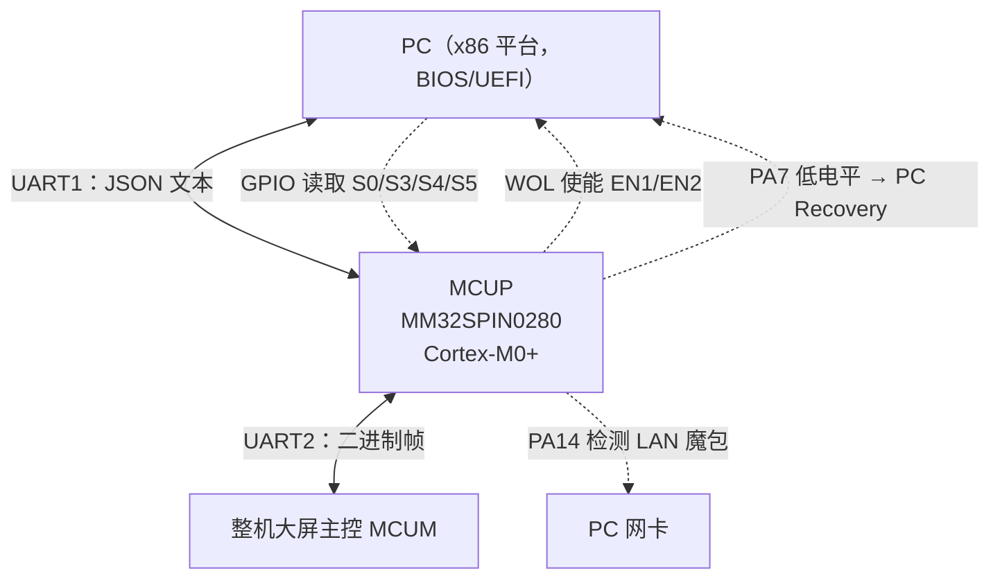
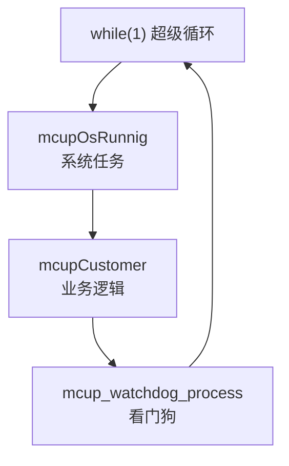
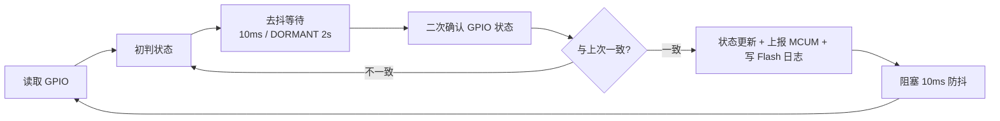
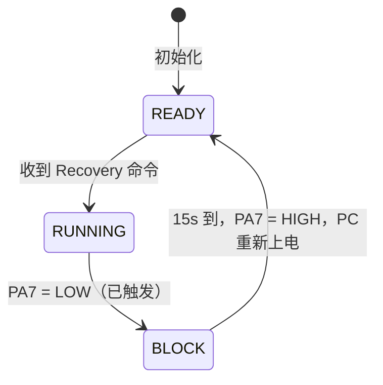
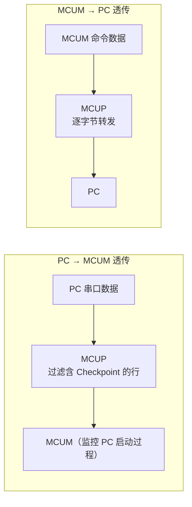
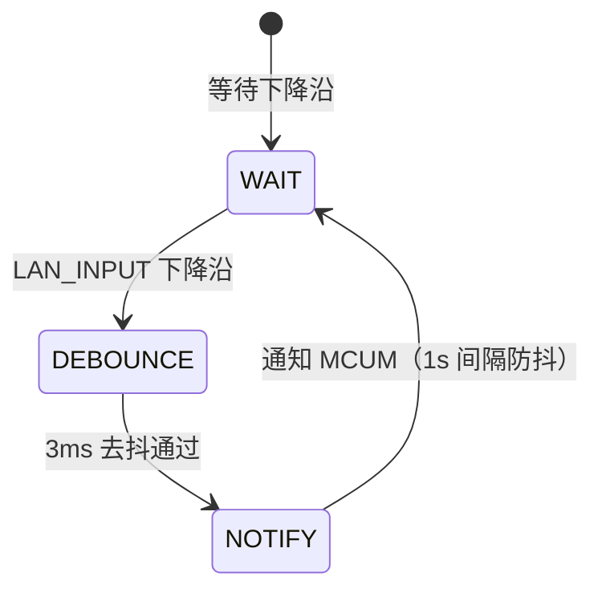
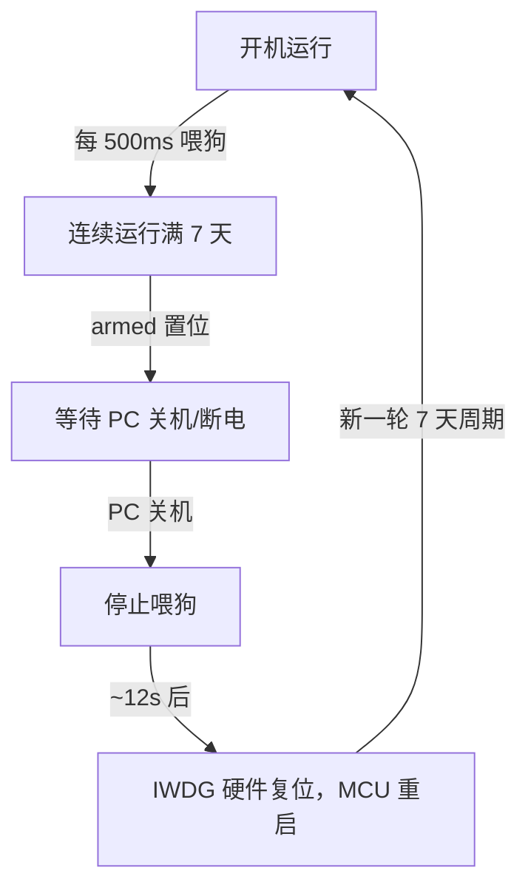

# MCUP：连接 PC 与整机大屏的电源管理协处理单元

MCUP（MCU Power 桥接模块）是基于灵动微 MM32SPIN0280（ARM Cortex-M0+，96MHz）的独立协处理器固件（FW V0.03），部署在 PC 模块与整机大屏主控（MCUM）之间。它通过两条 UART 分别承载与 PC BIOS 的 JSON 文本交互、与 MCUM 的二进制帧交互，并用 GPIO 直读 PC 的 ACPI 电源状态（S0/S3/S4/S5）、控制 WOL 使能与 PC Recovery。角色上接近上一课 [[2026-8-25 学习记录|EC]]：都是"CPU 不参与的常驻电源管理单元"，但 MCUP 不接键盘/电池/风扇，专注 PC 电源状态感知与整机联动。本篇基于 8-26 培训 PPT，并补充 ACPI S 状态信号语义、PWRBTN# 无条件断电机制、WOL 魔包结构、POST Code 输出链路等 PPT 未展开的底层细节。

---

## 一、系统架构：三端拓扑与主循环

### 1.1 定位

MCUP 是 PC BIOS 与整机大屏 MCUM 之间的桥梁：

| 通道 | 对象 | 协议 | 用途 |
| --- | --- | --- | --- |
| UART1（PA9/PA10） | PC BIOS | JSON 文本 | 命令交互 + POST Code 采集 + 透传 |
| UART2（PA2/PA3） | 整机大屏 MCUM | 二进制帧 | 状态上报 + 远程控制 |
| GPIO | PC 硬件 | 电平 | S0/S3/S4/S5 状态读取、WOL 使能、Recovery |



MCUP 的 GPIO 侧线全部直接对 PC 硬件生效：读取 ACPI 状态、控制网卡 WOL 使能、触发 PC 强制重启。MCUM 只通过串口协议间接操纵这些功能。

### 1.2 主循环任务模型

固件是裸机超级循环（super loop），无 RTOS：

```c
while (1) {
    mcupOsRunnig();          // 系统任务：Recovery + GPIO读取 + 串口组帧 + MCUM发送
    mcupCustomer();          // 业务逻辑：状态上报 + 透传 + 品牌/错误码 + 命令解析
    mcup_watchdog_process(); // 看门狗：500ms喂狗 + 7天armed逻辑
}
```



三个函数依序轮转，配合 SysTick 1ms 中断做时间基准。中断（UART 收发）只做数据搬运，业务处理全部落在主循环，避免在中断上下文里做重活——这是 Cortex-M0+ 裸机程序的典型分工。

---

## 二、系统基础：调度、时钟与版本

### 2.1 系统调度（user_logic/mcupControlOtherObjectApi.c）

| 阶段 | 内容 |
| --- | --- |
| 系统初始化 | Crash 回溯、CRC32 版本号、串口收发、GPIO 初始化 |
| 系统运行任务 | Recovery、GPIO 去抖、串口组帧、MCUM 队列 |
| 业务逻辑调度 | 状态上报、透传、品牌、错误码、POST Code、命令解析、升级检测、WOL 魔包 |

### 2.2 系统时钟与中断（user/main.c）

- SysTick 1ms 中断 → `uwTick` 全局毫秒计数器
- 所有超时判断（去抖、组帧超时、WatchDog 周期）都以 `uwTick` 为基准
- 500ms 周期计数器 + 延迟计数器由 `uwTick` 派生

SysTick 是 ARM Cortex-M 内核自带的 24 位递减计数器，不占用外设定时器；在裸机工程里"1ms 心跳 + 全局 tick + 软件定时器"是最轻量的调度方案，等价于 Keil 工程里常见的 `HAL_GetTick()` 模式。

### 2.3 版本管理

| 项 | 值 |
| --- | --- |
| 硬件版本 | V1.0.0 |
| 软件版本 | V0.1.0 |
| 固件标识 | MCUP-General_V0.03_A0DF4B83_M280 |
| MCU | MM32SPIN0280（ARM Cortex-M0+） |

固件标识中 `A0DF4B83` 是固件镜像的 CRC32，作为固件指纹参与升级校验与版本比对（见第七章 CRC）。

---

## 三、硬件驱动层

### 3.1 GPIO 引脚清单（user/driver_gpio.c）

| 引脚 | 端口 | 方向 | 功能 |
| --- | --- | --- | --- |
| PC_S0 | PA1 | 输入（浮空） | PC ACPI S0 状态 |
| PC_S3 | PA0 | 输入（浮空） | PC ACPI S3 状态 |
| PC_S4 | PA4 | 输入（浮空） | PC ACPI S4 状态 |
| PC_S5 | PA5 | 输入（浮空） | PC ACPI S5 状态 |
| RECORY_PC | PA7 | 输出（推挽） | PC Recovery（低电平 15s） |
| WOL_EN1 | PB0 | 输出（推挽） | WOL 使能 1 |
| WOL_EN2 | PB1 | 输出（推挽） | WOL 使能 2 |
| LAN_INPUT | PA14 | 输入（上拉） | LAN WOL 魔包检测 |
| LED_TST | PB10 | 输出（推挽） | 测试 LED |

关键设计约束：

- 输入引脚全部配置为浮空/上拉，避免对 PC 侧信号造成负载；
- PA7 低电平有效且持续 15s——这是"模拟长按电源键"的电气实现（底层机制见 8.2 节 PWRBTN# 无条件断电）；
- WOL 使能采用 EN1/EN2 双 GPIO 差分控制（EN1=LOW, EN2=HIGH 开；EN1=HIGH, EN2=LOW 关），防止单线故障导致误使能；
- LAN_INPUT 内部上拉，检测网卡魔包信号的下降沿。

### 3.2 PC ACPI 状态判定真值表

| PC 状态 | S0 | S3 | S4 | S5 |
| --- | --- | --- | --- | --- |
| PC_RUNNING（运行） | 0 | 1 | 0 | 1 |
| PC_SLEEP（休眠） | 0 | 0 | 0 | 1 |
| PC_DORMANT（深度休眠） | 0 | 0 | 1 | 1 |
| PC_SHUT_DOWN（关机） | 0 | 0 | 1 | 0 |
| PC_POWER_OFF（断电） | 1 | 0 | X | 0 |

- 去抖策略：DORMANT 状态 2s 去抖（防误判），其他状态 10ms 去抖；
- 状态判定分两步：先读 GPIO 初判，去抖后再二次确认，避免电源状态跳变瞬间误报。

> [!warning]
> 该真值表以硬件工程师原理图为准。四个引脚的电平语义取决于原理图具体接法（接 PCH 的 SLP_S3#/SLP_S4#/SLP_S5# 反相输出，还是接电源轨指示信号），PPT 未给出接线，排查 PC 状态误判（见 FAQ Q1）时第一件事就是核对引脚连接与真值表的对应关系。

四个 GPIO 判定 ACPI 状态的组合本质，是对 PCH 电源状态信号的软件复刻——PCH 自身维护 G0/G1/G2/G3 全局状态与 SLP_Sx# 输出（见 8.1 节），MCUP 用 4 个 GPIO 采集该状态的外化信号。状态变化经去抖确认后：



### 3.3 UART 通信（user/driver_uart.c，115200 8N1）

| 通道 | 引脚 | 中断优先级 | 承载 |
| --- | --- | --- | --- |
| UART1 | PA9/PA10 | 0（最高） | JSON 命令交互 + POST Code 采集 |
| UART2 | PA2/PA3 | 1 | 二进制帧协议通信 |

- 接收均走中断逐字节处理，UART1 优先级最高，保证 PC 命令与 POST Code 不丢；
- 发送均为阻塞方式（轮询 TXE 标志），裸机下避免发送中断与接收中断的嵌套复杂度。

### 3.4 Flash 存储布局（user_logic/PcPostCodeHandle.c）

| 地址 | 内容 | 大小 |
| --- | --- | --- |
| 0x08000000 | Flash 起始 | — |
| 0x0800C800 | POST Code 存储 | 1KB |
| 0x0800C800 | PC 状态日志 | 1KB |
| SYS_KEY | FootPrint 密钥 | 32B |
| 0x08010000 | Flash 结束（应用区） | — |

- 支持页擦除（1KB/页）、字写入（4 字节对齐）、字节读取——MM32SPIN0280 片内 Flash 的标准操作方式；
- POST Code 与 PC 状态日志复用同一地址区，按各自生命周期写入；
- SYS_KEY 是 FootPrint 密钥（32B），用于固件/产品身份标识。

> [!note]
> PPT 标注"64KB 总容量"（0x08000000 ~ 0x08010000），而 MM32SPIN0280 芯片规格为 128KB Flash（0x08000000 ~ 0x0801FFFF）。差异说明该 64KB 是 Bootloader + APP 双区划分下的**应用分区**，Bootloader 独立占用（课后任务即 MCU 固件烧录，Bootloader + APP 双区结构）。

---

## 四、PC 交互

### 4.1 串口收发（mcupPcUsartRead.c / mcupPcUsartWrite.c）

- 接收：中断逐字节接收，双缓冲机制；满 32 字节或超时 5ms 自动组帧——这是"长度未知"串口帧的标准定界策略（长度定界 + 时间定界）；
- 发送：将 MCUM 透传数据逐字节转发至 PC。

### 4.2 PC 状态检测状态机（mcupPcGpioRead.c）

读取 GPIO → 去抖 → 二次确认 → 阻塞 10ms → 循环。状态变化时自动上报 MCUM，同时写入 Flash 日志便于问题追溯。这是 MCUP 最核心的功能：MCUM 与大屏据此判断 PC 是否可交互（运行/休眠/深度休眠/关机/断电）。

### 4.3 PC Recovery（user_logic/mcupPcGpioWrite.c）

触发条件：

- MCUM 发送 `M_TO_P_RECOVERY_PC` 命令；
- PC 发送 `mcumsetmcustatus=upgrade` 后超时。



> [!warning]
> Recovery 过程中 PA7 持续低电平 15s，此期间 PC 无法响应其他命令；该操作不可中断。工程语义：PC 死机/无响应时，MCUP 拉低 PA7 模拟**长按电源键 15 秒**，触发 PCH 的电源按钮无条件断电 override（PWRBTN# 保持断言 ≥4s，见 8.2 节），随后恢复高电平让 PC 重新上电。具体"断电→再上电"的路径（PA7 直连 PWRBTN# 还是经 EC/SIO 转发、是否联动 PS_ON#）取决于主板原理图。

### 4.4 JSON 命令协议（16 条）

MCUP 通过 UART1 接收 PC 的 JSON 文本命令，**命令匹配采用字符串前缀比较（strncmp），不做严格 JSON 解析**——Cortex-M0+ 上省掉 JSON 解析器的 RAM/Flash 开销，且容错更好（PC 侧拼接/换行差异不影响匹配）。

版本 / 状态 / 升级：

| JSON 命令 | 功能 |
| --- | --- |
| `{"method":"mcupgetversion"}` | 获取 MCUP 固件版本（CRC32） |
| `{"method":"mcupgetmoduleversion"}` | 获取模块型号（mm32spin0280） |
| `{"method":"mcupgetotakey"}` | 获取 OTA 密钥 |
| `{"method":"mcupsetmcustatus","value":"upgrade"}` | 设置升级模式（15s 超时重启） |
| `{"method":"mcupsetmcustatus","value":"work"}` | 设置工作模式 |
| `{"method":"mcupgetmcustatus"}` | 查询 MCU 状态 |

WOL 控制：

| JSON 命令 | 功能 |
| --- | --- |
| `{"method":"mcumsetwol","value":"on"}` | 开启 WOL |
| `{"method":"mcumsetwol","value":"off"}` | 关闭 WOL |
| `{"method":"mcumgetwol"}` | 查询 WOL 状态 |

品牌 / 错误码 / POST Code 查询：

| JSON 命令 | 功能 |
| --- | --- |
| `{"method":"mcumgetbrandcode"}` | 获取品牌代码 |
| `{"method":"mcumgeterrorcode"}` | 获取错误码 |
| `{"method":"mcumgetpostcode"}` | 读取 Flash 中的 POST Code |

USB Ready 管理：

| JSON 命令 | 功能 |
| --- | --- |
| `{"method":"mcumSwitchUsbBIOSReady"}` | USB BIOS Ready（bit0） |
| `{"method":"mcumSwitchUsbOSReady"}` | USB OS Ready（bit1） |
| `{"method":"mcumgetUsbReady"}` | 查询 USB Ready 标志 |
| `{"method":"mcupgetUsbSend"}` | 查询 USB Send 标志 |

### 4.5 串口透传



- PC → MCUM：将 PC 串口数据透传至 MCUM，过滤含 `Checkpoint` 的数据（POST Code 单独处理，见 6.5 节）；
- MCUM → PC：逐字节转发，MCUM 借此通道远程控制 PC。

---

## 五、MCUM 通信：二进制帧协议

### 5.1 帧格式（9 + N 字节）

```text
┌────┬────┬────┬────────┬────────┬──────────┬─────────┬──────────────┬──────────┐
│ AA │ BB │ CC │ MainID │ SubID  │ DataLen  │ Reserve │ Data[0~32]   │ CheckSum │
└────┴────┴────┴────────┴────────┴──────────┴─────────┴──────────────┴──────────┘
 帧头(3B)        命令ID             长度       保留      数据(N≤32B)      校验
```

```text
CheckSum = (AA + BB + CC + MainID + SubID + DataLen + Reserve + 全部 Data) 之和的低 8 位
```

> [!note]
> `9 + N` 的字节计数隐含 DataLen 为 2 字节（3 帧头 + MainID 1 + SubID 1 + DataLen 2 + Reserve 1 + N + CheckSum 1 = 9 + N）。PPT 未明确各字段宽度，实现时以协议头文件为准。

### 5.2 接收状态机（mcupMcumUsartRead.c）

中断逐字节接收 → 状态机校验帧头 `AA→BB→CC` → 校验 CheckSum → 通过后入命令队列。帧头校验 + 累加和校验双保险：帧头解决字节对齐，CheckSum 解决内容完整性。

### 5.3 发送：双队列机制（mcupMcumUsartWrite.c）

| 队列 | 语义 | 用途 |
| --- | --- | --- |
| 一次性队列 sendOnceQueue | 按间隔定时发送，发完即弃 | 状态上报、命令应答 |
| 循环队列 sendLoopQueue | 周期重复发送，直到收到停止命令 | PC 状态持续上报（MCUM 确认后停止） |

循环队列典型场景：PC 状态变化后持续上报，直到 MCUM 回 `ACK_SEND_PC_STATE` 停止——保证 MCUM 一定收到，又不会永久占用带宽。

### 5.4 MCUM 命令列表（13 条）

| 命令 | 功能 |
| --- | --- |
| ACK_SEND_PC_STATE | 停止循环发送（确认收到 PC 状态） |
| GET_PC_STATE | 查询 PC 状态并回复 |
| UNVARNISHED_SEND_TO_PC | MCUM 透传数据到 PC |
| SET_MCUP_GPIO_MODE | 设置 GPIO 模式（浮空/上拉/下拉/推挽/开漏） |
| SET_MCUP_GPIO_LEVEL | 设置 GPIO 电平 |
| GET_MCUP_GPIO_LEVEL | 读取 GPIO 电平 |
| GET_MCUP_VERSION | 获取 MCUP 版本（CRC32，4 字节） |
| SET_OPEN_WOL | 开启 WOL 并回复 |
| SET_CLOSE_WOL | 关闭 WOL 并回复 |
| RECOVERY_PC | 触发 PC Recovery |
| GET_PC_VENDOR | 获取 PC 品牌代码 |
| GET_PC_ERROR_CODE | 获取 PC 错误码 |
| GET_PC_USB_READY | 获取 USB Ready 标志 |

MCUM 可远程控制 MCUP 的 GPIO（模式/电平），意味着整机大屏可经此通道间接操纵 PC 侧硬件——MCUP 在这里是"可远程编程的电源管理执行器"。

---

## 六、业务功能

### 6.1 品牌识别

| 关键字 | 编码 |
| --- | --- |
| SEEWO | 1 |
| MAXHUB | 2 |
| CVTOUCH | 3 |
| CUSTOMER | 4 |
| MH_DIANSHANG | 5 |

从 PC 串口数据中自动匹配品牌关键字（BIOS 启动时输出的产品标识字符串），识别后存储编码供 MCUM 查询——整机大屏据此区分接入的 PC 模块品牌，做差异化联动。

### 6.2 错误码检测

| 关键字 | 错误类型 | 编码 |
| --- | --- | --- |
| 1PCM1 | CMOS | 1 |
| 1PCM2 | HDD | 2 |
| 1PCM3 | EDID | 3 |
| 1PCM4 | 显卡 | 4 |
| 1PCM5 | ME | 5 |
| 1PCM6 | 内存 | 6 |

从 PC POST 串口数据中匹配错误码，**只升不降**（严重度递增），确保最高级别错误不被后续低严重度错误覆盖。覆盖了从 [[CMOS、CPU、PCH 知识体系梳理|CMOS]]、存储（HDD）、显示链路（EDID/显卡）、Intel ME 到内存的典型开机故障域，与 BIOS POST 失败点一一对应。

### 6.3 USB Ready 管理

标志位管理 PC USB 切换状态：

| 标志 | bit0 | bit1 |
| --- | --- | --- |
| SocUsbSwitchFlag | BIOS Ready | OS Ready |
| UsbSendFlag | USB Send | USB ACK |

流程：PC 依次发送 BIOS Ready → OS Ready 命令 → MCUP 记录标志并通知 MCUM 完成 USB 切换。

> [!tip]
> 这是整机大屏的 USB 通路复用机制：USB 资源在 PC 模块与整机主控之间切换。BIOS 阶段 USB 归属 PC（BIOS 需枚举键盘/启动设备），OS 就绪后按策略保持或切回。与用户侧 H61 项目调试的 USB 供电 GPIO（GPP_D16~D23，PWREN_USBxx）属同一类问题域——USB 通路的供电与切换都依赖固件侧的标志/GPIO 协同（见 [[GPIO]]、[[USB]]）。

### 6.4 WOL（Wake-on-LAN）

- 使能控制：`EN1=LOW, EN2=HIGH` 开启；`EN1=HIGH, EN2=LOW` 关闭；
- 魔包检测：LAN_INPUT（PA14）下降沿 + 3ms 去抖确认 → 通知 MCUM，间隔 1s 防抖。



WOL 底层是 AMD 1995 年发布的 Magic Packet 技术（见 8.3 节）：6 字节 `0xFF` 前导 + 目标 MAC 重复 16 次，网卡识别后触发唤醒。MCUP 的 LAN_INPUT 检测的是网卡侧外化的"魔包到达"信号（Link/Activity 或网卡 WOL 输出），据此让整机大屏得知"PC 将被网络唤醒"。

### 6.5 POST Code 采集与存储（PcPostCodeHandle.c）

数据流：


- 从 PC 串口数据中过滤含 `Checkpoint` 的行，缓存到 1KB 缓冲区；
- 等待 10s 后批量写入 Flash（0x0800C800）——**10s 延迟写**的目的是等 POST 结束一次性落盘，减少 Flash 擦写次数（Flash 有写寿命）；
- 可通过 PC JSON 命令 `mcumgetpostcode` 读取已存储的 POST Code，用于追溯 PC 启动自检过程，定位开机失败问题。

> [!note]
> POST Code（Checkpoint）是 BIOS 在自检各步骤向 I/O 端口 80h 输出的状态码，传统上用 POST 卡读取；本方案中 CVTE 定制 BIOS 将启动日志经串口文本输出，MCUP 旁路监听串口并过滤 `Checkpoint` 行即可获得完整启动轨迹。与用户日常用 sscom5131 比对串口 DEBUG 输出的验证手段同源（见 8.4 节）。

### 6.6 固件升级管理（pcControlOtherObjectApi.c）

| 方式 | 触发 | 动作 |
| --- | --- | --- |
| PC 命令触发 | PC 发送 upgrade 命令 | 15s 超时后 `NVIC_SystemReset()` |
| 升级工具触发 | 检测连续升级字节命令 | 满足条件后 `NVIC_SystemReset()` |

两种方式最终都通过系统重启进入 Bootloader 升级模式（Bootloader + APP 双区，课后任务为烧录 SOP）。

---

## 七、系统保障

### 7.1 WatchDog：7 天 armed 机制（mcupWatchDog.c）

针对整机**长时间不断电**场景设计：

| 参数 | 值 |
| --- | --- |
| 喂狗间隔 | 500ms |
| IWDG 超时 | ~12s |
| Armed 触发 | 连续运行满 7 天 |



设计动机：整机大屏常年通电，MCUP 连续运行越久，状态漂移风险越高（RAM 碎片、计数器饱和、状态机卡死）。armed 后借 PC 关机窗口主动让 IWDG 复位 MCU，**把"重启"安排在系统空闲时**，避免运行中重启导致 PC 状态丢失。IWDG（独立看门狗）由内部 LSI 时钟驱动，独立于主时钟，MCU 死机时依然有效。

### 7.2 CRC 校验

- CRC-8/16/CCITT/32 多算法库；
- 固件版本号 = CRC32（固件指纹，见 2.3 节）；
- 升级数据带 BOARD_TYPE 校验，防止跨机型刷写。

### 7.3 队列与调试

- 中断安全循环队列（关中断保护）：UART 中断入队、主循环出队，临界区用关中断（Cortex-M0+ 无 BASEPRI，只能用 `__disable_irq`/`__enable_irq` 或 PendSV 方案）；
- `printf` → UART1 重定向：调试日志直接走 PC 串口，与用户项目的 [[RunTime Services|MyPrintLib]] 直写 COM1 思路一致（脱离调试器、日志经串口外发）；
- Crash 回溯（cm_backtrace）：HardFault/MemManage/Bus/Usage/Debug Fault 自动诊断 + 调用栈输出（配合 addr2line 精确定位），等价于 MCU 侧的"错误日志转储"。

---

## 八、与 BIOS 体系的底层关联（PPT 之外的补充）

### 8.1 ACPI S 状态：真值表背后的 PCH 信号

ACPI 全局状态 G0~G3 与睡眠状态 S0~S5（ACPI 规范 §3.3，Intel 600 系列 PCH 数据手册）：

| 状态 | 语义 | PCH 信号行为 |
| --- | --- | --- |
| G0/S0 | 正常工作，CPU 可运行或处于 C-state | SLP_S3#/SLP_S4#/SLP_S5# 均不断言（高） |
| G1/S3 | Suspend-to-RAM，上下文存内存 | 仅 SLP_S3# 断言（低） |
| G1/S4 | Suspend-to-Disk，上下文存磁盘 | SLP_S3# + SLP_S4# 断言，SLP_S5# 不断言 |
| G2/S5 | Soft Off，上下文不保存 | SLP_S3#/SLP_S4#/SLP_S5# 全部断言 |
| G3 | 机械断电，仅 RTC 供电 | 无唤醒可能 |

> [!tip]
> 对比 MCUP 真值表与上表：MCUP 的 S0/S3/S4/S5 四个 GPIO 若分别接 PCH 的 SLP_S3#/SLP_S4#/SLP_S5# 反相缓冲与主电源指示，则组合值应与 ACPI 状态严格对应。真值表中 `PC_POWER_OFF` 行 S0=1（主电源切断指示为高电平或主电源 OK 信号翻转）也支持这一推断。确证需原理图，但理解 SLP_Sx# 断言组合是读懂该表的基础（关联 [[ACPI]]、[[8-20 ACPI汇报设备]]）。

### 8.2 PWRBTN# 与 4 秒无条件断电 override

Intel PCH 的 PWRBTN# 引脚行为（Intel 600 系列 PCH 数据手册 Event Input Signals）：

- **S0 下短按**：PCH 产生 SMI 或 SCI（取决于 SCI_EN/PWRBTN_EN/GLB_SMI_EN），软件据此发起睡眠——这是 ACPI 软电源按钮路径；
- **S5/Deep Sx 下短按**：唤醒事件，系统回到 S0；
- **任意状态长按 ≥4 秒**：无条件断电到 S5（unconditional transition to S5），不依赖 CPU/OS；时长经 `PM_CFG2.PBOP` 可配 4~14s，PCH 内部还有约 1.3s 延迟。

MCUP Recovery 拉低 PA7 15s 的语义即"长按电源键"：4s 处已满足 override 条件（PCH 强制断电到 S5），15s 是安全余量；释放后 PC 按主板设计重新上电。这也是 FAQ Q1"开机后立刻关机"的机制背景——若 MCUP 误判状态错误地触发 Recovery，PC 会周期性强制断电。

### 8.3 WOL 的硬件链路

Magic Packet 结构（AMD 1995 白皮书）：

```text
┌────────────────┬──────────────────────┬──────────┐
│ 0xFF × 6       │ 目标 MAC × 16        │ 密码(可选) │
│ 同步流          │ 16 次重复的 MAC 地址  │ 4 或 6 字节 │
└────────────────┴──────────────────────┴──────────┘
共 102 + 4/6 字节，通常封装为 UDP 广播（端口 7/9）
```

硬件链路：网卡在 S5 下由待机电源（+5VSB / PCIe AUX）供电并保持监听 → 收到匹配自身 MAC 的魔包 → 网卡断言 WAKE# → PCH 收到唤醒事件 → 上电。ACPI 规范要求 WOL 支持从 S3/S4/S5 唤醒。

MCUP 的角色在使能侧与感知侧：EN1/EN2 控制网卡 WOL 功能是否使能；LAN_INPUT（PA14）监听网卡外化的魔包信号，让整机大屏实时感知"PC 正在被网络唤醒"。FAQ Q2"网络唤醒不开机"即排查链路前半段（使能是否生效、魔包检测是否命中）。

### 8.4 POST Code 输出机制

- BIOS 每完成一个自检步骤，向 **I/O 端口 80h** 写一个 checkpoint 字节（Manufacturing Test Port）；传统 POST 卡插槽读取显示；
- AMI Aptio V 提供标准 POST codes 列表（如 0x55/0xAA 是数据总线测试序列，非错误码；E0xx/AFxx 段为 Aptio 阶段码）；
- 现代平台可配置经串口输出（Console Redirection / 调试串口），BIOS 以文本行流式打印 checkpoint——MCUP 过滤的 `Checkpoint` 行即此通道产物；
- UEFI 固件编译为 DEBUG 模式才有完整 DEBUG 串口输出（RELEASE 下 DEBUG() 展开为空）——与用户项目 `DEBUG_MODE=0`（RELEASE，PcdDebugPrintErrorLevel=0x80000000）下改用 [[RunTime Services|MyPrintLib]] 直写 COM1 的取舍同源：串口日志是 BIOS 侧唯一不依赖调试器的观测通道。

### 8.5 MCUP vs EC vs Super I/O 角色对比

| 维度 | EC（[[2026-8-25 学习记录|8-25 EC]]） | MCUP（本篇） | Super I/O（[[Super IO]]） |
| --- | --- | --- | --- |
| 内核 | 8051/ARM Cortex-M 等 | ARM Cortex-M0+（MM32SPIN0280） | 8051 兼容为主 |
| 供电 | VSTBY 常驻 | 待机/常供电 | VSTBY 常驻 |
| 与主机总线 | eSPI/LPC（60h/64h 端口） | 无总线连接，仅 UART + GPIO | LPC/eSPI |
| 核心职责 | 键盘/电池/风扇/电源时序 | PC 电源状态监测、WOL、Recovery、POST Code | 传统 I/O、硬件监控 |
| 交互对象 | CPU/OS（ACPI 事件源） | PC 串口 + 整机大屏 MCUM | 主机（Super I/O 端口） |
| 厂商 | ITE/ENE/Nuvoton 等 | 灵动微（国产） | ITE 等 |

三者都是"CPU 之外的常驻管理芯片"，差别在总线归属与职责边界：EC 进 ACPI 体系（SCI/SMI 事件源），MCUP 走私有串口协议（整机级联动），Super I/O 暴露标准端口给 BIOS/OS。

### 8.6 与用户项目的关联

- **串口日志链路**：MCUP 用 UART1 旁路监听 BIOS 串口（Checkpoint/POST Code/错误关键字）——与用户 [[RunTime Services|MyPrintLib]] 直写 COM1 的方案互为镜像（一个写、一个读），验证手段同为串口工具比对；
- **电源状态感知**：MCUP 的 S0/S3/S4/S5 GPIO 判定，与用户 H61 项目"USB 供电使能 GPIO（GPP_D16~D23）在 S3 下保持供电"调试同属 ACPI 状态信号应用（[[GPIO]]、[[ACPI]]）；
- **Flash 持久化**：POST Code 写片内 Flash 的 10s 批量策略，与用户 NV 变量持久化于 SPI Flash NVRAM 的寿命考量一致；
- **升级双区**：Bootloader + APP 模式是 MCU 固件升级的标准结构，与 BIOS 侧 Capsule Update/FMP 双镜像思路对应。

---

## 九、FAQ 故障案例

**Q1：PC 开机后立刻关机**（单 PC 正常、单大屏正常、搭配异常）
排查方向：MCUP 是否误判 PC 状态 → 核对 GPIO 真值表与项目一致性。机制背景：若状态机误判为异常并触发 Recovery（PA7 拉低），PWRBTN# 长按 4s 无条件断电路径被激活，表现为"开机后立刻关机"（见 8.2）。

**Q2：网络唤醒不开机**
排查方向：WOL_EN1/EN2 使能状态是否正确（EN1=LOW, EN2=HIGH 才开启）；LAN_INPUT 是否正确检测魔包信号。链路：使能 → 网卡监听 → 魔包匹配 → WAKE# → PCH（见 8.3）。

---

## 术语表

| 术语 | 含义 |
| --- | --- |
| MCUP | MCU Power 桥接模块，PC 与整机大屏之间的协处理器固件 |
| MCUM | 整机大屏主控，与 MCUP 经 UART2 二进制帧协议通信 |
| MM32SPIN0280 | 灵动微电子电机控制 MCU，Cortex-M0+ 96MHz，128KB Flash / 8KB SRAM，3×UART |
| ACPI S 状态 | G0/S0 工作、S3 STR、S4 STD、S5 Soft Off、G3 机械断电（[[ACPI]]） |
| SLP_Sx# | PCH 输出的电源状态信号，低电平有效断言 |
| PWRBTN# | 电源按钮信号，长按 ≥4s 触发无条件断电到 S5（PM_CFG2.PBOP 可配） |
| Recovery | MCUP 拉低 PA7 15s 模拟长按电源键，强制重启 PC |
| WOL | Wake-on-LAN，AMD Magic Packet 远程唤醒 |
| Magic Packet | 6×0xFF + 目标 MAC×16（+可选密码）的唤醒帧，UDP 7/9 广播 |
| POST Code | BIOS 自检状态码，写 I/O 端口 80h，可经串口文本输出 |
| Checkpoint | AMI 对 POST 状态码的称谓；本文中指 BIOS 串口日志中带此关键字的行为 |
| IWDG | 独立看门狗，LSI 时钟驱动，死机时仍有效 |
| armed | WatchDog 7 天周期置位标志，armed 后等 PC 关机窗口主动复位 |
| SysTick | Cortex-M 内核 24 位递减定时器，本文作 1ms 时基 |
| cm_backtrace | Armink 开源 Cortex-M 故障追踪库（HardFault 诊断 + 调用栈） |
| strncmp 前缀匹配 | JSON 命令采用前缀比较而非完整 JSON 解析，省资源且容错 |
| Bootloader + APP | MCU 固件双区结构，升级经复位进入 Bootloader |
| BIOS Ready / OS Ready | USB 通路切换标志位（SocUsbSwitchFlag bit0/bit1） |
