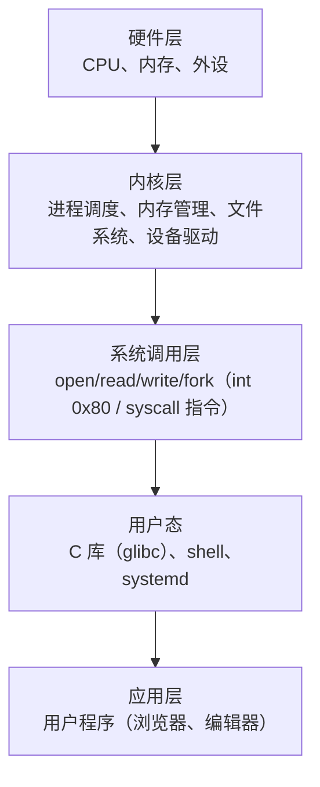
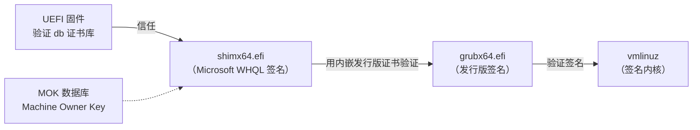
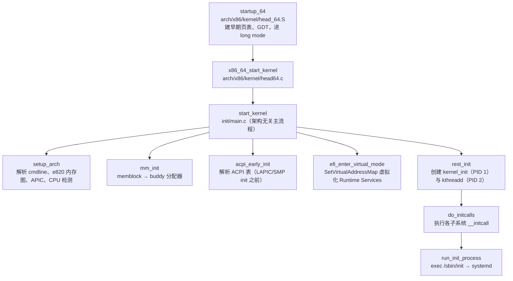
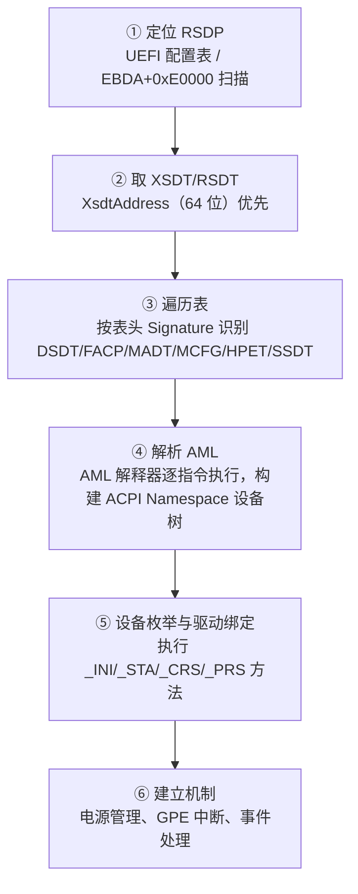
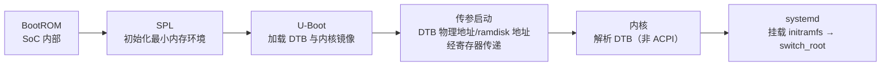
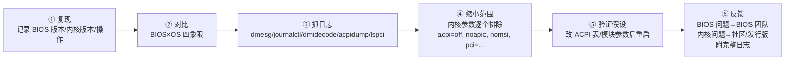

# Linux 系统与 BIOS 的交互：从 GRUB 到内核的完整启动链路


---

## 一、Linux 系统基础：内核、发行版与层次结构

### 1.1 Linux = 内核 + 发行版

Linux 本身只是内核（Kernel，Linus Torvalds 1991 年发布）。日常所说的"Linux 系统"指内核 + GNU 工具链 + 桌面环境组成的完整操作系统，即**发行版（Distribution）**。这个区分对 BIOS 开发者有实际意义：同一个内核可以在不同发行版上运行，而 BIOS 只关心内核启动协议与固件接口，不关心上层包管理。

### 1.2 系统层次结构



BIOS 开发人员关注的是内核层与硬件层之间的接口——内核如何通过 ACPI/SMBIOS/PCI 感知硬件，即本文核心。

### 1.3 常见发行版对比

| 发行版 | 特点 | 适用场景 |
| --- | --- | --- |
| RHEL / Rocky Linux | 企业级稳定，认证支持 | 服务器 / 数据中心 |
| Ubuntu / Debian | 社区活跃，软件包丰富 | 桌面 / 开发 / 服务器 |
| Fedora | 技术预览，内核版本新 | 开发测试 |
| CentOS Stream | RHEL 上游滚动版 | 服务器（替代 CentOS） |
| Arch Linux | 极简、滚动更新 | 高级用户 / 学习 |

### 1.4 国产系统与信创

| 系统 | 包管理 | 桌面 | 架构 |
| --- | --- | --- | --- |
| 统信 UOS / Deepin | apt | DDE | x86 / ARM / MIPS |
| 银河麒麟 Kylin | apt / dnf | UKUI | x86 / ARM / 飞腾 |
| openEuler | dnf | 服务器导向（默认无桌面） | ARM / x86 / RISC-V |
| Anolis OS | dnf | 阿里云系 | x86 / ARM |
| Loongnix | apt / dnf | 龙芯专用 | LoongArch |

> [!note] 信创要点
> 国产系统自带**国密算法**（SM2 非对称 / SM3 摘要 / SM4 对称）与**可信计算**（TPM/TPCM 信任根）模块，是政府采购的合规门槛。对 BIOS 开发者，意味着固件需额外验证：SMBIOS 中系统厂商/产品名是否被信创 OS 正确识别（[[SMBIOS]]），以及国密证书/可信启动对 UEFI Secure Boot 流程的叠加。

---

## 二、x86 UEFI 启动链路：SEC → systemd 全程

### 2.1 完整链路与归属域

```mermaid
flowchart LR
    subgraph BIOS["UEFI 固件域（BIOS 开发职责）"]
        A["SEC<br/>CAR、安全验证"] --> B["PEI<br/>内存初始化"]
        B --> C["DXE<br/>设备枚举、驱动"]
        C --> D["BDS<br/>选择启动项 Boot####"]
    end
    subgraph LOADER["Bootloader 域"]
        D --> E["GRUB 2<br/>shim/grubx64.efi"]
        E --> F["读取 grub.cfg<br/>构造菜单"]
        F --> G["加载 vmlinuz + initrd<br/>到内存"]
    end
    subgraph KERN["内核域"]
        G --> H["ExitBootServices()<br/>交棒内核"]
        H --> I["解压启动<br/>startup_64"]
        I --> J["start_kernel<br/>init/main.c"]
        J --> K["initramfs 挂载<br/>/init → switch_root"]
    end
    subgraph USER["用户态域"]
        K --> L["systemd<br/>PID 1 拉起服务"]
    end
```



四个阶段的分界清晰：**BIOS 只负责到 `ExitBootServices()`**。此后每一步（GRUB 加载、内核解压、initramfs、systemd）都可能暴露 BIOS 侧遗留 Bug——典型如 UEFI Runtime 表损坏导致内核 panic、ACPI 表错误导致设备缺失。

> [!warning] 交棒后 BIOS 不可再干预
> `ExitBootServices()` 调用后，UEFI **Boot Services**（内存分配、句柄协议、定时器等）全部失效，仅 **Runtime Services**（`GetVariable`/`SetVariable`/`GetTime`/`ResetSystem`）仍可调用——这正是 [[RunTime Services]] 笔记中"退出启动服务"语义的落点。GRUB 在交棒前必须完成所有 Boot Services 依赖操作，内核侧同理。

### 2.2 Legacy BIOS 模式对比

Legacy 模式走 MBR → 引导扇区 → GRUB stage1/1.5/2 三级链：MBR（512 字节，末尾 0xAA55）加载到 0x7C00，其中前 446 字节是 `boot.img`，只做 LBA 绝对寻址、加载 `core.img`（存放于 MBR Gap，LBA1~2047）；`core.img` 内置文件系统驱动后才能读取 `/boot/grub/grub.cfg`。MBR 分区表上限 2TB，新机型基本 UEFI only。

### 2.3 GRUB 2 详解

GRUB（GRand Unified Bootloader）是绝大多数发行版默认 Bootloader，UEFI 模式下使用 GRUB 2：

| 项 | 说明 |
| --- | --- |
| ESP 分区 | FAT32 格式，GPT 类型 GUID 为 `C12A7328-F81F-11D2-BA4B-00A0C93EC93B`，挂载点 `/boot/efi` |
| 启动文件 | `/EFI/<vendor>/grubx64.efi`（Ubuntu 为 `/EFI/ubuntu/`，RHEL 为 `/EFI/redhat/`） |
| 配置文件 | ESP 侧 `/EFI/<vendor>/grub.cfg` 或根分区 `/boot/grub/grub.cfg` |
| 安全启动 | 先运行 shim（Microsoft 签名），再跳转 grubx64.efi |

`menuentry` 配置示例：

```text
menuentry 'Ubuntu' --class ubuntu {
    set root='hd0,gpt2'                          # 指定内核所在分区
    linux /boot/vmlinuz-5.15.0-25-generic \
        root=UUID=xxxx-xxxx ro quiet splash      # 内核命令行参数
    initrd /boot/initrd.img-5.15.0-25-generic    # 加载 initramfs
}
```

### 2.4 Secure Boot 信任链：shim 与 MOK

UEFI 固件只执行被 db 证书库信任签名的 EFI 二进制。发行版无法让每家固件信任自己的证书，于是引入 **shim** 作为中间层：



- **shimx64.efi**：携带 Microsoft 签名，固件默认信任；内部嵌入发行版证书，负责验证下一级。
- **MOK（Machine Owner Key）**：用户自签内核/模块时，用 `mokutil --import` 登记到 MOK 数据库，由 shim 校验——这是定制内核在 Secure Boot 开启时能启动的机制。
- 信任链任一环节断裂（未签名、证书被 dbx 吊销）即启动中止——排查"Secure Boot 开启后 Linux 起不来"时按此链逐级验证。

### 2.5 GRUB 启动子流程与命令行救急

1. UEFI 固件按 `Boot####` NVRAM 变量加载 `shim/grubx64.efi` 作为 EFI 应用；
2. 读取 grub.cfg 构造启动菜单；
3. 用户选择或超时取默认条目，执行 `menuentry`；
4. 读取 vmlinuz 与 initrd 到内存；
5. 调 `ExitBootServices()`，按 Linux Boot Protocol 构造 `boot_params` 块，跳转内核入口。

grub.cfg 丢失/损坏时，在 GRUB 菜单按 `c` 进入命令行：`ls`（列分区）、`cat`（查看文件）、`search`（按 UUID 搜分区）；手工 `linux ...` + `initrd ...` + `boot` 即可启动——这是现场救急技能，也是判断"卡死是否由 grub.cfg 引起"的手段。

---

## 三、内核早期启动：从 startup_64 到 start_kernel

### 3.1 内核镜像结构：vmlinuz 是自解压归档

磁盘上的 `vmlinuz` 并非裸内核，而是带引导头的自解压镜像：

| 段 | 内容 |
| --- | --- |
| setup_header | 前 ~512 字节，magic `0x53726448`（"HdrS"），含协议版本、加载地址、payload 偏移 |
| 解压 stub | `arch/x86/boot/compressed/head_64.S`，负责解压并把控制权交给内核主入口 |
| 压缩载荷 | 实际内核二进制，gzip/zstd/lz4 等（zstd 自 5.9 加入，解压最快） |

> [!tip] 与 MCU 心智模型对应
> 这等价于 Keil 工程里带启动文件的固件：`setup_header` 类似中断向量表/启动头，解压 stub 类似 `__main` 前的汇编启动代码，压缩载荷才是真正的 main 程序。现代 Boot Protocol ≥ 2.02 时，实模式 setup 代码被跳过，bootloader 直接走 32/64 位入口。

### 3.2 内核入口调用链



关键源码位置：`start_kernel` 在 `init/main.c`；`setup_arch`、`efi_enter_virtual_mode` 在 `arch/x86/kernel/`；`acpi_early_init` 在 `drivers/acpi/bus.c`。`start_kernel` 的初始化顺序即源码调用顺序——这也是排障依据：`acpi_early_init` 排在 LAPIC/SMP 初始化之前，ACPI 表错误会直接影响中断控制器与 CPU 拓扑解析。

### 3.3 initramfs 与 switch_root

initramfs 解决"鸡生蛋"问题：内核要访问根文件系统需要存储驱动，而存储驱动本身在文件系统上。方案是把必要驱动与工具打包进 initramfs（cpio 归档），内核解压到内存 tmpfs，执行其中的 `/init`：加载驱动 → 探测并挂载真实根文件系统 → `switch_root` 切换根 → 移交 systemd。

> [!note] BIOS 侧影响
> 卡在 initramfs 阶段（如 `Kernel panic - not syncing: VFS: Unable to mount root fs`）常被误判为 BIOS 问题。实际多为：根设备驱动缺失、`root=UUID` 与分区 UUID 不匹配、根文件系统损坏。排查时先确认 GRUB 命令行中的 `root=` 参数与 `blkid` 输出一致。

---

## 四、BIOS 传递给内核的五大资源

GRUB 调 `ExitBootServices()` 前，把 `boot_params`（`arch/x86/include/uapi/asm/bootparam.h`）填好交给内核，内含：e820 内存图、命令行指针、initrd 地址与大小、视频模式、`efi_info`（EFI 内存图与 System Table 指针）。BIOS 侧产物经此结构消费：

| 资源 | 内核消费方式 | 出错影响 |
| --- | --- | --- |
| ACPI 表（DSDT/SSDT/FACP/MADT/MCFG/HPET） | `acpi_early_init` 解析，构建 Namespace | ACPI Error，设备缺失，电源管理失效，严重时 panic |
| SMBIOS 表（Type 0/1/2/4/16/17） | `/sys/class/dmi/id/`、dmidecode | 系统信息识别错误（机型/序列号/内存参数） |
| PCI 配置空间 | 总线扫描、BAR 分配、驱动绑定 | 设备枚举异常、资源冲突 |
| UEFI 内存图（EFI_MEMORY_DESCRIPTOR） | 转换合并进 e820 后建立物理内存模型 | 内存区域类型错误，运行时服务失效 |
| e820 Map（Legacy） | 直接作为物理内存布局 | 内存范围错误导致可用内存异常 |

### 4.1 EFI 内存图 → e820 转换

UEFI 平台由 `GetMemoryMap()` 返回 `EFI_MEMORY_DESCRIPTOR` 数组，内核/GRUB 需转换为 Linux 期望的 e820 格式（EDK2 参考实现见 `OvmfPkg/Csm/LegacyBiosDxe/LegacyBootSupport.c` 的 E820 兼容段）：

| EFI 内存类型 | e820 类型 | 语义 |
| --- | --- | --- |
| EFI_CONVENTIONAL_MEMORY | E820_RAM | 可用系统内存 |
| EFI_LOADER_CODE / DATA | E820_RAM | Bootloader 代码/数据，可回收 |
| EFI_BOOT_SERVICES_CODE / DATA | E820_RAM | 启动服务代码/数据，退出后可回收 |
| EFI_ACPI_RECLAIM_MEMORY | E820_ACPI | ACPI 表，OS 初始化后可回收 |
| EFI_RUNTIME_SERVICES_CODE / DATA | E820_RESERVED | Runtime 服务段，必须保留（虚拟映射） |
| EFI_ACPI_MEMORY_NVS | E820_NVS | ACPI NVS，必须保留 |
| EFI_MEMORY_MAPPED_IO | E820_RESERVED | 内存映射 I/O |
| EFI_UNUSABLE_MEMORY | E820_RESERVED | 坏内存 |

转换边界情况：640K-1MB 传统 hole 需特殊处理；Runtime Services 段若与可用内存重叠（Apple TV 固件曾有此 Bug）会导致内存损坏——转换层需修正重叠。

> [!warning] Runtime 段必须 E820_RESERVED
> 若 BIOS 把 Runtime Services 段标成 RAM，内核可能覆盖它，导致 `SetVariable` 等运行时服务静默失效——表现为"BIOS 设置保存后重启丢失"。这正是 [[RunTime Services]] 中 NV 变量持久化链路的硬件前提。用 `dmesg | grep -i e820` 与 `cat /proc/iomem | grep -i runtime` 可核对。

---

## 五、ACPI 表解析：RSDP 定位到 AML 执行

### 5.1 RSDP 的两种定位方式

RSDP（Root System Description Pointer）是 ACPI 的入口，内核按启动方式选择定位路径（ACPI 规范 §5.2.5）：

| 启动方式 | 定位方法 |
| --- | --- |
| UEFI | 从 EFI System Table 配置表中按 `EFI_ACPI_TABLE_GUID`（`8868E871-E4F1-11D3-BC22-0080C73C8881`）直接取 RSDP 指针 |
| Legacy | 扫描 EBDA（扩展 BIOS 数据区）首 1KB（EBDA 段指针存于 0x40E），以及物理内存 0x000E0000–0x000FFFFF 范围，按 16 字节对齐搜索签名 `"RSD PTR "`（注意末尾空格） |

RSDP 结构（v2.0+）：

| 字段 | 偏移/长度 | 说明 |
| --- | --- | --- |
| Signature | 0 / 8 | `"RSD PTR "` |
| Checksum | 8 / 1 | 前 20 字节校验和（全字节相加低字节为 0） |
| OEMID | 9 / 6 | OEM 字符串 |
| Revision | 15 / 1 | 0 = ACPI 1.0；≥2 = ACPI 2.0+（含 6.x） |
| RsdtAddress | 16 / 4 | RSDT 物理地址（v2.0 起废弃） |
| Length | 20 / 4 | 整个 RSDP 长度 |
| XsdtAddress | 24 / 8 | XSDT 物理地址（v2.0+ 使用） |
| ExtendedChecksum | 32 / 1 | 整个表校验和 |

### 5.2 六步解析流程



其中 **MCFG**（PCIe ECAM 基地址）与 [[PCIe]] 笔记的 ECAM 机制直接对应——内核靠 MCFG 表获得 PCIe 配置空间的内存映射基址，这也是为什么 MCFG 表缺失/错误时 `lspci` 会枚举异常。

### 5.3 查看与导出 ACPI 表

```bash
ls /sys/firmware/acpi/tables/            # 列出所有 ACPI 表
sudo cat /sys/firmware/acpi/tables/DSDT > dsdt.aml
sudo cat /sys/firmware/acpi/tables/SSDT1 > ssdt1.aml
ls /sys/firmware/acpi/tables/dynamic/    # 动态 SSDT
dmesg | grep -i acpi                     # ACPI 版本与状态/错误
```

`/sys/firmware/acpi/tables/` 是内核启动后对内存中 ACPI 表原样的导出（含校验和），比 Windows 侧（RWEverything/ACPIView）更易获取原始二进制。

工具链：**acpidump**（acpica-tools 包，`acpidump -b -n DSDT -o dsdt.aml` 按表名导出）；**iasl**（Intel 官方编译器，`-d` 反编译 `.aml` → `.dsl`，`-e` 指定外部表联合反编译）；**acpiexec**（模拟执行 AML，离线调试）。

---

## 六、ACPI 表反编译、修改与自定义加载

### 6.1 反编译与重编译流程

```bash
# 1. 导出
sudo cat /sys/firmware/acpi/tables/DSDT > /tmp/dsdt.aml
# 2. 反编译为 .dsl（ASL 源码）
iasl -d /tmp/dsdt.aml                       # 生成 /tmp/dsdt.dsl
iasl -e ssdt1.dsl ssdt2.dsl -d dsdt.aml     # 有外部符号引用时一起反编译
# 3. 编辑 .dsl
# 4. 重编译
iasl /tmp/dsdt.dsl                          # 输出 /tmp/dsdt.aml，失败打印 Error/Warning 行号
```

ASL 示例（PCIe Root 设备声明）：

```asl
Scope (_SB) {
  Device (PCI0) {
    Name (_HID, EISAID("PNP0A08"))  // PCIe Root
    Method (_CRS, 0, Serialized) {
      Return (ResourceTemplate() {...})
    }
  }
}
```

常见编译错误：

| 错误类型 | 说明 |
| --- | --- |
| Reserved 字段被引用 | 规范预留字段不可在 Named Object 中引用 |
| AccessSize 不匹配 | 字段访问宽度与定义不一致（[[2026-8-24 学习记录|HII 笔记]]中也有同类对齐坑） |
| 返回类型不一致 | Method 返回值与调用方期望类型冲突 |
| Namespace 冲突 | 同一 `_SB.PCI0` 被多次定义 |

### 6.2 加载自定义表（覆盖 BIOS 表）

**方法 A：initrd 覆盖（推荐）**——内核支持从 initramfs 加载同名表替换固件表：

```bash
# 将 .aml 放入 initrd 的 kernel/x86/acpi/ 目录
sudo update-initramfs -u   # Debian/Ubuntu
sudo dracut -f             # RHEL/openEuler
# 重启后 dmesg | grep -i acpi 验证
```

**方法 B：内核命令行参数**（5.6+ 支持 `acpi_table=` 指定文件）：

```text
GRUB_CMDLINE_LINUX="acpi=strict acpi_osi=Linux"
GRUB_CMDLINE_LINUX="acpi_table=/boot/ssdt1.aml"
sudo update-grub
```

验证与回滚：对比 `/sys/firmware/acpi/tables/` 中表的大小与签名；起不来时在 GRUB 命令行删除 acpi 参数或用旧 initramfs 启动。

> [!warning] 生产机禁用
> 加载自定义 ACPI 表会覆盖 BIOS 固件表，表语法错误可直接导致内核 panic——只在测试机上进行。这是 BIOS 团队验证"疑似 ACPI Bug"的标准手段：反编译 → 定位 → 改表 → 重编译 → initrd 加载 → 复测，确认问题后回修固件。

### 6.3 ACPI 调试内核参数速查

| 参数 | 作用 | 风险等级 |
| --- | --- | --- |
| `acpi=off` | 完全禁用 ACPI | 核武器：电源管理/温度监控全失效，仅测试用 |
| `acpi=noirq` | 禁用 ACPI 中断路由 | 解决 IRQ 冲突 |
| `acpi=strict` | 严格校验表内容 | 校验失败的表被忽略 |
| `pci=noacpi` | PCI 设备不采用 ACPI 配置 | 配合定位 PCI 枚举问题 |
| `acpi_osi=Linux` | 向固件报告 OS 身份为 Linux，触发厂商 Linux 兼容路径 | 解决部分厂商按 OS 分支的 ACPI |
| `acpi_osi=!` | 报告空 OSI 字符串 | 绕过 _OSI 分支 |
| `acpi_osi="Windows 2022"` | 伪装 Windows 身份 | 触发 Windows 专用 ACPI 路径 |
| `acpi_backlight=vendor` | 跳过通用 ACPI 背光接口 | 解决背光/亮度问题 |
| `acpi.debug_level=0x2` | ACPI 子系统调试输出 | 定位方法执行细节 |

> [!tip] 对 BIOS 开发者的价值
> `acpi_osi=!` / `acpi_osi="Windows 2022"` 是验证"BIOS 是否按 OS 身份返回不同表"的开关——固件侧 `_OSI` 分支逻辑（AML 里 `If (LEqual (_OSI, "Windows 2022"))`）只有在对应身份下才走特定路径。`acpi=strict` 可暴露表内校验和/结构错误，是发现"表本身损坏"的第一手段。

---

## 七、ARM 平台启动与 DTB

### 7.1 启动链路



### 7.2 ARM vs x86 关键差异

| 维度 | ARM | x86 |
| --- | --- | --- |
| 硬件描述 | Device Tree（DTB） | ACPI |
| Bootloader | U-Boot / EDK2 | UEFI 固件 |
| 中断控制器 | GIC | APIC / LAPIC |
| 内存图 | DTB `/memory` 节点 | e820 / UEFI 内存图 |

> [!note] 国产 ARM 服务器
> 鲲鹏、飞腾等国产 ARM 服务器通常**同时支持 DTB 与 ACPI**，服务器场景倾向 ACPI 以复用 x86 软件栈。对 BIOS 开发者，这意味着同一份 ACPI 固件代码可能需要移植验证到 ARM UEFI（EDK2 的 ARM/ARM64 架构支持），MCFG/FADT 等表在两种架构上语义一致。

---

## 八、常用调试工具：BIOS 开发者的 Linux 观测窗口

### 8.1 固件产物核对

```bash
sudo dmidecode -t system       # 主机型号、序列号（SMBIOS Type 1）
sudo dmidecode -t baseboard    # 主板信息（Type 2）
sudo dmidecode -t bios         # BIOS 版本日期（Type 0）
sudo dmidecode -t memory       # 内存插槽、频率（Type 17）
sudo dmidecode -t slot         # PCIe 插槽（Type 9）
lspci -vvv                     # PCI 设备详细信息
lspci -nn                      # 设备号（vendor:device）
lsusb                          # USB 设备
```

dmidecode 直接读 `/dev/mem` 解析 SMBIOS 表（[[SMBIOS]]），lspci 依赖 PCI 枚举结果（[[PCIe]]）——这两者是对"BIOS 产出的表与配置空间是否正确"的最快实测手段，与固件侧的 `sdmidecode`/`dumpvar` 输出对照即完成闭环。

### 8.2 资源与中断

```bash
cat /proc/iomem                # 物理地址空间分配（含 e820 段）
cat /proc/ioports              # I/O 端口分配
cat /proc/interrupts           # 中断分配（LAPIC/IOAPIC 视角）
ls /sys/kernel/iommu_groups/   # IOMMU 分组（直通排查）
sudo cat /sys/class/dmi/id/product_name
sudo cat /sys/class/dmi/id/bios_version
```

`/proc/iomem` 的 `System RAM` 段即 e820 的 `E820_RAM`，可与固件侧 `memmap` 命令（UEFI Shell）输出的物理内存布局比对——发现内存段缺失/错位时，先怀疑 BIOS 内存描述符转换。

### 8.3 日志三件套

```bash
dmesg | tail -100              # 内核环形缓冲区（最常用）
dmesg -w                       # 持续观察
journalctl -k                  # 本次启动内核日志
journalctl -b -1               # 上次启动
journalctl -u sshd             # 某服务
systemd-analyze                # 启动耗时总览
systemd-analyze blame          # 各服务耗时排序
systemd-analyze critical-chain # 关键启动链
```

> [!tip] BIOS 启动时间与 systemd-analyze
> `systemd-analyze` 的 `Kernel` 时间从内核第一条 printk 起算，`Firmware` 时间即 BIOS POST 时间——整机开机性能优化时，用它与 BIOS 侧 `TimeStamp`（AMI 有 POST time 记录）对齐，可定位时间是耗在固件还是内核。

### 8.4 内核崩溃分析：kdump + crash

内核 panic 是 BIOS 兼容性问题的极端形态（ACPI 表错误、Runtime 表损坏都可能触发）。kdump 机制：主内核崩溃时用 `kexec` 预加载的备用内核（crash kernel）接管，导出 `/proc/vmcore` 内存转储：

```bash
# 1. 预留 crash 内存（内核参数）
crashkernel=512M
# 2. 预加载备用内核
kexec -p /boot/vmlinuz-... --initrd=/boot/initramfs-... \
      --command-line="root=... maxcpus=1 irqpoll"
# 3. 触发崩溃测试
echo c > /proc/sysrq-trigger
# 4. 保存转储
cp /proc/vmcore /mnt/vmcore
# 5. 离线分析（需 kernel-debuginfo 提供带符号 vmlinux）
crash /usr/lib/debug/lib/modules/$(uname -r)/vmlinux vmcore
```

crash 常用命令：`bt`（崩溃栈回溯，PANIC 原因第一手证据）、`log`（内核环形缓冲区全文）、`ps`（崩溃时任务列表）、`mod`（模块状态）。

```text
crash> bt
PID: 1362  TASK: ffff90f972365280  CPU: 5  COMMAND: "AliYunDun"
 #0 machine_kexec ...
 #4 no_context ...
 #5 __bad_area_nosemaphore ...
PANIC: "BUG: unable to handle kernel NULL pointer dereference at 0000000000000074"
```

`vmcore` 基于 ELF 格式：PT_LOAD 段保存物理内存快照，NOTE 段（PRSTATUS/VMCOREINFO）保存 CPU/任务/模块/寄存器状态。拿到 panic 后先看 `PANIC:` 行（崩溃类型与地址），再 `bt` 看调用栈定位触发模块。

### 8.5 模块与设备事件

```bash
lsmod / modprobe / modinfo    # 模块加载与查看
udevadm monitor               # 设备事件实时监控（热插拔）
sysctl -a                     # 运行时内核参数
ls /sys/bus/                  # sysfs 设备树（每个设备对应 kobject）
```

---

## 九、启动卡死排查：阶段归属与通用流程

### 9.1 卡死阶段 → 责任域映射

| 卡死阶段 | 常见根因 | 主要责任域 |
| --- | --- | --- |
| 卡在 GRUB 前 | 启动盘识别失败、Boot#### 指向错误 | **BIOS**（检查启动顺序、串口调试打印） |
| 卡在 GRUB 菜单/命令行 | grub.cfg 损坏、内核路径错误 | Bootloader（用命令行手工启动验证） |
| 卡在加载内核 | 内核与 CPU 不匹配、内存训练异常、解压失败 | BIOS 内存初始化 + 内核镜像 |
| 卡在 initramfs | 根设备驱动缺失、UUID 错误、根文件系统损坏 | OS（核对 `root=` 与 blkid） |
| 卡在 systemd | 某服务卡死 | OS（systemd-analyze blame / critical-chain） |
| 内核 panic | 驱动或 ACPI 问题 | BIOS（ACPI 表）+ OS 驱动，看 call trace 定位 |

> [!warning] 责任边界判定
> 卡 GRUB 前几乎必然是 BIOS 侧（固件没把磁盘/Boot#### 处理好）；卡 initramfs 后几乎必然是 OS 侧。中间地带（加载内核、panic）最需要交叉验证——先用 `acpi=off` 排除 ACPI 嫌疑，再逐个排除内核参数，避免把内核问题甩给 BIOS 或反之。

### 9.2 通用排查流程



四象限对比法：BIOS 版本 × OS 版本两两组合测试，快速定位"换 BIOS 才好 / 换 OS 才好"的归属。日志抓取优先级：`dmesg`（内核环形缓冲区，含 ACPI Error/panic call trace）> `journalctl`（systemd 结构化）> `dmidecode`/`acpidump`（固件产物快照）> `lspci -vvv`（枚举细节）。

---

## 十、与 BIOS 开发实践的结合

1. **ACPI 验证闭环**：BIOS 改 DSDT/FACP 后，Linux 侧 `dmesg | grep -i acpi` 应无 Error/Warning；有异常时用 iasl 反编译核对表结构（第六章流程），这是固件发布前最便宜的表校验手段。
2. **内存图一致性**：`/proc/iomem` 与固件 `memmap`（UEFI Shell）比对，重点核对 Runtime 段（E820_RESERVED）与 ACPI 表区域（E820_ACPI）——错误标记会直接导致 NV 变量丢失或 ACPI 表被覆盖。
3. **串口日志双端对照**：BIOS 侧 [[RunTime Services|MyPrintLib]] 直写 COM1 的日志与内核侧 `console=ttyS0,115200` 串口日志衔接——定位"BIOS 最后一条日志 vs 内核第一条日志"之间的空洞，即交棒间隙问题（GRUB 加载、boot_params 构造）。
4. **启动性能**：`systemd-analyze` 的 Firmware 时间与 BIOS POST time 对齐，量化固件在整机开机中的占比。
5. **国产平台验证**：信创 OS（UOS/麒麟）对 SMBIOS 信息、ACPI 表、国密/可信链的依赖比常规发行版更严格——固件发布前应在国产 OS 上跑一轮 dmesg/dmidecode 冒烟。

---

## 术语表

| 术语 | 含义 |
| --- | --- |
| 发行版 | Linux 内核 + GNU 工具链 + 桌面/软件包体系组成的完整操作系统 |
| 信创 | 信息技术应用创新，要求国产 CPU/OS/固件 + 国密算法（SM2/SM3/SM4）+ 可信计算 |
| GRUB 2 | GRand Unified Bootloader 2，主流 Linux 发行版默认 Bootloader |
| ESP | EFI System Partition，FAT32 格式，GPT 类型 GUID `C12A7328-...`，存引导程序 |
| shim | Microsoft 签名的第一阶段引导器，向固件传递发行版证书信任 |
| MOK | Machine Owner Key，shim 校验自签内核/模块的用户密钥库 |
| Boot#### | UEFI NVRAM 启动项变量，记录 ESP 中引导程序路径 |
| ExitBootServices | UEFI Boot Services 终止函数，固件→OS 控制权交接点 |
| boot_params | GRUB 传给内核的参数块（e820、命令行、initrd、efi_info） |
| vmlinuz | 自解压内核镜像，setup_header magic "HdrS"（0x53726448） |
| startup_64 | x86_64 内核汇编入口（arch/x86/kernel/head_64.S） |
| start_kernel | 架构无关内核主流程（init/main.c） |
| setup_arch | x86 架构初始化：e820、APIC、CPU 检测 |
| acpi_early_init | ACPI 表早期解析（drivers/acpi/bus.c），在 LAPIC/SMP 之前 |
| efi_enter_virtual_mode | 对 EFI Runtime Services 调 SetVirtualAddressMap 建立虚拟映射（[[RunTime Services]]） |
| initramfs | 内存初始根文件系统（cpio），含根设备驱动，解决启动鸡生蛋问题 |
| switch_root | 从 initramfs 切换到真实根文件系统的操作 |
| RSDP | Root System Description Pointer，ACPI 入口结构（"RSD PTR " 签名） |
| XSDT / RSDT | 扩展/根系统描述表，RSDP 指向的表数组（XSDT 为 64 位版本） |
| AML | ACPI Machine Language，DSDT/SSDT 中的字节码，内核解释执行 |
| ACPI Namespace | AML 构建的设备树（\_SB 根下的 Device/Method 节点） |
| iasl | Intel ACPI Compiler/Decompiler（-d 反编译，-e 外部表，重编译） |
| acpidump | acpica-tools 提供的 ACPI 表导出工具 |
| MCFG | PCIe ECAM 基地址表，内核定位 PCIe 配置空间内存映射（[[PCIe]]） |
| e820 | BIOS 提供的内存布局表（Legacy INT 15h E820 得名），UEFI 下由 EFI 内存图转换 |
| EFI_MEMORY_DESCRIPTOR | GetMemoryMap 返回的 EFI 内存描述符（Type/Phys/Pages/Attr） |
| E820_RAM / E820_ACPI / E820_NVS | e820 内存类型：可用 RAM / ACPI 可回收 / ACPI NVS 保留 |
| DTB | Device Tree Blob，ARM 平台硬件描述（x86 的 ACPI 对应物） |
| kdump / vmcore | 崩溃转储机制：备用内核收集主内核内存快照为 vmcore |
| crash | vmcore 离线分析工具（bt/log/ps/mod 命令） |
| crashkernel= | 内核参数，预留崩溃备用内核内存 |
| _OSI | AML 中的操作系统接口查询方法，固件据此按 OS 身份返回不同表 |
| acpi_osi=! / acpi_osi="Windows 2022" | 内核参数，控制报告给固件的 OS 身份 |
