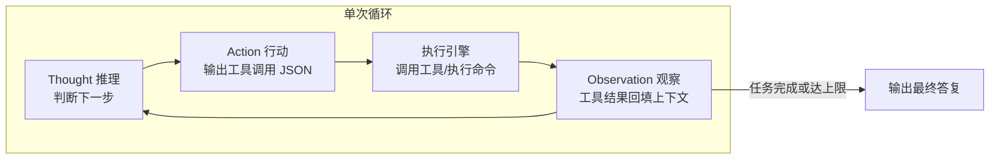
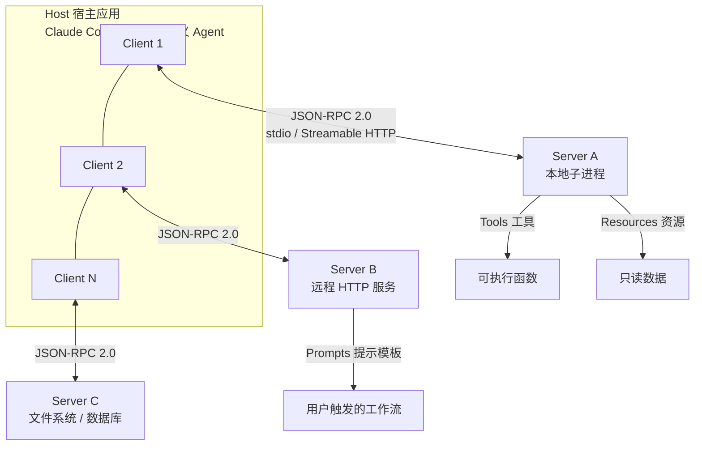
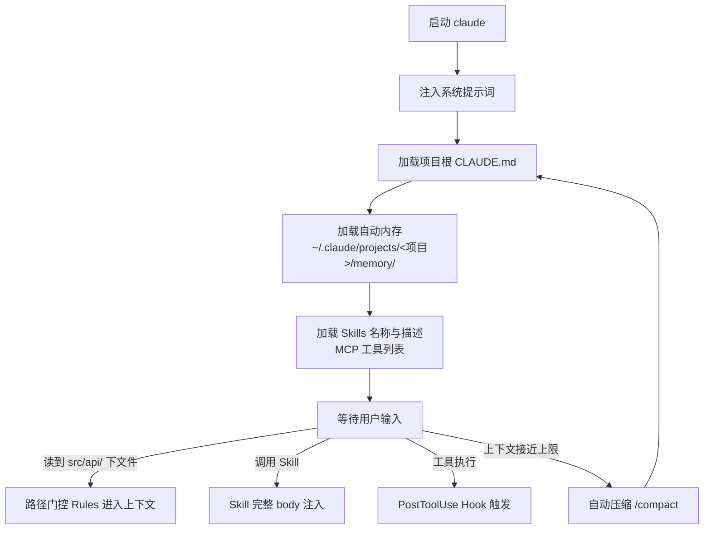
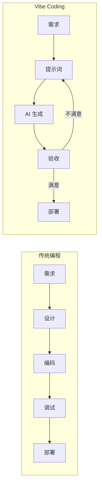

# AI 基础知识及 Claude Code 应用（2026-8-28）

> 本笔记基于部门校招新人培训课件《AI基础知识及 Claude Code 应用_V1.pptx》整理，并补充 Anthropic 官方文档、MCP 规范与业界资料。培训由计算设备与电源事业部 AI Campus 组织，主题覆盖 AI 术语、Agent 底层结构、Claude Code 安装/配置/命令/扩展，以及办公场景落地。笔记按"概念 → 机制 → 工具 → 工程落地"组织，重点补全了 PPT 未展开的 ReAct 循环、MCP 协议架构、Claude Code 配置加载时序与上下文窗口管理机制。

---

## 一、AI 核心术语速览

PPT 给出了一张 11 项术语表，其中多数条目在后续章节展开。下表保留 PPT 原表，补充"底层含义"一列，帮助理解每个术语在 Agent 系统中的实际位置。

| 名词 | 中文 | 核心含义 | 底层含义 |
|---|---|---|---|
| LLM | 大语言模型 | 基于海量文本训练的语言预测模型 | Agent 的推理引擎，按 token 概率分布生成文本；本身无状态 |
| Prompt | 提示词 | 给模型的输入指令 | 唯一控制模型行为的输入通道，系统提示词（system prompt）决定角色与规则 |
| Context Window | 上下文窗口 | AI 的记忆窗口，超出范围被遗忘 | 单次调用可容纳的 token 上限；Agent 每轮调用都受其约束，是成本与性能的主要杠杆 |
| RAG | 检索增强生成 | 生成前先从知识库检索 | chunking 切分 → embedding 向量化 → 向量库召回 → 拼接上下文 → 生成；解决 LLM 知识陈旧与幻觉 |
| Agent | 智能体 | 围绕 LLM 的执行框架 | LLM + Planning + Tool use + Memory，循环调用直至任务完成 |
| MCP | 模型上下文协议 | Agent 统一连接外部工具的标准协议 | JSON-RPC 2.0 之上定义 Host/Client/Server 三层与 Tools/Resources/Prompts 三种原语 |
| CoT | 思维链 | 展示中间推理步骤 | 通过"逐步推理"降低复杂任务出错率；衍生 CoT-SC（自洽性采样）、ToT（思维树）、ReAct（推理+行动） |
| Memory | 记忆系统 | 让 AI 持续学习用户偏好 | 分层：工作记忆（本轮）/短期（会话内）/长期（跨会话向量库）/情景（历史事件记录） |
| Profile | 用户画像 | AI 构建的用户模型 | 职业、偏好、沟通风格等长期特征的持久化 |
| LTM | 长期记忆 | 跨会话记住信息 | 落地形态：磁盘文件（Claude Code 自动内存）、向量数据库、知识图谱 |
| Skill | 技能包 | Agent 可调用的专项能力模块 | 渐进式披露：会话启动只加载名称与描述，触发时才注入完整执行流程 |

> [!note]
> Context Window 的"遗忘"不是模型主动删除，而是超出窗口后旧 token 无法参与注意力计算。Claude Code 通过 /compact 把会话历史压缩成摘要后重新注入，属于"主动管理遗忘"的工程手段，见[[#七、常用命令解析]]。

## 二、Agent 的底层结构

### 2.1 组成与循环

PPT 给出的公式：`Agent = LLM + Planning + Tool use + Memory`，并注明"循环调用 LLM + 解析执行 FC 输出 + 管理状态"。FC 即 Function Calling（函数调用），指模型输出结构化 JSON 描述"要调用哪个工具、传什么参数"，由运行时执行后把结果回填上下文。

所有 Agent 共享同一个执行骨架，即 ReAct（Reason + Act）循环：



循环的中止条件有四类：任务完成、达到最大迭代次数、超时、超出成本预算。缺少中止条件的 Agent 会在失败模式下无限消耗 token，这是 Agent 工程最常见的失控点。

### 2.2 五大组件

| 组件 | 职责 | 工程落点 |
|---|---|---|
| LLM Core | 推理引擎 | 工具调用可靠性比基准分更重要；模型可插拔（model interface 抽象） |
| Planning | 决定动作序列 | 单步推理（ReAct）、预规划（Plan-and-Execute）、动态重规划（执行中修订计划） |
| Memory | 跨轮/跨会话状态 | 工作记忆（本轮 scratchpad）、会话记忆、长期记忆（向量库）、情景记忆（历史结果） |
| Tools | 影响外部世界 | 结构化 schema 描述（参数+返回）；工具描述质量直接决定模型选工具的正确率 |
| Control & Guardrails | 约束与护栏 | 最大迭代数、超时、成本上限、工具白名单、高危操作人工确认 |

> [!warning]
> 工具描述是模型选择工具的唯一依据。描述含糊会导致错误路由——这等价于驱动 API 文档质量决定调用方行为，属于"文档即接口"约束。

### 2.3 Agent Harness 概念

原始 LLM 只是文本预测器，不具备读文件、执行命令、记忆状态的能力。Claude Code、Cursor、Codex 这类产品本质是给模型套了一层 **Agent Harness（智能体执行框架）**，负责：模型接口适配、工具注册表、上下文管理、规划模块、执行引擎、权限与审批、错误恢复、观测与计费。理解这一层，就理解了 Claude Code 与"网页版 ChatGPT"的本质差异——前者是带完整执行环境的 agent，后者是单轮对话接口。

## 三、MCP 协议

PPT 把 MCP 称为"AI 的 USB 接口"，一句话带过。MCP（Model Context Protocol，模型上下文协议）由 Anthropic 于 2024 年 11 月开源，是 AI 应用连接外部数据与工具的开放标准，解决 M×N 集成问题（M 个应用 × N 个数据源 → M+N 次对接）。

### 3.1 三层架构



| 角色 | 说明 |
|---|---|
| Host | LLM 应用，创建并管理多个 Client，执行权限与用户授权策略，聚合上下文 |
| Client | Host 内的连接器，与一个 Server 保持 1:1 连接，隔离各 Server 的数据边界 |
| Server | 提供专项能力的进程，暴露 Resources/Tools/Prompts；可以是本地进程或远程服务 |

设计原则：Server 只暴露能力，不读取整个对话历史；完整对话留在 Host 侧；Server 之间相互隔离，跨 Server 交互由 Host 控制。这保证了安全边界。

### 3.2 三种核心原语

| 原语 | 控制方 | 作用 | 类比 |
|---|---|---|---|
| Tools | 模型控制 | 可执行函数（搜索、发邮件、读文件），模型生成调用参数 | REST 的 POST |
| Resources | 应用控制 | 可读数据（文件、数据库行、文档），可订阅更新 | REST 的 GET |
| Prompts | 用户控制 | 预定义模板工作流，经 UI/斜杠命令触发 | 脚本模板 |

Server 侧还有反向能力：**Sampling**（Server 请求 Host 用其模型补全一段生成，需用户批准）、**Roots**（告知 Server 允许操作的目录/URI 范围）、**Elicitation**（Server 中途向用户索取补充信息）。

### 3.3 传输与生命周期

- **传输层**：stdio（本地：Host 启动 Server 子进程，换行分隔 JSON-RPC 消息走 stdin/stdout，延迟约 5–15µs）；Streamable HTTP（远程：单端点 POST/GET，SSE 推送，OAuth 2.1 鉴权）。旧的 HTTP+SSE 双端点传输已弃用。
- **消息格式**：JSON-RPC 2.0 三种消息——request（带 id）、response（带 id 与 result/error）、notification（无 id，单向）。

```json
// request 示例：列出工具
{ "jsonrpc": "2.0", "id": 1, "method": "tools/list", "params": {} }
// response 示例：工具调用
{ "jsonrpc": "2.0", "id": 2, "method": "tools/call", "params": { "name": "search", "arguments": { "q": "ECAM" } } }
```

- **生命周期**：initialize（能力协商，双方声明 capabilities）→ initialized notification → 操作阶段（tools/list、tools/call、resources/read 等）→ 断开。
- **扩展**：Tasks（异步长任务，轮询 + 持久句柄）、Skills over MCP（结构化指令经 MCP 发现与消费）、MCP Apps（内联 UI 组件）。

> [!tip]
> MCP 与 BIOS 开发中的既有模式可对照：MCP 的 Host/Client/Server 类似 UEFI 的 Protocol 生产/消费关系——驱动（Server）安装 Protocol，应用（Host）通过 LocateProtocol/HandleBuffer 定位并调用，协议本身是契约，双方实现独立演进。MCP 的 capability 协商则对应 DXE 阶段 Depex 表达依赖的方式，只是后者是静态编译期声明、前者是运行时动态协商。

## 四、办公可用模型与公司网关

### 4.1 模型清单（PPT 原表）

| 模型名称 | 供应商 | 输入上限 | 输出上限 |
|---|---|---|---|
| deepseek-v4-pro | DeepSeek | 1M | 384K |
| glm-5.2 | 智谱 AI | 1M | 128K |
| qwen3.7-max | 阿里巴巴 | 991K | 64K |
| Claude-Opus-4.6 | Anthropic | 1M | -- |
| gpt-5.5 | OpenAI | 1M | -- |
| gpt-5.6-sol | OpenAI | 1M | -- |
| gpt-5.6-terra | OpenAI | 1M | -- |
| kimi-k2.7-code | Kimi | 256K | 64K |
| gemini-3.1-pro-preview | Google | 1M | -- |
| MiniMax-M3 | MiniMax | 1M | 64K |

API 密钥申请入口：`https://ai.cvte.com/profile/ai-account`。

### 4.2 网关接入机制

公司把多个厂商模型聚合到统一网关 `https://token.cvte.com`，客户端只需对接一个端点。Claude Code 侧的关键环境变量：

| 变量 | 作用 |
|---|---|
| `ANTHROPIC_BASE_URL` | 网关根域名，Claude Code 自动拼接 `/v1/messages` |
| `ANTHROPIC_AUTH_TOKEN` | 网关签发的令牌，第三方网关必须用此变量 |
| `ANTHROPIC_API_KEY` | 仅对 `api.anthropic.com` 官方端点有效；指向第三方网关时会被静默忽略并回退 OAuth 会话 |
| `CLAUDE_CODE_DISABLE_NONESSENTIAL_TRAFFIC` | 设为 `1` 关闭遥测等非必要请求，减少 token 消耗 |

> [!warning]
> `ANTHROPIC_BASE_URL` 填根域名即可，**不要**手动拼 `/v1`——Claude Code 内部 SDK 会自动追加，拼了反而 404。同理，第三方网关场景下 `ANTHROPIC_API_KEY` 会被忽略，必须使用 `ANTHROPIC_AUTH_TOKEN`，否则请求回退到官方 OAuth 计费通道。

> [!note]
> 用户日常环境即按此模式接入：`~/.claude/settings.json` 配置 `model: haiku`、`effortLevel: max`，经 CCH 网关路由。网关为 OpenAI 兼容实现，实测拒绝 OpenAI 协议的 `developer` message role；glm-5.2 拒绝 `effort=off` 参数。切换模型或调试网关时留意这两项兼容性限制。

## 五、Claude Code 安装与接入

### 5.1 Windows 安装流程

```bash
# 1. 安装 Node.js（winget 包管理器）
winget install -e --id OpenJS.NodeJS.LTS
# 2. 验证 Node.js 与 npm
npm --version
# 3. 全局安装 Claude Code CLI
npm install -g @anthropic-ai/claude-code
# 4. 验证安装
claude --version
```

Linux 安装差异仅在于 Node.js 来源：经 NodeSource 仓库（`curl -fsSL https://deb.nodesource.com/setup_lts.x | sudo -E bash -`）后 `sudo apt-get install -y nodejs`，后续 `npm install -g` 相同。

### 5.2 连接 CCH 网关

配置文件位置：Windows 为 `C:\Users\<用户名>\.claude\settings.json`，Linux/macOS 为 `~/.claude/settings.json`。

```json
{
  "env": {
    "ANTHROPIC_AUTH_TOKEN": "your-api-key-here",
    "ANTHROPIC_BASE_URL": "https://token.cvte.com",
    "CLAUDE_CODE_DISABLE_NONESSENTIAL_TRAFFIC": "1"
  },
  "permissions": {
    "allow": [],
    "deny": []
  }
}
```

- `permissions.allow/deny` 控制工具调用授权：空列表表示每项操作都请求确认，可写入具体工具名（如 `Bash`、`Edit`）实现白名单。
- 若默认后台模型（haiku/sonnet）指向官方不可达端点，可通过 `ANTHROPIC_DEFAULT_HAIKU_MODEL` / `ANTHROPIC_DEFAULT_SONNET_MODEL` 把后台小调用也路由到网关，避免静默失败。

### 5.3 VS Code 插件

扩展市场搜索 "Claude Code" 安装后，右下角出现图标；另装 **Claude Code Switch** 可在不同 AI 模型间切换，配置默认与备用模型。

## 六、Claude Code 配置体系

PPT 列举了五类配置。下表补全官方文档的加载时机与压缩（compaction）后的行为——这两点是配置体系的核心工程语义：

| 机制 | 位置 | 加载时机 | 压缩后行为 |
|---|---|---|---|
| CLAUDE.md | 项目根目录 / ~/CLAUDE.md | 每个会话开始注入 | 从磁盘重新注入 |
| Rules | `.claude/rules/*.md` | 无条件规则启动即加载；带 `paths:` 前言的按路径门控 | 无门控的重新注入；门控的直到匹配文件被读才重载 |
| Skills | `.claude/skills/<name>/SKILL.md` | 启动只载 name+description；调用时载完整 body | 重新注入，每 skill 上限 5000 token，总预算 25000，最旧的先丢 |
| Subagents | `.claude/agents/*.md` | 由主会话经 Agent 工具调用 | body 从不进主上下文，只返回最终消息+元数据 |
| Hooks | settings.json 注册 | 绑定生命周期事件，条件满足必定执行 | 钩子是代码不是上下文，不受压缩影响 |



### 6.1 CLAUDE.md

放 AI 需要时刻记住的"事实"：构建命令、目录结构、代码规范、团队约定。官方建议控制在 200 行以内——超长会稀释 adherence（指令遵循度）。目录级 CLAUDE.md（子目录放置）在访问该目录时才加载，离开后自动从上下文卸载，用于 monorepo 团队隔离。CLAUDE.md 的更新需要像代码一样评审。

### 6.2 Rules

`.claude/rules/*.md`，与 CLAUDE.md 同级的约束机制，区别在**路径门控**：带 `paths:` 前言的规则只在读取匹配路径时加载。

```markdown
---
paths:
  - "src/api/**"
  - "**/*.handler.ts"
---
所有 API handler 在处理前必须用 Zod 校验输入。
```

适合"追加式约定"（如 migrations 只增不改）这类跨目录但非全局的约束。无门控的 Rules 每次压缩都会重新注入——这既是保证，也是 token 开销，应避免把大段内容写成无门控规则。

### 6.3 Skills

`.claude/skills/<name>/SKILL.md`，描述标准化执行流程。**渐进式披露**是核心设计：会话启动只载 name + description，模型按任务自动匹配或经 `/name` 手动触发后才注入完整 body。这避免了把全部流程塞进 system prompt 的 token 浪费。

目录结构：

```
.claude/skills/
└── <skill-name>/
    ├── SKILL.md          # 必需：入口文件（含 name/description 前言与正文）
    ├── references/       # 可选：详细文档
    ├── workflows/        # 可选：步骤指南
    ├── scripts/          # 可选：脚本
    └── templates/        # 可选：模板
```

> [!tip]
> 判断用 Skill 还是 Subagent：希望过程在主对话中逐步可见、可随时干预 → Skill；希望旁路任务（深度搜索、日志分析）不污染主上下文 → Subagent。Skill 压缩后有 5000/25000 token 预算，正文最重要的指令要放文件开头。

### 6.4 Subagents

`.claude/agents/*.md`，YAML frontmatter 声明 name、description，可选 model 与工具白名单；正文成为该子代理的 system prompt。子代理运行在**独立上下文窗口**，读大文件、长日志的结果不占主上下文，只把最终消息与元数据传回主会话。子代理可嵌套，最多 5 层。这与 8-27 Linux 笔记中多进程/多阶段流水线的并行思想同构：隔离上下文换并行度。

### 6.5 Hooks

通过 settings.json 注册，绑定 Claude Code 生命周期事件，**确定性执行**（LLM 无法忽略）。钩子类型与用途：

| Hook 事件 | 触发时机 | 典型用途 |
|---|---|---|
| UserPromptSubmit | 处理用户提示前 | 输入校验、日志 |
| PreToolUse | 工具执行前 | 安全闸门：拦截危险命令（exit 2 = 阻止） |
| PostToolUse | 工具执行后 | 自动格式化、跑 linter |
| Notification | 权限请求/等待输入时 | 桌面通知 |
| Stop | Claude 完成回复时 | 完成日志、状态更新 |
| SubagentStop | 子代理完成时 | 子代理编排 |
| PreCompact | 上下文压缩前 | 备份会话记录 |
| SessionStart | 会话开始时 | 加载开发环境（git status 等） |

可用环境变量：`CLAUDE_PROJECT_DIR`（项目路径）、`CLAUDE_FILE_PATHS`（被修改文件）、`CLAUDE_TOOL_INPUT`（工具参数 JSON）。

### 6.6 配置优先级与自动内存

配置优先级：**企业托管设置（managed-settings.json，不可覆盖）> CLI 标志 > settings.json > settings.local.json（个人覆盖，自动 gitignore）**。

Claude 还会自动写项目笔记：`~/.claude/projects/<project>/memory/`，上限 25KB 或 200 行，跨会话保留对项目的理解。对话记录存 `projects/<project>/<session>.jsonl`，文件编辑前的快照存 `file-history/`（checkpoint 恢复用），默认 30 天自动清理。

## 七、常用命令解析

PPT 命令表按功能域重新分组，补注机制：

| 功能域 | 命令 | 作用与机制 |
|---|---|---|
| 会话管理 | `/clear` | 清空当前对话；切换无关任务前使用，旧对话会挤占后续文件读取的空间并产生 token 开销 |
| | `/compact` | 压缩对话为结构化摘要；支持 `/compact focus on <主题>` 保留指定重点 |
| | `/resume` | 恢复历史会话 |
| | `/copy [n]` | 复制最近一条回复到剪贴板 |
| | `/export [文件名]` | 导出整个对话为纯文本 |
| | `/exit` | 退出会话 |
| 信息与诊断 | `/context [all]` | 查看上下文窗口使用情况 |
| | `/usage` | 查看 token 用量与费用 |
| | `/status` | 版本号、模型、账户、连接状态 |
| | `/insights` | 生成使用分析报告 |
| 模型与模式 | `/plan` | 规划模式：先出计划再执行（对应 Plan Mode，计划写入 plans/ 目录） |
| | `/model` | 切换模型（网关场景可配合模型发现枚举网关模型） |
| | `/effort [low~max]` | 调整思考力度，共五档：low / medium / high / xhigh / max |
| | `/fast` | 快速模式开关，响应约快 2.5 倍 |
| 扩展管理 | `/mcp /skills /plugin` | 管理 MCP 服务器、Skills、插件 |

> [!note]
> 上下文管理的三层手段：`/clear`（硬清空）、`/compact`（压缩保留）、`/autocompact <token>`（设定自动压缩阈值，如 500k）。另外把大文件读取交给 Subagent 是"软隔离"手段——文件内容留在子代理窗口，主窗口只收摘要。这与嵌入式开发中把大段日志分流到文件再 grep 关键行是同一思路：控制"视线范围"就是控制上下文成本。

## 八、扩展生态：Plugins、Skills、MCP

### 8.1 Plugins

Claude Code v2.x 引入插件市场机制（`~/.claude/plugins`，市场克隆 + 安装版本 + 数据分离）。示例：

```bash
# 添加 drawio 绘图市场并安装
/plugin marketplace add jgraph/drawio-mcp
/plugin install drawio@drawio
```

Claude HUD（github.com/jarrodwatts/claude-hud）：实时编程状态栏，在 IDE 中显示模型活动、token 消耗等运行指标。

### 8.2 MCP 接入

```json
// .mcp.json（项目级，随 git 共享）
{
  "mcpServers": {
    "drawio": {
      "command": "npx",
      "args": ["-y", "drawio-mcp"]
    }
  }
}
```

MCP 配置分两级：`.mcp.json`（项目级、团队共享）与用户级个人服务器（`~/.claude.json` 记录）。本地 Server 走 stdio（Host 启动子进程），远程走 Streamable HTTP。

### 8.3 部门 Skill 生态

部门建成的 Skill 存放于飞书 Wiki（cvte.feishu.cn/wiki/LaXlwjxoMiguSHkrEJxcPNEqnvh），推荐 `gitpush-skill`（一键推送）、`release-ec-skill`（EC 固件发布流程）。Skill 即团队"可执行 SOP"，把发布检查清单、构建命令固化进版本库——与 BIOS 团队用 build 脚本封装全量构建是同一管理思路（见 [[BIOS 编译环境搭建]]）。

## 九、AI 应用扩展与 Vibe Coding

### 9.1 PPT 给出的四个落地场景

| 场景 | 工具 | 说明 |
|---|---|---|
| 代码审查 | `/review` | 自动检测 PR，多子代理并行检查，重点找 Bug 与逻辑错误，同事 review 前先自检 |
| PPT 制作 | AI 辅助 | 样式重排、Markdown → PPT、设计风格优化 |
| 程序流程图 | drawio-mcp | 自然语言描述 → 自动生成流程图（本笔记所有 Mermaid 图即为同类实践） |
| 个人知识库 | Wise 平台 | `wise.cvte.com` 结构化存储与检索，知识库平台 `https://wise.cvte.com/platform/knowledge-bases` |

### 9.2 Vibe Coding 概念与边界

Vibe Coding 由 OpenAI 联合创始人 Andrej Karpathy 于 2025 年 2 月提出：开发者以自然语言描述意图、全盘接受 AI 输出、把报错原样贴回、不读 diff 地迭代。核心流程是"需求 → 提示词 → AI 生成 → 验收 →（不满意）改提示词"，与传统"设计 → 编码 → 调试"形成对照。柯林斯词典将其选为 2025 年度词汇。



适用边界需要明确：个人工具、原型、低风险场景适用；涉及鉴权、金融暴露、对外发布与生产环境时必须回到"评审 + 测试 + 理解"的完整工程流程。2025 年底一份对 5 个主流 vibe coding 工具的安全研究在 15 个测试应用中发现 69 个漏洞，且存在 AI 误删数据库的实案——AI 输出的代码默认不信任，等价于固件开发中对工具链产物做校验的习惯。

> [!warning]
> 安全与可维护性上，Vibe Coding 的"不读代码"与固件开发的规范直接冲突：BIOS 代码要过 Code Review、烧录前要核对镜像哈希。AI 辅助适合提速与初稿，产出必须回到既有质量门禁内。用户侧的既有实践（TortoiseGit 提交、UEFI Shell 实测验证、串口日志比对）全部保留，AI 只改变"写初稿"这一段。

## 十、与 BIOS 开发工作流的结合点

| 场景 | 用法 | 对应本文机制 |
|---|---|---|
| 项目上下文固化 | 仓库根 CLAUDE.md 写构建命令（fast_build.bat）、Package 路径（OemJYTianPkg）、模块结构 | 6.1 CLAUDE.md |
| 团队约束 | `.claude/rules/` 写"EDK II 模块必须含 .inf/.dec/.sdl"、"代码注释用中文"等路径门控规则 | 6.2 Rules |
| 重复流程固化 | 把"改单文件 → 增量链接 → 拷贝固件到 U 盘 F:\"固化为 Skill | 6.3 Skills |
| 大代码库旁路 | 让 Subagent 读 PciEnumAPP.c 全文后只返回要点，主会话聚焦决策 | 6.4 Subagents |
| 安全闸门 | PreToolUse Hook 拦截 `rm -rf`、`git push --force` 等危险命令（exit 2） | 6.5 Hooks |
| 提交流程 | `/review` 自检后再交同事评审、TortoiseGit 提交 | 9.1 代码审查 |
| 工具接入 | 通过 MCP 接入串口工具、固件烧录器、知识库（Wise） | 三、MCP 协议 |
| 文档产出 | 流程图/架构图由 Mermaid 直接写入 Obsidian 笔记，避免 SVG | 9.1 流程图 |

> [!tip]
> 与 [[8-27 Linux]] 中 BIOS 资源传递（ACPI/SMBIOS）的主题一致：Agent 工程与固件工程共享"契约 + 状态管理"的底层思维。MCP 原语是工具契约，上下文窗口管理是状态管理；UEFI 的 Protocol/PPI 是组件契约，HOB 是阶段间状态传递。本库的 [[Hook_List]]（AMI TSE Hook 机制）与 Claude Code Hooks 都是"在既有执行流上挂确定性回调"，只是前者在固件运行期、后者在 Agent 生命周期。

---

## 术语表

| 术语 | 全称/含义 |
|---|---|
| LLM | Large Language Model，大语言模型 |
| FC | Function Calling，函数调用，模型输出结构化工具调用 |
| RAG | Retrieval-Augmented Generation，检索增强生成 |
| CoT | Chain-of-Thought，思维链 |
| CoT-SC | Chain-of-Thought Self-Consistency，思维链自洽性采样 |
| ToT | Tree-of-Thought，思维树 |
| ReAct | Reason + Act，推理与行动交替循环 |
| MCP | Model Context Protocol，模型上下文协议 |
| JSON-RPC | 基于 JSON 的远程过程调用协议 2.0 |
| SSE | Server-Sent Events，服务端单向推送 |
| Harness | Agent 执行框架，模型与真实世界之间的中间层 |
| Context Window | 上下文窗口，单次模型调用可处理的 token 上限 |
| Compaction | 上下文压缩，把历史对话转为结构化摘要 |
| Progressive Disclosure | 渐进式披露，按需加载指令的设计模式 |
| Vibe Coding | Karpathy 提出的自然语言编程范式 |
| LTM | Long-Term Memory，长期记忆 |
| CCH | CVTE 公司 AI 模型网关（token.cvte.com），OpenAI/Anthropic 兼容聚合端点 |

