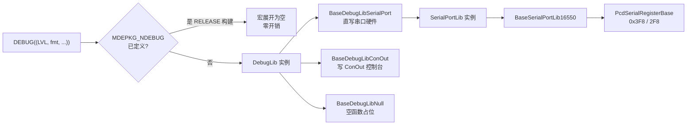
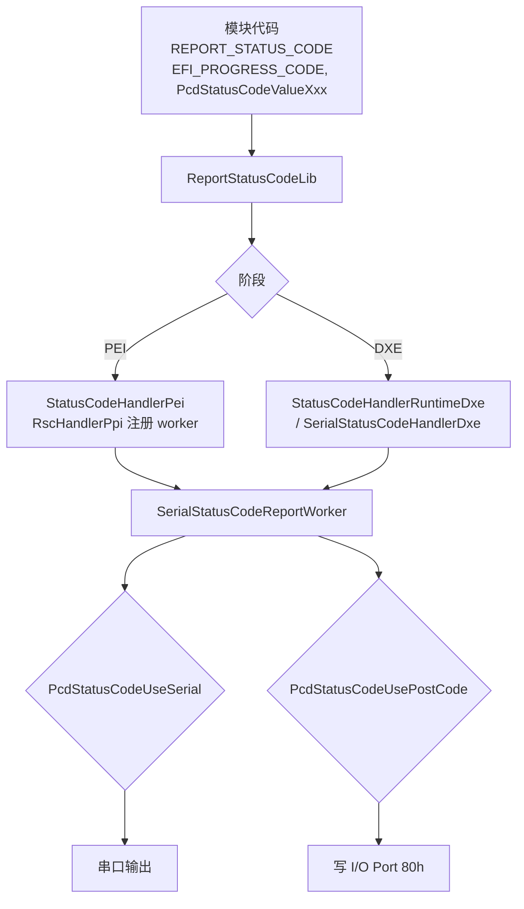
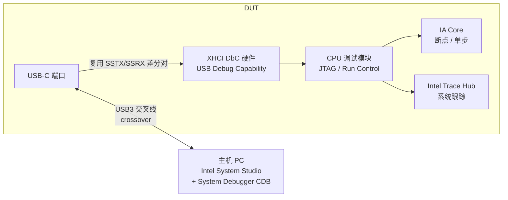
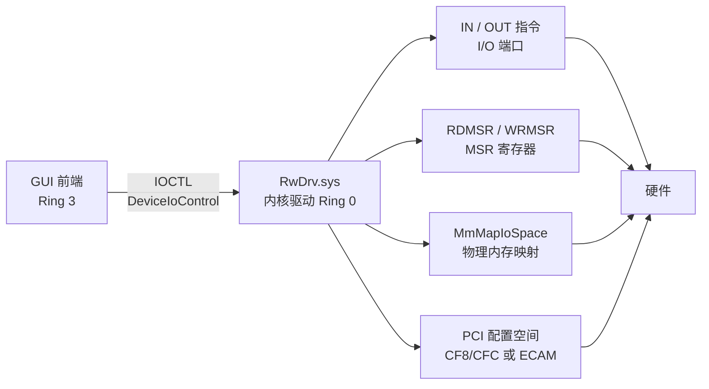

# BIOS Debug 调试技术与实战


---

## 一、为什么 BIOS Debug 特殊

### 1.1 与 OS 层调试的本质差异

BIOS 是系统启动的第一层软件，硬件问题往往在 BIOS 阶段暴露。与 Linux/Windows 下的 GDB、WinDbg 不同，BIOS 调试有以下约束：

| 约束 | 说明 |
|---|---|
| 无操作系统支持 | 调试早期（SEC/PEI）连文件系统、网络都没有，调试信息只能走最低层的通道（I/O 端口、串口） |
| 特权模式执行 | 代码运行在 Ring 0 甚至 SMM（System Management Mode），OS 调试器无法介入 |
| 硬件依赖 | 必须在真实硬件或仿真器上运行，时间敏感，时序问题难以复现 |
| 代码规模大 | EDKII 有数百万行代码，且分 SEC→PEI→DXE→BDS→OS 多阶段执行，每阶段可用资源不同 |
| 影响范围大 | 一个 Bug 可能导致整机无法开机（No Boot） |

### 1.2 核心调试思路


> [!tip]
> 系统化的方法论比工具本身更重要：**先定位问题在哪个阶段，再选择对应工具，最后分析日志修复**。90% 的日常调试只需要串口。

---

## 二、调试工具全景

PPT 给出了六类工具的能力对比，下表保留原表并补充了各工具的底层工作方式：

| 工具 | 适用阶段 | 优势 | 劣势 | 成本 | 底层机制 |
|---|---|---|---|---|---|
| 串口（Serial） | PEI / DXE / BDS | 简单易用、实时输出 | 需串口硬件、无断点 | 低 | DebugLib → SerialPortLib → 16550 UART，见[[#三、串口调试]] |
| Post Code（80h） | SEC / PEI | 无需额外工具、快速定位 | 信息量有限、需查表 | 极低 | 写 I/O Port 80h，ReportStatusCode 链路，见[[#四、Post Code 调试]] |
| Intel DCI | PEI / DXE / BDS | USB-C 连接、支持 CDB 断点 | 需平台支持 DCI | 低 | XHCI DbC 复用 USB3 引脚转发 JTAG 序列，见[[#五、Intel DCI 调试]] |
| UEFI Shell | DXE / BDS | 交互式调试、灵活 | 需 DXE 阶段已加载 | 低 | Shell 是运行在 DXE/BDS 的 UEFI 应用，见[[#六、UEFI Shell 调试]] |
| RW-Everything | OS 环境 | 寄存器读写、硬件检查 | 需 OS 环境、无早期阶段 | 免费 | RwDrv.sys Ring0 驱动 + IOCTL，见[[#七、RW-Everything]] |
| Chipsec | DXE / OS | 安全审计、寄存器检查 | 需 OS 环境 | 免费 | Python 工具，基于读写 I/O/MMIO/MSR 的安全分析框架 |

工具选择路径：新手从串口 + Post Code 入门；进阶使用 DCI 硬件断点与 RW 寄存器级验证；辅助工具负责代码导航（VS Code / Source Insight）与固件分析（UEFITool）。

> [!note]
> 与用户调试环境的关系：串口工具链即 [[2026-8-26 学习记录|MCUP 笔记]] 中的 sscom5131 串口助手 + 自有测试机；RW-Everything 已有 `D:\feishu_download\RwPortableX64V1.7`（Rw.exe）可用；UEFI Shell 命令链见 [[UEFI shell调试命令和APP]]。

---

## 三、串口调试

### 3.1 硬件链路


目标板需有串口接头（DB9 或板载 USB-to-UART 调试口），主机侧用终端软件接收 ASCII 日志。波特率默认 115200，数据位 8、无校验、停止位 1（8N1），与 EDK2 默认 PCD 一致（`PcdUartDefaultBaudRate = 115200`）。

### 3.2 16550 UART 底层

串口调试的物理层是 16550 兼容 UART，EDK2 中由 `SerialPortLib` 库类抽象。平台默认通过 `PcdSerialRegisterBase` 指定基地址（COM1 = 0x3F8、COM2 = 0x2F8），访问方式可为 I/O 映射或 MMIO（`PcdSerialUseMmio`）。

| 寄存器 | 偏移（COM1 基址 0x3F8） | 作用 |
|---|---|---|
| THR / RBR | +0 | 发送保持寄存器（写）/ 接收缓冲寄存器（读） |
| IER | +1 | 中断使能 |
| IIR / FCR | +2 | 中断识别 / FIFO 控制 |
| LCR | +3 | 线路控制（含波特率除数锁存位 DLAB） |
| MCR | +4 | 调制解调控制 |
| LSR | +5 | 线路状态（BIT5=THR 空、BIT0=数据就绪） |
| MSR | +6 | 调制解调状态 |

发送流程：写 LCR 设置 8N1 → 写除数寄存器配置波特率 → 轮询 LSR.BIT5（THR 空）→ 写 THR。`BaseSerialPortLib16550`（MdeModulePkg/Library/BaseSerialPortLib16550）即此流程的标准实现，`SerialPortWrite` 是 DEBUG 输出的最终落点。

### 3.3 DEBUG() 宏详解

`DEBUG()` 宏定义于 `MdePkg/Include/Library/DebugLib.h`，库类实例在 DSC 的 `[LibraryClasses]` 段映射：

```c
// EDK2 DEBUG() 宏用法（双重括号是宏语法，不是笔误）
#include <Library/DebugLib.h>

DEBUG ((DEBUG_INFO, "Hello BIOS!\n"));
DEBUG ((DEBUG_INFO, "Status = %r\n", Status));
DEBUG ((DEBUG_ERROR, "Failed: %r\n", Status));
```

**错误级别（Debug Level）位定义**，对应 `PcdDebugPrintErrorLevel` 的位掩码：

| 级别 | 值 | 说明 |
|---|---|---|
| DEBUG_INIT | 0x00000001 | 初始化 |
| DEBUG_WARN | 0x00000002 | 警告 |
| DEBUG_LOAD | 0x00000004 | 加载 |
| DEBUG_FS | 0x00000008 | 文件系统 |
| DEBUG_POOL | 0x00000010 | 内存池 |
| DEBUG_PAGE | 0x00000020 | 内存页 |
| DEBUG_INFO | 0x00000040 | 一般信息（最常用） |
| DEBUG_DISPATCH | 0x00000080 | 驱动派发 |
| DEBUG_VERBOSE | 0x40000000 | 详细输出 |
| DEBUG_ERROR | 0x80000000 | 错误（任何配置下都应输出） |

DSC 中的典型配置：`PcdDebugPrintErrorLevel = 0x80000042`（= ERROR | INFO）。注意 DEBUG_ERROR 是 BIT31，与 `PcdDebugPrintErrorLevel` 按位与后非零才输出——生产版本关闭 INFO 以下级别、保留 ERROR 是通用实践。

**常用格式化符**：

| 格式符 | 含义 |
|---|---|
| %d | 十进制整数（INTN） |
| %x / %X | 十六进制 |
| %r | EFI_STATUS，自动转可读文字（如 `EFI_NOT_FOUND`） |
| %s | CHAR8* 窄字符串 |
| %S | CHAR16* 宽字符串（UEFI 默认编码） |
| %g | EFI_GUID |
| %p | 指针 |
| %a | ASCII 字符串 |
| %t / %T | 时间（GetTime/GetPerformanceCounter 相关） |

### 3.4 DEBUG() 的编译期展开与库实例选择



DebugLib 库类有多个实例，差异决定调试输出去向：

| 库实例 | 输出目标 | 典型用途 |
|---|---|---|
| `BaseDebugLibSerialPort` | 串口硬件（经 SerialPortLib） | 早期阶段、无控制台环境，最常用 |
| `BaseDebugLibConOut` | UEFI 控制台（屏幕） | 控制台已初始化后的调试 |
| `BaseDebugLibStdErr` | Standard Error 控制台 | UEFI Driver 调试 |
| `BaseDebugLibNull` | 丢弃 | 关闭调试，无需重编译 |
| `PeiDxeDebugLibReportStatusCode` | 走 ReportStatusCode 链路 | 生产固件（与 Post Code 同通道） |

**PcdDebugPropertyMask** 提供宏级别的开关（`0x2F` 为常用全开值）：

| 位 | 宏 | 含义 |
|---|---|---|
| BIT0 | DEBUG_PROPERTY_DEBUG_ASSERT_ENABLED | 启用 ASSERT |
| BIT1 | DEBUG_PROPERTY_DEBUG_PRINT_ENABLED | 启用 DEBUG 打印 |
| BIT2 | DEBUG_PROPERTY_DEBUG_CODE_ENABLED | 启用 DEBUG_CODE 块 |
| BIT3 | DEBUG_PROPERTY_CLEAR_MEMORY_ENABLED | 分配清零 |
| BIT4 | DEBUG_PROPERTY_ASSERT_BREAKPOINT_ENABLED | ASSERT 时下断点 |
| BIT5 | DEBUG_PROPERTY_ASSERT_DEADLOOP_ENABLED | ASSERT 时死循环 |

> [!warning]
> **MDEPKG_NDEBUG 陷阱**：DSC 的 `[BuildOptions]` 在 RELEASE 构建时定义 `-DMDEPKG_NDEBUG`，所有 DebugLib 宏（DEBUG / ASSERT / DEBUG_CODE）被编译器在预处理阶段整体移除，DEBUG() 展开为空——这就是 RELEASE 版本下串口无任何输出的根因。项目当前 `DEBUG_MODE=0`（RELEASE，PcdDebugPrintErrorLevel=0x80000000）正是此情形，自研 MyPrintLib 直写 COM1（`IoWrite16(0x3F8)`）绕开 DebugLib 的原因即在此，见[[#九、Debug 方法论]]。

### 3.5 ASSERT 与进阶技巧

```c
ASSERT (Pointer != NULL);        // 条件不满足 → 输出位置并 halt
ASSERT_EFI_ERROR (Status);       // Status 非成功 → halt
// 输出格式: ASSERT [ModuleName] File.c(42): Pointer != NULL

DEBUG_CODE (                    // 仅在 DEBUG 构建（MDEPKG_NDEBUG 未定义）中编译执行
  DumpHex (2, Address, Size, Buffer);
);
```

- **ASSERT 行为**：DebugLib 中 `ASSERT` 展开为条件检查，失败时打印文件名/行号与表达式，然后按 `PcdDebugPropertyMask` 的 BIT4/BIT5 决定 INT3 断点还是死循环（`CpuDeadLoop`）。
- **CpuDeadLoop()**：实现在 `MdePkg/Library/BaseLib/CpuDeadLoop.c`，本质是 `for (Index = 0; Index == 0;) CpuPause();`（PAUSE 指令低功耗自旋）。调试用途：插在关键位置让系统停在指定点，再用 DCI 连接查看状态；调试器改掉栈上的 Index 或手动修 `rsp` 后 `ret` 可继续执行。注意 VS2019+ 编译器优化已使"改 Index 跳出"变难，属已知问题。
- **DumpHex**：`MdePkg/Library/BaseLib` 提供的十六进制转储函数，配合 DEBUG_CODE 只在调试构建输出。
- **时间戳**：`GetPerformanceCounter()` 来自 TimerLib（DSC 中映射平台 TimerLib 实例），两次调用差值除以 `GetPerformanceCounterProperties()` 得到的频率即为耗时，用于定位异常慢的步骤。

---

## 四、Post Code 调试

### 4.1 80h 端口机制

POST = Power-On Self-Test。BIOS 在启动过程中持续向 **I/O Port 80h** 写入状态码（检查点），外部 POST 卡/数码管把端口值实时显示出来。系统卡死时，最后停留的代码就是定位线索。

| 查看方式 | 说明 |
|---|---|
| 主板 2 位数码管 | 最常见，直接读 |
| PCI POST 诊断卡 | 插 PCI/PCIe 槽，解码 80h 写操作 |
| USB POST 显示器 | 如 AMIDebug RX（AMI 官方 USB 诊断设备） |
| 串口 Post Code 日志 | DSC 开 `PcdStatusCodeUseSerial` 后与 DEBUG 同通道输出 |
| BMC/IPMI | 服务器平台远程查看 |

> [!note]
> 80h 端口的另一用途是**哑延时**：Linux 内核的 `inb_p()/outb_p()` 用对 0x80 的空读写实现约 1µs 的 I/O 总线延时，因为写 80h 不会影响任何真实设备。这也解释了为什么 POST 卡能廉价实现——它只是解码一个"无害"端口上的写入。

### 4.2 EDK2 ReportStatusCode 链路

EDK2 的 Post Code 不是直接 `IoWrite8 (0x80, x)` 散落各处，而是走统一的 **ReportStatusCode** 框架，最终由 handler 决定输出到串口还是 80h：



关键 PCD 与源码位置：

| PCD | 归属 | 作用 |
|---|---|---|
| `PcdStatusCodeUseSerial` | gEfiMdeModulePkgTokenSpaceGuid | TRUE 时 status code 同时输出串口（0x00010022，可动态配置） |
| `PcdStatusCodeUseMemory` | 同上 | 状态码写入内存（PEI 引导期内存 / DXE 运行时内存），供 OS 读取 |
| `PcdStatusCodeReplayIn` | 同上 | DXE 阶段重放 PEI 阶段的状态码 |
| `PcdStatusCodeValuePeiMemoryDiscovered` 等 | 同上 | 各检查点的具体取值 |

模块代码用法：

```c
#include <Library/ReportStatusCodeLib.h>

// 报告进度码（值由 PCD 定义）
REPORT_STATUS_CODE (
  EFI_PROGRESS_CODE,
  PcdGet32 (PcdStatusCodeValuePeiMemoryDiscovered)
);

// 平台自定义检查点：直接写 80h
IoWrite8 (0x80, 0x35);
```

### 4.3 EDK2 默认检查点值 vs AMI Aptio 实际检查点

PPT 给出的检查点值（`PEI_CORE_STARTED 0x20`、`DXE_CORE_STARTED 0x40`、`BDS_STARTED 0x60`）来自 EDK2 MdeModulePkg 的 **PcdStatusCodeValueXxx 默认值**。但 AMI Aptio 平台实际输出到 80h 的是 **AMI 自定义检查点表**，两者整体偏移 0x10~0x30：

| 阶段 | PPT / EDK2 默认值 | AMI Aptio 实际值 |
|---|---|---|
| SEC | 0x10-0x1F | 0x01-0x0B（执行）/ 0x0C-0x0F（错误） |
| PEI 内核启动 | 0x20（PEI_CORE_STARTED） | 0x10 |
| PEI 内存初始化 | 0x2x（MEMORY_DISCOVERED 0x28） | 0x2B-0x2F（SPD 读取 → 配置内存） |
| 内存已安装 | — | 0x31 |
| PEI 内存错误 | 0x5x（错误码） | 0x50-0x5F（如 0x55 = 内存未安装） |
| DXE 内核启动 | 0x40（DXE_CORE_STARTED） | 0x60 |
| BDS 启动 | 0x60（BDS_STARTED） | 0x90 |
| Setup 界面 | 0x90-0x9F | 0xA9（开始 Setup）/ 0xAB（Setup 输入等待） |
| 系统就绪 | 0xAA | 0xAD（准备 Boot 事件）/ 0xAF（退出 Boot 服务） |

> [!warning]
> **拿 PPT 表对真机数码管会错位**。真机 AMI Aptio 平台卡 0x2x 表示的是"内存检测前 PEI 初始化"（0x20-0x2F），而 PPT 的 0x20 = PEI_CORE_STARTED、0x28 = PEI_MEMORY_DISCOVERED——语义接近但数值不同；DXE 卡 0x6x 在 PPT 里是 BDS，在 AMI 里却是 DXE 阶段。排查时以 AMI 官方检查点表（Aptio 4.x/5.x Status Code 文档）为准，PPT 表仅适用于确认 PCD 值未被重定义的标准 EDK2 平台。

AMI 常用检查点速查（Aptio 5.x，与 [[8-26 MCUP]] 笔记的 POST Code IO 0x80 采集对应）：

| 代码 | 含义 |
|---|---|
| 0x10 | PEI 内核已启动 |
| 0x2B | 内存初始化：读取 SPD |
| 0x2F | 内存初始化（其他） |
| 0x31 | 内存已安装 |
| 0x50-0x5F | PEI 错误（0x50 无效内存类型/速度、0x51 SPD 读取失败、0x55 内存未安装、0x59 微码未找到） |
| 0x60 | DXE 内核启动 |
| 0x68 | PCI 主机桥初始化 |
| 0x90 | BDS 阶段启动 |
| 0x94 | PCI 总线枚举 |
| 0x99 | Super I/O 初始化 |
| 0x9A-0x9D | USB 初始化/复位/检测/使能 |
| 0xA9 | 开始 Setup |
| 0xAD | 准备 Boot 事件 |
| 0xD0-0xDF | DXE 错误（0xD3 架构协议不可用、0xD4 PCI 资源分配错误） |

诊断流程：系统不亮 → 看最后 Post Code → 查表定位阶段 → 卡 0x2x 查内存（条子、SPD、MRC 日志）；卡 0x6x 查 DXE 驱动（串口看哪个驱动报错）；卡 0x9x 查启动设备与 BDS 配置。

---

## 五、Intel DCI 调试

### 5.1 DCI 是什么

DCI = **Direct Connect Interface**（Intel 官方名称，PPT 中写作 Debug Connection Interface 不准确）。它是 Intel 平台的闭壳调试（Closed Chassis Debug）接口，通过标准 USB 接口提供 JTAG 级调试能力，替代昂贵的 XDP 调试头。



关键机制：

- **传输拓扑有两种**：`DCI.USB2 / DCI.USB3`（前身 DbC，USB Debug Class，走 USB 协议栈）；`DCI.OOB`（Out of Band，前身 BSSB，绕过 USB 控制器直连引脚，需要 Intel SVT Closed Chassis Adapter 专用适配器）。
- **DbC 是 XHCI 控制器属性而非端口属性**：自 PCH 100 系列（Skylake）起 Intel 内置的 XHCI 控制器支持 USB Debug Capability，只要该控制器支持 DbC，任意 USB3 端口都可作调试口，硬件会自动选择首个接入调试线缆的端口。
- **物理连接**：使用 USB 3.0 调试交叉线（内部收发交叉，类似以太网 crossover），主机侧枚举出 "Intel USB Native Debug Class Device" 即表示 DCI 已生效。
- **主机软件**：Intel System Studio（免费可续期许可）中的 System Debugger 组件，即 PPT 所称 CDB；另有开源 OpenDCI 实现。
- **能力**：断点、单步、寄存器/内存读写、Run Control（JTAG Probe Mode）、Intel Trace Hub 系统跟踪。

### 5.2 启用条件

DCI 不是默认开启的功能，需要三层条件：

| 层面 | 配置 | 说明 |
|---|---|---|
| BIOS Setup | Setup → Debug → DCI Enable | 对应变量：IED（Intel Enhanced Debug）、CPU Run Control、CPU Run Control Lock（须置 0）、Platform Debug Connect、xDCI Support |
| FSP UPD | PchDciEn、PlatformDebugConsent、PchTraceHubMode、DebugInterfaceEnable | 参考 FSP Integration Guide 按 SoC 配置 |
| 构建 | BIOS 需编译 Debug 版本 | 与 [[#3.4 DEBUG() 的编译期展开与库实例选择|MDEPKG_NDEBUG]] 同理，Release 版调试符号与断点信息缺失 |

> [!warning]
> DCI 同时是**安全攻击面**：可通过修改 SPI Flash 中的 Setup 变量（chipsec dump + UEFITool 提取 + IFRExtractor 改写）在消费级主板上强制开启 DCI，配合 USB3 调试线即可对 CPU 做单步控制。量产固件应关闭 DCI 并置位 Run Control Lock，防止闭壳调试接口被恶意利用。

### 5.3 与 XDP/JTAG 的对比

| 维度 | XDP / JTAG | Intel DCI |
|---|---|---|
| 接头成本 | XDP 探头 $5000+ | 标准 USB3 交叉线（约 $15）或 CCA 适配器 |
| 连接 | 专用调试头/开壳 | USB-C/USB3 闭壳 |
| 功能 | 完整 JTAG Run Control | 断点、单步、寄存器/内存、Trace Hub 跟踪 |
| 平台要求 | 平台留有 XDP 焊点 | 10 代+ 平台原生支持（Skylake 起，PCH 100 系列） |
| 可用时段 | 全阶段 | DCI.USB2 在 CSE Boot Stall 前可用，DCI.USB3 需 S0 状态 |

---

## 六、UEFI Shell 调试

Shell 是运行在 DXE/BDS 阶段的 UEFI 应用，提供命令行交互调试能力，详细命令链见 [[UEFI shell调试命令和APP]]，此处列出 PPT 的核心命令：

| 命令 | 作用 |
|---|---|
| `memmap` | 显示内存映射 |
| `dh -d` | 显示所有设备/驱动句柄 |
| `dmem <addr> <size>` | Dump 内存 |
| `mm <addr>` | 修改内存 |
| `io <port>` | 读写 I/O 端口 |
| `pci <bus>:<dev>` | 查看 PCI 设备配置空间 |
| `acpiview` | 查看 ACPI 表（`-s` 验证表签名） |
| `smbiosview` | 查看 SMBIOS 数据 |
| `bcfg boot dump` | 查看 BootOrder / Boot#### 启动项 |
| `load MyDriver.efi` | 加载驱动，随后可直接运行自定义 `.efi` 应用 |

实战流程：Setup 设 Boot Option #1 = UEFI Shell → `memmap` 检查内存布局 → `dh -d` 确认驱动加载 → `dmem/mm` 检查内存数据 → `pci` 检查设备配置。

> [!tip]
> `startup.nsh` 脚本：Shell 启动时自动执行，适合批量命令。无显示器环境可用串口连接 Shell（终端输出重定向），与 [[#三、串口调试|串口链路]] 复用同一物理通道。

---

## 七、RW-Everything

### 7.1 能力与场景

RW-Everything 是 Windows 下的免费硬件读写工具，图形界面访问 CPU/芯片组/外设的底层资源，常用于 BIOS 验证与问题复现：

| 能力 | 典型场景 |
|---|---|
| PCI 配置空间读写（BAR/Command/Status） | 检查 PCIe Link Speed/Width、BAR 分配 |
| 物理内存 Dump | 验证 BIOS 内存布局、数据正确性 |
| CMOS / NVRAM 变量读写 | 验证变量持久化（对应 [[RunTime Services]] 的 NV 变量） |
| EC 寄存器访问 | 风扇/温度/电源控制验证 |
| ACPI 表 / SMBIOS 数据查看 | 检查 DSDT/SSDT 内容（[[ACPI]]） |
| GPIO 配置与电平 | 验证 GPIO 引脚状态（[[2026-8-21 学习记录|GPIO 笔记]]） |

### 7.2 底层原理：Ring0 驱动模型



RW-Everything 启动时加载内核驱动 `RwDrv.sys`（与开源的 WinRing0 同类架构），用户态通过标准 IOCTL 机制把读写请求交给 Ring 0 驱动执行，结果回传 GUI。这正是它能绕过 Windows 用户态硬件访问限制的原因，也因此**必须以管理员权限运行**。

> [!warning]
> **驱动封锁与安全风险**：Windows 11 的 Vulnerable Driver Blocklist（配合 HVCI 内存完整性 / Smart App Control）已把 RwDrv.sys、WinRing0x64.sys 列入封禁名单，新系统上可能驱动被挡、程序打不开，需评估风险后手动关闭防护。WinRing0 家族还存在 CVE-2023-1048 类 BYOVD（Bring Your Own Vulnerable Driver）漏洞——恶意程序可加载该驱动获得任意 MSR/物理内存读写。调试机可以接受，生产环境不要安装此类工具。

---

## 八、常见 Debug 场景速查

| 场景 | 症状 | 工具 | 检查点 | 关键模块 | 方法 |
|---|---|---|---|---|---|
| 内存初始化失败 | Post Code 卡 0x2x、黑屏 | Post Code + 串口 + DCI | 内存条兼容性、SPD 数据 | MRC | 串口搜索 "MRC" 输出；换条/换槽排除 |
| PCIe 设备异常 | 设备不识别、Link Down | Shell（pci）+ 串口 | Link Speed/Width、BAR 分配 | PciHostBridge | 串口搜 "PCI" 和 "BAR"；检查配置空间 |
| ACPI 表错误 | OS BSOD、电源管理异常 | Shell（acpiview）+ iASL | DSDT/SSDT 编译错误 | ASL 编译器 | `acpiview -s` 验证表签名；iASL 反编译排查 |
| 启动失败 | 无法进 OS、Boot 选项丢失 | Shell + 串口 | BootOrder、Boot####、FilePath | BdsDxe | `bcfg boot dump`；检查启动变量 |
| USB 设备问题 | USB 不识别、启动卡住 | 串口 + Shell（dh -d） | XHCI 控制器初始化 | UsbBusDxe | 逐个拔出排除法 |
| Secure Boot 拒绝引导 | SB 拒绝引导 | Shell + 串口 | PK/KEK/db/dbx 变量 | SecurityStubDxe | 临时关闭 SB 排除变量问题 |

> [!note]
> 与本项目关联：PCIe 场景对应 [[PCIe]] 笔记的 ECAM 配置空间解析（PciEnumAPP 实战）；ACPI 场景对应 [[ACPI]] 笔记；USB 场景与 H61 侧线项目的 XHCI/GPIO 供电调试相关（[[2026-8-21 学习记录|GPP_D16~D23]]）；Secure Boot 场景对应 [[8-27 Linux]] 笔记的 shim/MOK 信任链。

---

## 九、Debug 方法论与最佳实践

### 9.1 调试方法论（五步）

1. **复现**：稳定复现是调试的前提，复现不了的 Bug 无法定位；
2. **缩小范围**：二分法排除（阶段、模块、驱动）；
3. **对比**：正常 vs 异常 A/B 对比，diff 日志差异；
4. **假设-验证**：每次只改一个变量，验证假设后再改下一个；
5. **记录**：每次尝试都记录结果，避免重复踩坑。

### 9.2 日志分析技巧

- 保存完整串口日志（PuTTY 开启 Log 功能），不依赖屏幕回放；
- 用 diff 工具对比正常/异常日志；
- 搜索关键词：ERROR、WARN、ASSERT、FAIL；
- 关注"最后一个正常输出"之后的内容——卡死点就在那里；
- 时间戳分析：找耗时异常的步骤（GetPerformanceCounter）。

### 9.3 效率提升

- 搭建固定调试环境（串口线/终端配置一次配好）；
- 脚本化自动收集串口日志；
- 制作 Post Code 速查表；
- **Git bisect**：定位引入 Bug 的提交（[[Git 使用]]），二分查找历史版本；
- 团队知识库：常见问题与解决方案沉淀。

### 9.4 与自研 MyPrintLib 的对接

项目当前处于 RELEASE 构建（`DEBUG_MODE=0`，MDEPKG_NDEBUG 生效），标准 DEBUG() 全部展开为空。自研 MyPrintLib（OemJYTianPkg/JYTianLibModule）直写 COM1 串口（`IoWrite16(0x3F8)` 轮询 LSR + 写 THR），正是对[[#3.4 DEBUG() 的编译期展开与库实例选择|DebugLib 依赖]]的替代：脱离 AMI DebugLib，在 RELEASE 下保留串口日志能力，参考先例 OemPkg/Function/HddCheck/HddCheck.c。验证手段与本节方法论一致：sscom5131 比对实际 DEBUG 输出与预期。

**黄金法则**：先串口看全局 → Post Code 定阶段 → DCI/RW 看细节。约 80% 的问题用串口解决，15% 需要 Post Code 辅助，仅 5% 需要 DCI 或 RW-Everything。

---

## 术语表

| 术语 | 全称 | 含义 |
|---|---|---|
| POST | Power-On Self-Test | 上电自检，BIOS 启动阶段 |
| Post Code / Checkpoint | — | 写入 I/O 80h 的十六进制进度码 |
| DEBUG() | — | EDK2 DebugLib 的调试输出宏 |
| ASSERT | — | EDK2 断言宏，条件不满足时 halt |
| DebugLib | — | EDK2 调试库类，MdePkg/Include/Library/DebugLib.h |
| SerialPortLib | — | 串口硬件抽象库类，最终落点 16550 |
| ReportStatusCodeLib | — | 状态码上报库类，Post Code 的统一通道 |
| PCD | Platform Configuration Database | EDK2 平台配置数据库，编译期/运行时配置 |
| MDEPKG_NDEBUG | — | RELEASE 构建宏，定义后 DebugLib 宏全部移除 |
| DCI | Direct Connect Interface | Intel 闭壳调试接口，USB 承载 JTAG 能力 |
| DbC | USB Debug Capability | XHCI 控制器的调试能力，DCI 的传输基础 |
| CDB | — | PPT 所称 Intel 调试器（Intel System Studio 的 System Debugger） |
| XDP | eXtended Debug Port | Intel 传统硬件调试端口（JTAG） |
| RW-Everything | — | Windows Ring0 硬件读写工具（RwDrv.sys） |
| MRC | Memory Reference Code | 内存参考代码，负责内存初始化 |
| UART | Universal Asynchronous Receiver-Transmitter | 通用异步收发器，串口物理层 |
| ISR | Interrupt Service Routine | 中断服务例程 |
| IOCTL | I/O Control | 用户态与驱动通信的控制码 |
| BYOVD | Bring Your Own Vulnerable Driver | 利用自带漏洞驱动提权的攻击手法 |
| EFI_STATUS | — | UEFI 状态码，%r 可格式化输出 |

---

