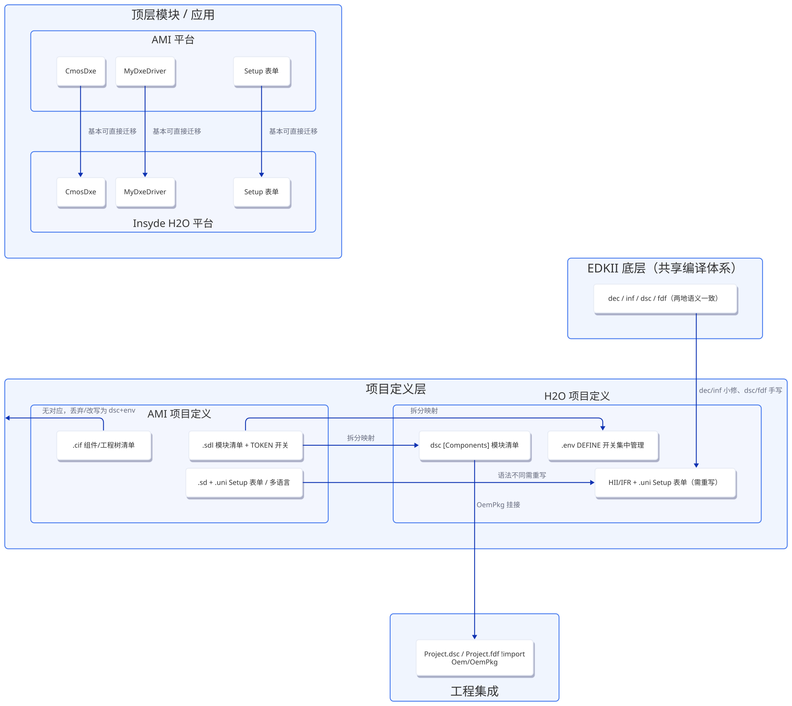
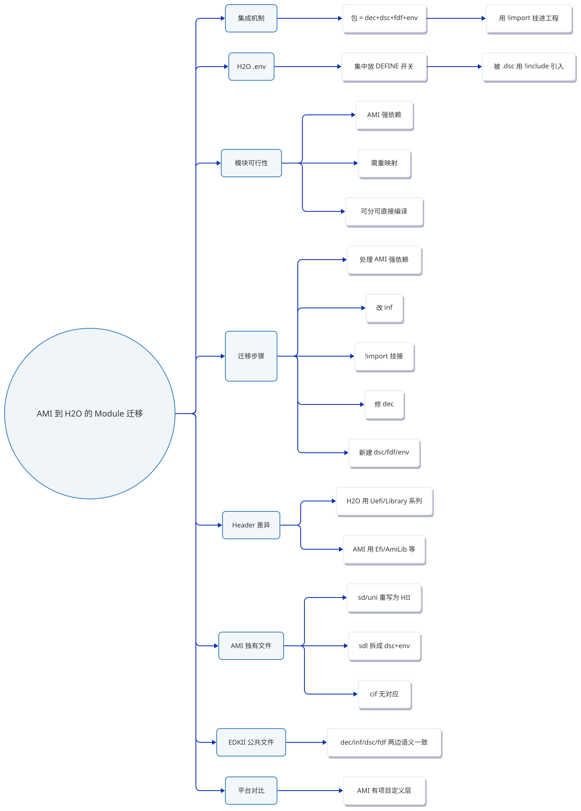
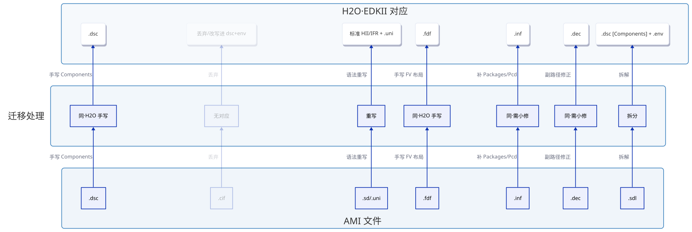
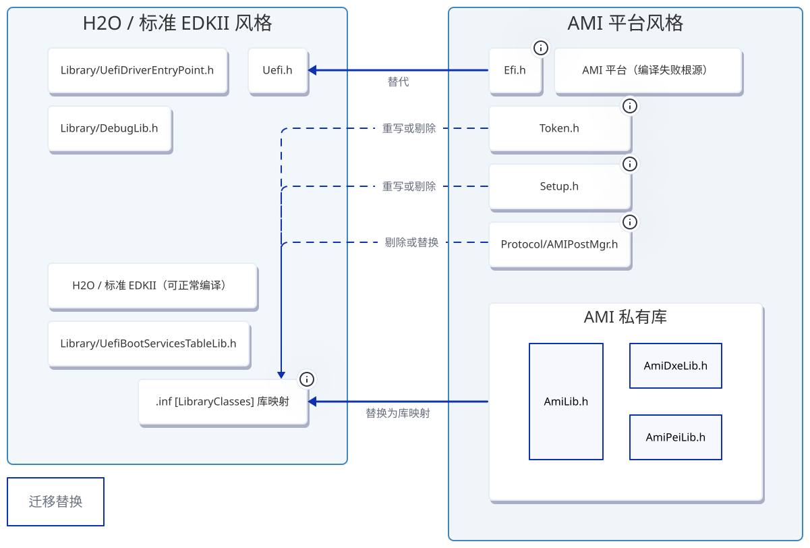

> 记录把「AMI 平台」的 OEM 包迁移到「Insyde H2O 平台」时，涉及的所有文件类型、作用、差异和迁移清单。


---



**图1｜两平台包/文件结构迁移架构图**



**图2｜全篇知识框架思维导图**

## 一、平台文件对比总表

| 文件                  | 哪个平台       | 作用            | 对应 Insyde H2O                         |
| ------------------- | ---------- | ------------- | ------------------------------------ |
| `.dec`              | EDKII（两边同） | 包声明/对外接口      | 同（需小修）                               |
| `.inf`              | EDKII（两边同） | 模块信息/编译单元     | 同（需小修）                               |
| `.dsc`              | EDKII（两边同） | 编什么/库映射       | 同，但这里要**手写**                         |
| `.fdf`              | EDKII（两边同） | flash 布局      | 同，但要**手写**                           |
| `.cif`              | AMI 私有     | 组件/工程树清单      | **无对应**                              |
| `.sdl`              | AMI 私有     | 模块清单 + 开关     | 对应 **`.dsc` 的 `[Components]` + `.env`** |
| `.env`              | Insyde 约定  | 集中放 DEFINE 开关 | AMI 用 `.sdl` 的 TOKEN 达成              |
| `.sd`/`.uni`（setup） | AMI 私有     | Setup 表单/多语言  | 对应 **HII/IFR + `.uni`**              |



**图3｜文件类型迁移映射图**

---


## 二、EDKII 公共文件详解（两边相同，这里重点讲 H2O 如何用）

### 2.1 `.dec` — 包声明文件（Declaration）

包对外的「说明书 / API 清单」。**只声明，不编译任何东西。**

```dec
[Defines]
    DEC_SPECIFICATION              = 0x00010005
    PACKAGE_NAME                   = OemJYTianPkg
    PACKAGE_GUID                   = A1B2C3D4-E5F6-4789-9ABC-DEF012345678
    PACKAGE_VERSION                = 0.1

[Includes]
    # 这些是「目录名」，会被加到依赖本包的模块的编译搜索路径（-I）里
    # 让模块能直接 #include <MyLib.h> 这类「按文件名」的头
    JYTianLibModule
    JYTianPeiModule
    JYTianPpiModule
    JYTianProtocolModuel
    JYTianSmi

[LibraryClasses]
    # 右侧必须是【头文件路径】—— 声明库类的接口头，不编译、不映射
    MyLib           | JYTianLibModule/MyLib.h
    MyCalcLib       | JYTianLibModule/MyCalcLib.h
    MyStackGuardLib | JYTianLibModule/MyStackGuard.h
    MyPrint         | JYTianLibModule/MyPrint.h

[Guids]
    gCmosProtocolGuid = { 0xA1B2C3D4, 0x5E6F, 0x7890, { 0xAB, 0xCD, 0xEF, 0x01, 0x23, 0x45, 0x67, 0x89 } }

[Protocols]
    gCmosProtocolGuid = { 0xA1B2C3D4, 0x5E6F, 0x7890, { 0xAB, 0xCD, 0xEF, 0x01, 0x23, 0x45, 0x67, 0x89 } }
```

**⚠️ 迁移注意：** 本包 `.dec` 的 `[LibraryClasses]` 右半路径写错了——`MyLib.h` 实际在 `JYTianLibModule/` 下，不是包根目录。正确的是 `MyLib | JYTianLibModule/MyLib.h`。当前写法文件不存在，EDK2 会报“库类头文件找不到”。


### 2.2 `.dsc` — 构建描述文件（Description）

分**平台级**和**包级**两层。

```dsc
# ============ 包级 .dsc（如 OemJYTianPkg.dsc）============
[Defines]
    !include OemJYTianPkg/OemJYTianPkg.env    # 引入开关文件

[Packages]
    OemJYTianPkg/OemJYTianPkg.dec             # 消费的包（对应 .dec 拉进来）

[LibraryClasses]
    # 右边必须是【实例 .inf】—— 库类 → 具体实现
    MyLib           | OemJYTianPkg/JYTianLibModule/MyLib.inf
    MyCalcLib       | OemJYTianPkg/JYTianLibModule/MyCalcLib.inf
    MyStackGuardLib | OemJYTianPkg/JYTianLibModule/MyStackGuardLib.inf
    MyPrint         | OemJYTianPkg/JYTianLibModule/MyPrintLib.inf

[Components.$(PEI_ARCH)]
    !if $(JYTianPkg_ALL_FEATURE_ENABLE) == YES
        OemJYTianPkg/JYTianPeiModule/MyPeiM.inf
    !endif

[Components.$(DXE_ARCH)]
    !if $(JYTianPkg_ALL_FEATURE_ENABLE) == YES
        OemJYTianPkg/JYTianDxeModule/MyDxeDriver.inf
    !endif
```

```dsc
# ============ 平台级 Project.dsc 里的一行 ============
# 用 !import 把包级 .dsc 嵌入平台 DSC，等于把它的 [Packages]/[LibraryClasses]/[Components] 全部展开进来
!import Oem/OemPkg/OemPkg.dsc
```

### 2.3 `.fdf` — 闪存描述文件（Flash Description File）

**这是唯一定义 FFS 在 flash 里布局/顺序/压缩/对齐 的文件。**

```fdf
# ============ 包级 .fdf（如 OemJYTianPkg.fdf）============
[FV.RECOVERYFV]                 # PEI 阶段模块放这里
    !if $(JYTianPkg_PEI_ENABLE) == YES
        INF OemJYTianPkg/JYTianPeiModule/MyPeiM.inf
    !endif

[FV.DXEFV]                      # DXE/SMM/UEFI_APP 模块放这里
    INF OemJYTianPkg/JYTianDxeModule/MyDxeDriver.inf
    INF OemJYTianPkg/JYTianProtocolModuel/CmosDxe.inf
```

```fdf
# ============ 平台级 Project.fdf 里的一行 ============
!import Oem/OemPkg/OemPkg.fdf
```

---

## 三、Insyde H2O 独有的 `.env`

集中放 DEFINE 开关的配置文件（Insyde 约定，非 EDKII 标准）。被 `.dsc` 用 `!include` 引进来。

```
# ============ OemJYTianPkg.env ============
[Defines]
    # 总开关
    DEFINE  JYTianPkg_ALL_FEATURE_ENABLE = YES

    # 子开关
    DEFINE  JYTianPkg_PEI_ENABLE   = YES
    DEFINE  JYTianPkg_DXE_ENABLE   = YES
    DEFINE  JYTianPkg_SMI_ENABLE   = YES
```

```dsc
# .dsc 里用它控制模块编不编
[Components.$(DXE_ARCH)]
    !if $(JYTianPkg_ALL_FEATURE_ENABLE) == YES
        OemJYTianPkg/JYTianDxeModule/MyDxeDriver.inf
    !endif
```

**注意：** 平台级 `Project.env`（BIOS_VERSION、BIOS_CUSTOMER 等）是给 `GetProjectEnv` 用的，也属“配置开关”，但**不是 EDKII 的 `Conf/target.txt`**（后者是 TARGET/ARCH/TOOL_CHAIN 那种全局构建选项）。

---

## 四、AMI 独有的文件（本平台无对应，迁移时要么丢弃要么改写）

### 4.1 `.sdl` — 模块清单 + 开关（相当于把 `.dsc` 的 `[Components]` + `.env` 合并了）

```
TOKEN
    Name  = "OemJYTianPkg_SUPPORT"
    Value  = "1"
    Help  = "Main switch to enable OemJYTianPkg support in Project"
    TokenType = Boolean          # AMI 的特性开关（对应 H2O 的 .env DEFINE）
    TargetMAK = Yes
    Master = Yes
End

INFComponent                    # 声明哪个 .inf 属于哪个包、什么类型、默认开关（对应 H2O 的 [Components]）
    Name  = "MyDxeDriver"
    File  = "MyDxeDriver.inf"
    Package  = "OemJYTianPkg"
    ModuleTypes  = "DXE_DRIVER"
    Token = "MyDxeDriver_INF_SUPPORT" "=" "1"
End
```

### 4.2 `.cif` — 组件/工程树清单（XML 风格）

```
<component>
    name = "OemJYTianPkg"
    category = Flavor
    LocalRoot = "OemJYTianPkg/"
    RefName = "OemJYTianPkg"
[files]
"OemJYTianPkg.sdl"
"OemJYTianPkg.dec"
[parts]
"JYTianPeiModule"
"JYTianDxeModule"
"JYTianLibModule"
"JYTianVirtualDevice"
<endComponent>
```

### 4.3 `.sd` + `.uni` — AMI 的 Setup 表单（SVD）

`.sd` 用声明式描述表单控件；`.uni` 定义多语言字符串。**对应 H2O 的标准 HII/IFR + `.uni`，语法不同，不能直接搬，要重写。**


---

## 五、Header 差异：AMI 风格 vs H2O/EDKII 风格

这是很多 AMI 模块编不过的根源——代码里用了 AMI 独有的头文件（`Efi.h`/`AmiLib.h`/`AmiDxeLib.h`/`AmiPeiLib.h`/`Token.h`/`Setup.h`/`AMIPostMgr.h`），本工程不存在。

```edk2c
// ❌ AMI 平台风格（本工程没有这些头）
#include <Efi.h>            // AMI 老式，标准 EDKII 用 <Uefi.h>
#include <AmiLib.h>
#include <AmiDxeLib.h>
#include <AmiPeiLib.h>
#include <Token.h>          // AMI 的代币/变量
#include <Setup.h>
#include <Protocol/AMIPostMgr.h>

// ✅ Insyde H2O / 标准 EDKII 风格
#include <Uefi.h>
#include <Library/UefiDriverEntryPoint.h>
#include <Library/UefiBootServicesTableLib.h>
#include <Library/DebugLib.h>
```



**图4｜Header 差异对比图**

---

## 六、集成机制（参考已集成好的 `Oem/OemPkg`）

H2O 里的一个包 = `.dec` + `.dsc` + `.fdf` + `.env`，通过 `!import` 挂进工程：

- `Project.dsc`：`!import Oem/OemPkg/OemPkg.dsc`
- `Project.fdf`：`!import Oem/OemPkg/OemPkg.fdf`

包路径相对 WORKSPACE 解析（`Oem/OemPkg/OemPkg.dec` 直接对应根目录下同路径文件）。

---

## 七、迁移步骤



**图5｜迁移步骤总览流程图**

### A. 把 OemJYTianPkg 变成 H2O 能识别的包

现有包只有 `OemJYTianPkg.dec` 和一堆模块目录，缺少 H2O 包必备的 `.dsc`/`.fdf`/`.env`，且 `.dec` 有 2 处要修。

1. **新建 `OemJYTianPkg.dsc`**（参考 `Oem/OemPkg/OemPkg.dsc`）
   - `[Packages]`：`OemJYTianPkg/OemJYTianPkg.dec`（运行库按需加 `MdeModulePkg/MdeModulePkg.dec` 等）
   - `[LibraryClasses]`：把自定义库类映射到实例——`MyLib`、`MyCalcLib`、`MyStackGuardLib`、`MyPrint`、`MySmbios` → 各自的 `.inf`
   - `[Components.$(PEI_ARCH)]` / `[Components.$(DXE_ARCH)]`：用 `!if <开关> == YES` 包裹列举各模块

2. **新建 `OemJYTianPkg.fdf`**（参考 `OemPkg.fdf`）
   - PEIM → `[FV.RECOVERYFV]`
   - DXE / SMM / UEFI_APP → `[FV.DXEFV]`（UEFI_APP 如需单独放，可另设 app FV）
   - `MyVirtualDevice` 的 SSDT/ASL 需加 FDF rule（参考 `Oem/OemPkg/OemDevice/OemSsdt.inf` 的写法）

3. **新建 `OemJYTianPkg.env`**：feature 开关 + 总开关（`JYTianPkg_ALL_FEATURE_ENABLE` 之类），沿用 OemPkg 的做法。

4. **修 `OemJYTianPkg.dec`**
   - `[LibraryClasses]` 头文件路径写错了：`MyLib|MyLib.h` 应为 `MyLib|JYTianLibModule/MyLib.h`（其余 `MyCalcLib`/`MyStackGuardLib`/`MyPrint` 同理）。当前路径文件不存在，EDK2 会直接报错。
   - 复核 `[Includes]` 是否覆盖所有跨目录 include（`MyDxeDriver.c` 引 `<CmosDxe.h>`、`<MyLib.h>` 目前靠已列的目录能解析；需确认 `JYTianDxeModule` 等目录是否要补进 `[Includes]`）

5. **挂进工程**
   - `Project.dsc` 加 `!import OemJYTianPkg/OemJYTianPkg.dsc`
   - `Project.fdf` 加 `!import OemJYTianPkg/OemJYTianPkg.fdf`

### B. 可选模块的 `.inf` 修正（按保留哪些模块来做）

- **重映射平台包**：
  - `MemSpdDxe.inf`：`Intel/AlderLakeBoardPkg/BoardPkg.dec` → `Intel/PantherLake/PantherLakeBoardPkg/BoardPkg.dec`（本工程是 PantherLake；SmbusHc.h 在 MdePkg，已具备）
  - `UsbPower.inf`：`ClientOneSiliconPkg/SiPkg.dec` → `OneSiliconPkg/SiPkg.dec`；且 `GpioLib.h`/`GpioConfig.h`/`Pins/GpioPinsVer4S.h` **工程里找不到**，要额外解决（换 H2O/Intel GPIO 头或改代码）
- **按需补 `[Packages]`**：`MyGop`（EdidActive.h 在 MdePkg，可能不用改）等通过编辑验证后确定
- 补 `[LibraryClasses]` 映射、`[FixedPcd]` 等在编辑阶段确认

### C. AMI 强依赖模块

这些要么剔除、要么逐个替代成 H2O/EDK2 写法（其中 JYTianSetupModule 要重写成 H2O HII 表单）。

| 模块                                                         | 缺失依赖                                                             |
| ---------------------------------------------------------- | ---------------------------------------------------------------- |
| `MyRTServices`、`MyStackGuardDemo`、`MyTimerDxe`、`MyLogoDxe` | `AmiTsePkg`、`Protocol/AMIPostMgr.h`（不存在）                         |
| `MyGPIO`                                                   | `AmiModulePkg` / `AmiCompatibilityPkg`、`AmiPeiLib.h`（不存在）        |
| `MySmbios`（库）+ `MySmbiosDxe`                               | `AmiLib.h`、`AmiDxeLib.h`、`Token.h`、`Efi.h`（不存在）                  |
| `MySmi`                                                    | `AmiDxeLib.h`（不存在）                                               |
| `JYTianSetupModule`                                        | AMI SVD（`Setup.h`/`Token.h`/`.sd`/`.uni`），无 .inf，需按 H2O HII 整表重写 |

### D. 模块可行性速查

- **可直接编译（只需接线/少量补包）**：`MyLib`、`MyCalcLib`、`MyPrintLib`、`MyStackGuardLib`、`CmosPpi`、`CmosDxe`、`MyDxeDriver`、`MyCalcDxe`、`MyGop`、`ReadDiskMedia`、`MyCalcPei`、`MyPeiM`、`MyUefiApp`、`PciEnumAPP`、`ReadEcApp`、`USBEnum`、`MyVirtualDevice`（含 ASL）
- **需重映射平台包**：`MemSpdDxe`、`UsbPower`
- **AMI 强依赖（难移植/建议剔除）**：上表 C 列的 8 个



**图6｜模块可行性概览图**
