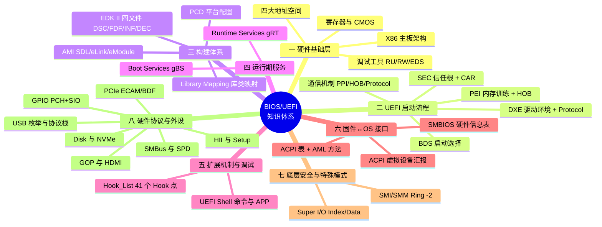
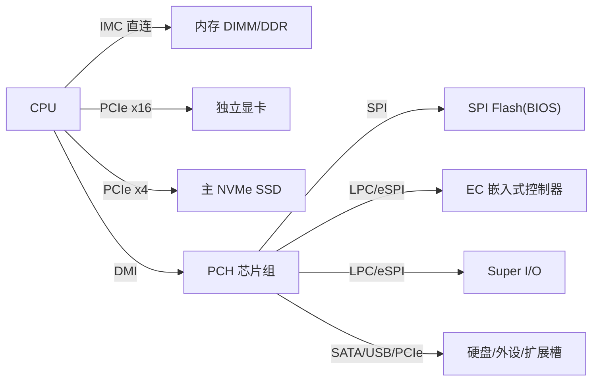
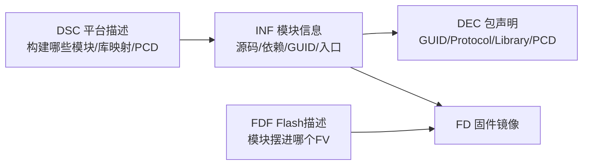
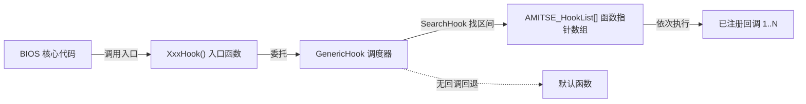
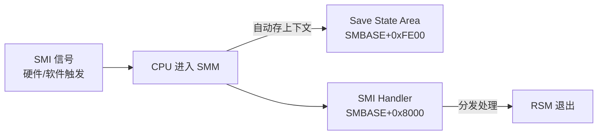
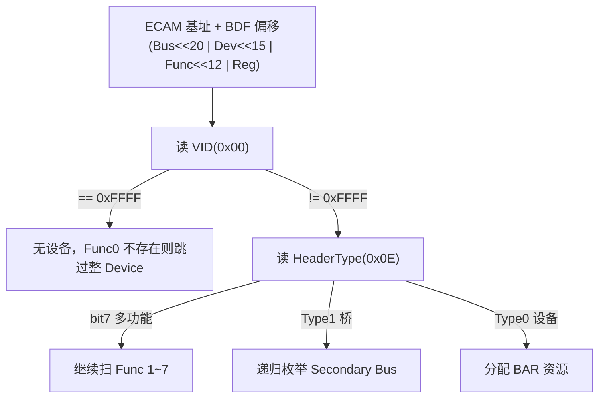
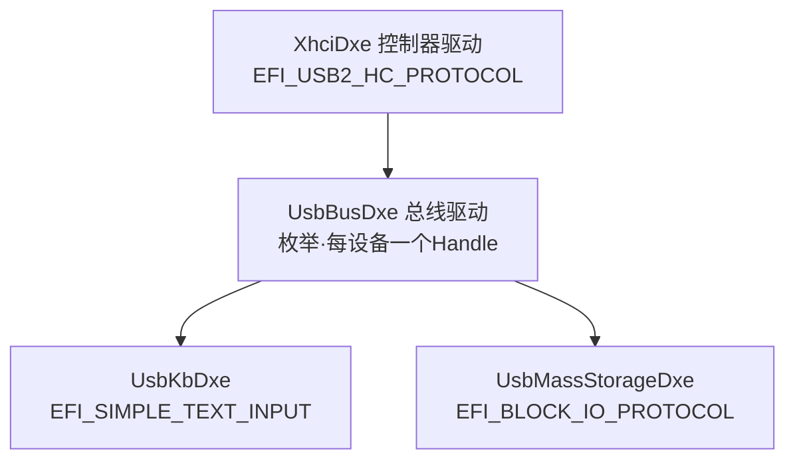
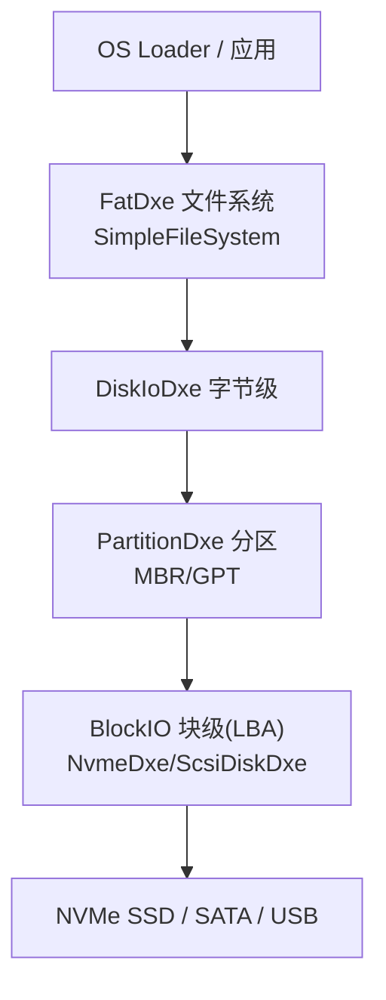
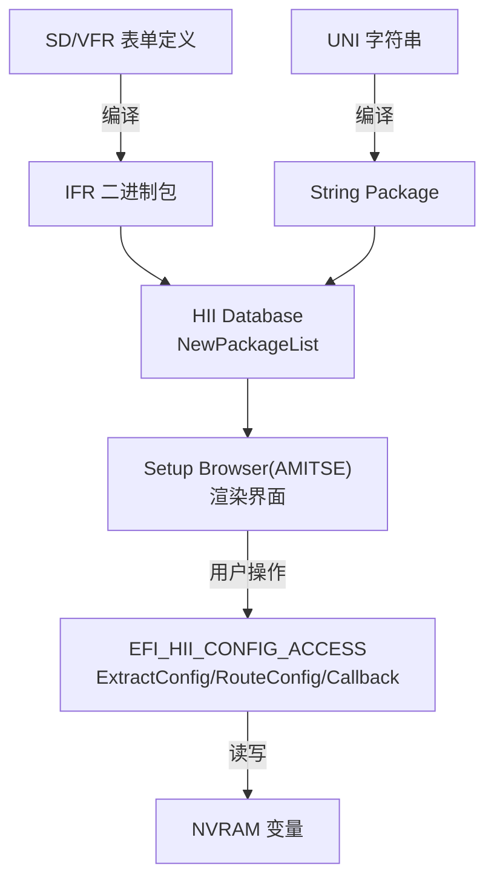

# BIOS/UEFI 固件开发知识体系全景梳理（2026-07-16 ~ 2026-08-24）

> 本文档系统梳理 2026-07-16 至 2026-08-24 全部 BIOS/UEFI 学习笔记，按 **八大阶段** 组织，厘清每个阶段的核心任务与目标，并给出"遇到具体开发需求时应如何编写代码"的对应写法。全文配套两类可视化：**Obsidian 原生 Mermaid 脑图**（内嵌，可直接在笔记库渲染）+ **ProcessOn 在线脑图**（可编辑）。

---

## 文档导读

- **覆盖范围**：`7-16 X86平台主板架构` → `8-24 HII & Setup`，共 29 个主题文件夹、约 78 篇笔记（含学习记录、日报、实践记录与专题笔记）。
- **阶段划分**：按"从硬件到固件、从启动到构建、从服务到接口、从安全到外设"的逻辑递进，分为八大阶段（见下表）。
- **每个阶段统一按三部分呈现**：① 核心任务与目标；② 关键知识点（含 Mermaid 图）；③ 本阶段开发需求 → 代码写法。

### 八大阶段总览

| 阶段 | 覆盖笔记（日期） | 主线 |
| --- | --- | --- |
| 一、硬件基础层 | 7-16 / 7-17 | 主板架构、四大地址空间、寄存器与 CMOS、调试工具 |
| 二、UEFI 启动流程 | 7-20 / 7-27 / 7-28 / 7-29 / 7-30 / 7-31 | 六阶段启动、PPI / HOB / Protocol 通信 |
| 三、构建体系 | 7-21 / 7-22 / 7-23 / 7-24 / 8-3 | EDK II 四文件 + AMI SDL/eLink 扩展层 |
| 四、运行期服务 | 7-31 / 8-5 | Boot Services（gBS）+ Runtime Services（gRT） |
| 五、扩展机制与调试 | 8-4 / 8-6 | Hook_List 扩展 + UEFI Shell 与 APP 开发 |
| 六、固件↔OS 接口 | 8-7 / 8-12 / 8-20 | ACPI、SMBIOS、ACPI 虚拟设备汇报 |
| 七、底层安全与特殊模式 | 8-10 / 8-11 | SMI/SMM（Ring -2）、Super I/O 编程 |
| 八、硬件协议与外设 | 8-13 / 8-17 / 8-18 / 8-19 / 8-20 / 8-21 / 8-24 | PCIe、SMBus/SPD、USB、GOP、Disk、GPIO、HII/Setup |

---

## 总览：八大阶段全景脑图

### 内嵌 Mermaid 脑图



### ProcessOn 在线脑图（可编辑）

- **总览知识体系脑图**（可在线编辑）：
  https://www.processon.com/thirds/dissociate/6a8f9a11ddee252d9ed14345?category=mind&partner=poToolAIMind&poInfo=Zz8pr1c0SwZ5Phpft7U1w0IQsmV4bYsBcIO79sLkMRwKGrZntAaN2aaZLcALR7uB2gAEicM-EVDBUxDjPUSCGGB7ANWnG3_P-FNiYPxeibomfc_sEbEzq_FY8tJRyuhCFJIuPz7CwnvYTUWPkuKPhSL3J35t1jo6Tr82RQ0h_8jRivk5qgd9SNLIixwKTPn7&partnerFlag=skill_mind_official_d7b06544-5fe7-42bc-942d-18ed26a0e70d

- **各阶段开发需求 → 代码写法对照脑图**（可在线编辑）：
  https://www.processon.com/thirds/dissociate/6a8f9a2c8d56e8392ba6d295?category=mind&partner=poToolAIMind&poInfo=UaIsucozMWW3iEsT6Tm3ZQEj_7W-W1dD7x9ISXkqyrA6K01korcjudxMKr-Gq7tmbJJGnzqQJAaiVwE1MII1X0SJc4-8xrH-hyWxOwJ78fvzLxDgyeRt4dt097ufdNh8bjyL82aI4oxOtzW3VkrZWYuduWfwBNb7RvlhwwMD7DhHtYt2VLmkj4kITsxStMr78WA0EFluTeoIjLr2E-uwbg&partnerFlag=skill_mind_official_d7b06544-5fe7-42bc-942d-18ed26a0e70d

---

# 阶段一：硬件基础层（7-16 / 7-17）

## 核心任务与目标

理解"一块 X86 主板由哪些部件组成、CPU 如何访问它们"，为后续所有固件开发打下**硬件访问模型**的基础。这一层不写固件逻辑，但决定了后面每个模块的代码怎么写——因为所有固件操作最终都归结为对 **Memory / IO / ISA / PCI 四大地址空间** 的读写。

## 1.1 X86 主板架构

**核心模型：CPU 直连高速设备 + PCH 桥接低速设备的分层架构。**

- **CPU 只直连三类最敏感设备**：内存（经内置 IMC）、独立显卡（PCIe x16，可拆 x8+x8）、主 NVMe SSD（PCIe x4）。
- **PCH（Platform Controller Hub）** 替代传统南桥，集成 SATA/USB/音频/网络/SPI/LPC 控制器，经 **DMI**（PCIe 变体）与 CPU 互联。设计动机：CPU 引脚数有限，PCH 用极少引脚换回上千个下游接口。
- **EC（嵌入式控制器）**：独立低功耗 MCU（8051/Cortex-M），关机后仍电池供电，负责电源时序、键盘矩阵、风扇、电池管理。开机时序 `电源按钮 → EC → 启动电源轨 → 释放 RSMRST → CPU 上电`。
- **SIO（Super I/O）**：承接传统低速 I/O（串口/PS2/GPIO/硬件监控），经 LPC/eSPI 挂 PCH。
- **DDR**：时钟上下沿各传一次数据，速率翻倍；**DIMM** 插槽提供 64 位数据位宽。



## 1.2 四大地址空间（BIOS 调试的基础）

CPU 通过四种方式访问外设，这是贯穿全周期的核心认知：

| 空间类型 | 访问方式 | 关键端口/寄存器 |
| --- | --- | --- |
| **Memory 空间** | 物理地址直接访问（段×16+偏移） | RAM/ROM/MMIO |
| **IO 空间** | `IN`/`OUT` 指令，独立编址 0000h~FFFFh | 0x60/0x64（KBC）、0x70/0x71（CMOS）、0xCF8/0xCFC（PCI） |
| **ISA 总线** | Index/Data 间接访问 | 0x2E/0x2F（SIO）、0x70/0x71（CMOS）、0x62/0x66（EC） |
| **PCI 总线** | 配置空间访问 | CONFIG_ADDRESS（0xCF8）含 Bus/Dev/Func/偏移 |

## 1.3 寄存器体系与 CMOS

- **寄存器**：通用（AX/EAX/RAX…）、段（CS/DS/ES/SS/FS/GS）、标志（EFLAGS）、系统（GDTR/IDTR/CR0-CR4/DR0-DR7/MSR）。
- **CMOS**：电池供电的可读写 RAM（标准 64 字节兼容 MC146818 RTC），存 RTC 时间、硬件配置、Setup 参数，经 0x70/0x71（Index/Data）访问。`0x0E` 诊断状态、`0x0F` 关机状态、`0x2E~0x2F` 校验和是调试重点。Clear CMOS 恢复默认值。

## 1.4 本阶段开发需求 → 代码写法

| 需求 | 代码写法 |
| --- | --- |
| 读 CMOS/RTC 寄存器 | `IoWrite8(0x70, Address); Value = IoRead8(0x71);` |
| 写 CMOS | `IoWrite8(0x70, Address); IoWrite8(0x71, Value);` |
| 读 PCI 配置空间（Legacy） | 向 `0xCF8` 写 32 位 CONFIG_ADDRESS（Bit31=1 使能，Bit23:16=Bus，Bit15:11=Dev，Bit10:8=Func，Bit7:2=偏移），再从 `0xCFC` 读数据 |
| 读 SIO/EC 寄存器 | 先写 Index 端口（0x2E）选寄存器偏移，再读写 Data 端口（0x2F） |

---

# 阶段二：UEFI 启动流程（7-20 / 7-27 / 7-28 / 7-29 / 7-30 / 7-31）

## 核心任务与目标

理清固件把机器从加电带到能交棒 OS 的 **完整时间线**，并掌握阶段之间/阶段内部**三种通信机制**的边界——这是理解"为什么某个模块要在某个阶段、用某种方式写"的关键。

## 2.1 六大启动阶段


| 阶段 | 核心任务 | 入口 | 出口 |
| --- | --- | --- | --- |
| **SEC** | 建立信任根、BIST 自检、**Cache-as-RAM（CAR）** 把缓存当临时内存、实模式切保护模式 | Reset Vector（0xFFFFFFF0） | 跳转 `PeiCore()` |
| **PEI** | 分 **Pre-Mem**（芯片组早期初始化 + **MRC 内存训练**，最耗时）→ **Post-Mem**（切 DRAM 重跑 + 硅初始化），建 **HOB 列表** | `PeiCore()` | `DxeIpl->Entry()` 调入 DXE |
| **DXE** | 代码量最大：Foundation 建环境 → Dispatcher 按 **Depex** 调度驱动 → PCI 枚举、设备初始化、ACPI/SMBIOS 表 | `DxeMain()` | `gBds->Entry()` 移交 BDS |
| **BDS** | 连接设备、管理启动项、加载 OS Loader（三件事） | `BdsEntry()` | `StartImage()` 启动 OS Loader |
| **RT** | OS 运行期提供少量服务（时间/变量/复位） | `ExitBootServices()` 返回 | 关机/休眠/崩溃 |
| **AL** | OS 终止后固件重新接管（S3/S4/S5/崩溃） | OS 终止 | 断电或重进 SEC |

**串口日志断句**（对照 MTL 平台日志定位阶段边界）：`FSP-T: CAR Init`（SEC）→ `PeiCore.Entry`（PEI）→ `MRC Entry...MemoryInit Complete`（内存训练）→ `EfiPeiMemoryDiscovered`（切 DRAM）→ `EfiEndOfPeiSignal`（PEI 结束）→ `DXE-Core.Entry`（DXE）→ `BDS.SignalEndOfDxe`（安全边界锁定）→ `BDS.HandoffToTse`（BDS 交接）。

## 2.2 阶段间/阶段内通信机制（本阶段重点）

| 机制 | 阶段 | 本质 | 关键差异 |
| --- | --- | --- | --- |
| **PPI** | PEI 内 | 带 GUID 的函数指针表，存 PEI 数据库，PEI 结束释放 | 无 Handle、无 Open/Close |
| **HOB** | PEI → DXE | 连续内存里的握手块，**PEI 写、DXE 只读** | 两阶段内存空间不同，唯一传话机制 |
| **Protocol** | DXE 内 | Handle 数据库上的接口 | 多了 Handle 概念，gBS 安装/定位 |

> 三种机制的区别本质是**生命周期 + 数据库位置**：PPI 在 PEI 数据库、PEI 结束即失效；HOB 跨越 PEI→DXE 边界；Protocol 在 Handle 数据库、整个 DXE 期存活。开发时"在哪个阶段写代码，就用哪个阶段能用的机制"。

## 2.3 本阶段开发需求 → 代码写法

### 需求 A：PEI 阶段两个 PEIM 之间通信（PPI）

**1. 共享头文件（生产者+消费者都 include，保证 GUID 与函数签名一致）**：

```c
#ifndef __JYTIAN_CMOS_PPI_H__
#define __JYTIAN_CMOS_PPI_H__
#define JYTIAN_CMOS_PPI_GUID { 0x9A5B6C7D, 0x8E7F, 0x6D5C, \
  { 0x4B,0x3A,0x2C,0x1D,0x0E,0xFF,0xEE,0xDD } }
extern EFI_GUID gJYTianCmosPpiGuid;
typedef struct _JYTIAN_CMOS_PPI {
  UINTN       Revision;                       // 首字段固定 Revision
  EFI_STATUS  (EFIAPI *ReadCmos)(IN UINT8 Address, OUT UINT8 *Value);
  EFI_STATUS  (EFIAPI *WriteCmos)(IN UINT8 Address, IN UINT8 Value);
} JYTIAN_CMOS_PPI;
#endif
```

**2. 生产者：InstallPpi**：

```c
JYTIAN_CMOS_PPI gJYTianCmosPpi = { JYTIAN_CMOS_PPI_REVISION, CmosRead, CmosWrite };
EFI_PEI_PPI_DESCRIPTOR gCmosPpiDesc = {
  EFI_PEI_PPI_DESCRIPTOR_PPI | EFI_PEI_PPI_DESCRIPTOR_TERMINATE_LIST,  // TERMINATE 不能漏
  &gJYTianCmosPpiGuid, &gJYTianCmosPpi
};
EFI_STATUS EFIAPI CmosPpiEntryPoint(EFI_PEI_FILE_HANDLE F, CONST EFI_PEI_SERVICES **S) {
  return PeiServicesInstallPpi(&gCmosPpiDesc);   // 生产
}
```

**3. 消费者：LocatePpi + Depex**：

```c
JYTIAN_CMOS_PPI *CmosPpi;
Status = PeiServicesLocatePpi(&gJYTianCmosPpiGuid, 0, NULL, (VOID**)&CmosPpi);
CmosPpi->ReadCmos(0x0E, &Value);
```
```ini
; 消费者 .inf —— Depex 从 TRUE 改成 PPI GUID，保证生产者先跑
[Depex]
  gJYTianCmosPpiGuid
```

> **PPI 与 Library 的区别**：PPI 是**运行时**查找（两个独立 PEIM），Library 是**编译期**链接（同一个模块）。一个消费者 PEIM 可同时用编译期链接的库和运行时查找的 PPI。

### 需求 B：PEI 向 DXE 传数据（HOB）

```c
// PEI 侧写：一行搞定
BuildGuidDataHob(&gMyPEIHobGUID, Data, Size);

// DXE 侧读：四步
Hob.Raw = GetHobList();                                    // 1. 拿清单头
while ((Hob.Raw = GetNextHob(EFI_HOB_TYPE_GUID_EXTENSION,   // 2. 按类型筛
                             Hob.Raw)) != NULL) {
  if (CompareGuid(&gMyPEIHobGUID, &Hob.Guid->Name)) {       // 3. 对 GUID
    MyData = (MY_HOB*)GET_GUID_HOB_DATA(Hob.Raw);           // 4. 命中读数据
    break;
  }
  Hob.Raw = GET_NEXT_HOB(Hob);                              // 步进
}
```

> HOB 原则：DXE 只有"查"的接口（GetFirstHob/GetNextHob），PEI 才有"建"的接口（BuildGuidDataHob 等）。

### 需求 C：DXE 阶段注册 Protocol 提供服务

```c
// 生产者：入口安装 Protocol（Handle 传 NULL 让系统自动建）
Status = SystemTable->BootServices->InstallMultipleProtocolInterfaces(
           &Handle, &gCmosProtocolGuid, &gCmosProtocol, NULL);

// 消费者：LocateProtocol 拿接口
CMOS_PROTOCOL *CmosProtocol;
Status = gBS->LocateProtocol(&gCmosProtocolGuid, NULL, (VOID**)&CmosProtocol);
CmosProtocol->ReadCmos(0x0E, &Value);
```
```ini
; 消费者 .inf —— 注意 Protocol 用 [Protocols] 段，GUID 值定义在 .dec 的 [Protocols] 段
[Protocols]
  gCmosProtocolGuid
[Depex]
  gCmosProtocolGuid
```

> **PPI vs Protocol 核心差异只有两个**：操作接口从 `PeiServices` 换成 `gBS`，多了 Handle 概念。结构体定义、GUID 使用、Depex 机制完全一样。

### 需求 D：创建 PEIM / DXE Driver 模块

```c
// PEIM 入口（PiPei.h，PeimEntryPoint）
EFI_STATUS EFIAPI MyPeiModuleEntry(EFI_PEI_FILE_HANDLE FileHandle,
                                   CONST EFI_PEI_SERVICES **PeiServices) {
  DEBUG((DEBUG_INFO, "My PEIM Loaded!\n"));
  return EFI_SUCCESS;
}
// DXE Driver 入口（Uefi.h，UefiDriverEntryPoint）
EFI_STATUS EFIAPI MyDxeDriverEntry(EFI_HANDLE ImageHandle,
                                   EFI_SYSTEM_TABLE *SystemTable) {
  DEBUG((DEBUG_INFO, "My DXE Driver Loaded!\n"));
  return EFI_SUCCESS;
}
```

---

# 阶段三：构建体系（7-21 / 7-22 / 7-23 / 7-24 / 8-3）

## 核心任务与目标

掌握"固件是怎么从源码变成可烧录镜像的"——即 EDK II 构建体系 + AMI Aptio V 扩展层。目标是能**新建一个模块并接入构建**、能**改库映射/改 PCD** 而不用改源码。

## 3.1 EDK II 四类元数据文件



| 文件 | 职责 | 一句话 |
| --- | --- | --- |
| **DSC** | 平台描述 | What & How：构建哪些模块、库类映射、PCD 取值 |
| **FDF** | Flash 描述 | Where & Layout：模块摆进哪个 FV、是否压缩 |
| **INF** | 模块信息 | 单个模块的配方：源码、依赖、GUID、入口 |
| **DEC** | 包声明 | 包提供什么：GUID/Protocol/Library/PCD 声明 |

核心关系：**DSC 引用 INF 确定构建哪些模块 → INF 引用 DEC 查找定义 → FDF 决定布局 → BaseTools 生成 FV/FD**。

## 3.2 关键概念

- **MODULE_TYPE**：`PEIM` / `DXE_DRIVER` / `DXE_SMM_DRIVER` / `UEFI_DRIVER` / `UEFI_APPLICATION` / `LIBRARY`，决定入口库（PeimEntryPoint / UefiDriverEntryPoint / UefiApplicationEntryPoint）。
- **库类 vs 库实例**：库类=接口（.h 声明），库实例=实现（.c+.inf），DSC 映射"选一个"——同一接口不同阶段挂不同实现（DebugLib 有 BaseDebugLibNull 空实现 / BaseDebugLibSerial 串口实现）。
- **PCD 四类**：`FeatureFlag`（编译开关）/ `FixedAtBuild`（编译定死）/ `PatchableInModule`（可补丁）/ `Dynamic`（运行时可变）。
- **Depex**：依赖表达式，决定调度顺序（TRUE 无条件、GUID 依赖、AND/OR 组合）。

## 3.3 AMI Aptio V 扩展层：SDL / eLink / eModule


- **SDL 核心对象**：`INFComponent`（模块声明→DSC [Components]）、`LibraryMapping`（库类→实例→DSC [LibraryClasses]）、`PCDMapping`/`Token`（→DSC [Pcds*]）、`FD_INFO/FD_AREA/FFS_FILE`（→FDF）。
- **eLink 扩展机制**：Parent eLink 是扩展点，Child eLink 注册功能函数，构建时自动合并成函数表（如 BDS_CONTROL_FLOW、TSE Hook）。
- **eModule 创建四类核心文件**：`.c/.inf`（代码+模块描述）+ `.sdl`（FFS_FILE/INFComponent/Token）+ `.cif`（组件信息，构建收录入口）；工程级还要改 **包 .cif**（注册子模块）、**.dec**（[Includes] 暴露头 + [Guids]/[Protocols] 定义 GUID）。

**库实例解析优先级（EDK II 官方，SDL 是其翻版）**：`组件级作用域 > [LibraryClasses.Arch.ModuleType] > [common.ModuleType] > [Arch] > [LibraryClasses] 全局`。

## 3.4 本阶段开发需求 → 代码写法

### 需求 A：新建一个模块接入构建（四件套）

1. **`.c`**：实现入口函数（MODULE_TYPE 对应入口签名）。
2. **`.inf`**：`BASE_NAME / FILE_GUID / MODULE_TYPE / ENTRY_POINT` + `[Sources]/[Packages]/[LibraryClasses]/[Depex]`。
3. **`.sdl`**：`Token`（模块开关）+ `INFComponent`（`Package` 必填、`ModuleTypes` 决定放哪个 FV）+ `FFS_FILE`。
4. **`.cif`**：`<component>` 声明模块（name/category/LocalRoot/RefName + [INF]/[files]）。

```sdl
; .sdl 示例：Token + INFComponent
TOKEN
  Name = "JYTianPpiModule_SUPPORT"  Value = "1"
  TokenType = Boolean  TargetMAK = Yes  Master = Yes
End
INFComponent
  Name = "CmosPpi"  File = "CmosPpi.inf"
  Package = "OemJYTianPkg"  ModuleTypes = "PEIM"
  Token = "CmosPpi_INF_SUPPORT" "=" "1"
End
```

> 最容易出错的三处：`Package` 缺了报 `Mandatory object missing - Package`；`ModuleTypes` 决定放哪个 FV；`.inf` 文件名、`.sdl` 的 `File`、`.cif` 的 `[INF]` 三个名字必须对齐。

### 需求 B：库类映射（LibraryMapping）

```sdl
INFComponent
  Name = "MyStackGuardLib"  File = "MyStackGuardLib.inf"
  Package = "OemJYTianPkg"  ModuleTypes = "BASE"
End
LibraryMapping
  Class = "MyStackGuardLib"            ; Class = INF 里 LIBRARY_CLASS 的值
  Instance = "OemJYTianPkg.MyStackGuardLib"  ; Instance = PackageName.InfComponentName
  ModuleTypes = "PEIM DXE_DRIVER"
End
```

> 三步链路：**.dec 声明库类** → **.sdl LibraryMapping 映射到 INF** → **消费者 INF 声明依赖**。缺任何一步都走不通（没 dec 报 "not resolved"，没 LibraryMapping 报 "not found"，消费者没写 LibraryClasses 报 undefined symbol）。

### 需求 C：PCD 读写

```c
#include <Library/PcdLib.h>
if (FeaturePcdGet(PcdComponentNameDisable)) { ... }   // FeatureFlag 布尔
UINT64 Fsb = FixedPcdGet64(PcdFSBClock);              // FixedAtBuild
UINT32 Baud = PcdGet32(PcdSerialBaudRate);            // Dynamic 运行时读
PcdSet32(PcdSerialBaudRate, 115200);                  // Dynamic 写（仅 DXE）
UINT32 V = PcdGetEx32(&gMyPkgTokenSpaceGuid, PcdMyCustomValue); // DynamicEx
```

> PCD 四步：DEC 定义（默认值）→ INF 引用（段名匹配类型）→ DSC 覆盖 → 代码 Get/Set。常见错误：FixedAtBuild 用 PcdSet（只读编译报错）、INF 引用的 PCD 未在 DEC 定义、PCD 段名不匹配类型。

---

# 阶段四：运行期服务（7-31 Boot Services / 8-5 Runtime Services）

## 核心任务与目标

掌握固件提供的两张函数指针表 **gBS**（启动期）和 **gRT**（运行期），理解 `ExitBootServices()` 这道分水岭——它决定了"什么服务在什么时间可用"。

## 4.1 Boot Services（gBS）

`gBS` 来自 `SystemTable->BootServices`，`ExitBootServices()` 后全部失效。服务类别与关键点：

| 类别 | 代表函数 | 关键点 |
| --- | --- | --- |
| Task Priority | RaiseTPL/RestoreTPL | APPLICATION < CALLBACK < NOTIFY < HIGH_LEVEL，**Raise/Restore 必须成对同函数** |
| Memory | AllocatePages/AllocatePool | Pages 4KB 单位；EfiBootServicesData（OS 回收）vs EfiRuntimeServicesData（需保留） |
| Event & Timer | CreateEvent/SetTimer | 无硬件 IRQ 全靠 Event；SetTimer 单位 100ns；CreateEventEx 支持事件组 |
| Protocol | Install/Locate/Open/Close | OpenProtocol 优于 HandleProtocol（带引用追踪） |
| Image | LoadImage/StartImage/ExitBootServices | LoadImage 不执行，StartImage 才跳入口 |

> `ExitBootServices()` 调用前必须取最新 memory map 并配合重试循环（返回 `EFI_INVALID_PARAMETER` 说明 map 已变化需重取），否则启动黑屏/卡住。

```c
// 事件 + 定时器示例
gBS->CreateEvent(EFI_EVENT_SIGNAL_READY_TO_BOOT, TPL_CALLBACK, Callback, NULL, &Evt);
gBS->SetTimer(TimerEvent, TimerPeriodic, 100000000);  // 每 10 秒触发（100ns 单位）
```

## 4.2 Runtime Services（gRT）

`gRT` 是 `ExitBootServices()` 后唯一可用的服务表，14 个函数分五类：**Variable / Time / Virtual Memory / Reset / Capsule**。

| 类别 | 接口 | 关键点 |
| --- | --- | --- |
| Variable | GetVariable/SetVariable/GetNextVariableName/QueryVariableInfo | (Name, VendorGuid) 二元组标识；属性 NV/BS/RT 组合 |
| Time | GetTime/SetTime/GetWakeupTime/SetWakeupTime | RTC 经 0x70/0x71；读时处理 UIP 更新中标志 |
| Virtual Memory | SetVirtualAddressMap/ConvertPointer | OS 重建页表后重定位 runtime 镜像 |
| Reset | ResetSystem | **不返回**；冷复位 0x0E / 热复位 0x06（PCH 0xCF9） |
| Capsule | UpdateCapsule/QueryCapsuleCapabilities | 固件在线升级，ESRT 暴露可升级资源 |

**变量属性**：`NON_VOLATILE`（存 SPI Flash NVRAM，掉电保留）、`BOOTSERVICE_ACCESS`、`RUNTIME_ACCESS`（设 RT 必须同时设 BS）。最常用组合 `NV | BS | RT`。

**GetVariable 两次调用范式**：

```c
DataSize = 0;
Status = gRT->GetVariable(L"BootOrder", &gEfiGlobalVariableGuid, &Attr, &DataSize, NULL);
if (Status != EFI_BUFFER_TOO_SMALL) return Status;   // 第一次只问大小
Data = AllocateZeroPool(DataSize);
Status = gRT->GetVariable(L"BootOrder", &gEfiGlobalVariableGuid, &Attr, &DataSize, Data);
```

> `EFI_NOT_FOUND` 是正常业务分支，不是错误（变量不存在时写默认值）。NVRAM 只有几十~几百 KB，写满触发 reclaim（整块擦除的高危路径）。

## 4.3 本阶段开发需求 → 代码写法

### 需求 A：设置持久化配置（NV 变量）

```c
UINT32 Value = 0x1234;
gRT->SetVariable(L"MySetting", &gMyVendorGuid,
                 EFI_VARIABLE_NON_VOLATILE | EFI_VARIABLE_BOOTSERVICE_ACCESS | EFI_VARIABLE_RUNTIME_ACCESS,
                 sizeof(Value), &Value);   // 落 SPI Flash NVRAM，掉电不丢
```

### 需求 B：编写 Runtime 存活驱动

```c
// INF: MODULE_TYPE = DXE_RUNTIME_DRIVER，[Depex] 强制
STATIC BOOLEAN mAtRuntime = FALSE;
STATIC VOID *mRuntimeBuffer = NULL;

// 入口：runtime 内存必须现在分配 + 注册两个事件
mRuntimeBuffer = AllocateRuntimeZeroPool(SIZE_4KB);
gBS->CreateEventEx(EVT_NOTIFY_SIGNAL, TPL_NOTIFY, OnExitBootServices, NULL,
                   &gEfiEventExitBootServicesGuid, &mExitBootServicesEvent);
gBS->CreateEventEx(EVT_NOTIFY_SIGNAL, TPL_NOTIFY, OnVirtualAddressChange, NULL,
                   &gEfiEventVirtualAddressChangeGuid, &mVirtualAddressChangeEvent);

// 虚拟地址变化回调：转换内部缓存指针（先叶子后根）
VOID EFIAPI OnVirtualAddressChange(EFI_EVENT E, VOID *C) {
  EfiConvertPointer(EFI_OPTIONAL_PTR, (VOID**)&mRuntimeBuffer);
}
```

> Runtime 约束：资源必须在 `ExitBootServices()` 前用 `EfiRuntimeServicesData` 分配好；漏转一个指针就是内核崩溃；不要在 runtime 代码用 `DEBUG()`（多数 DebugLib 实例 runtime 下不可用）。

### 需求 C：复位系统

```c
// 走 ResetSystemLib 封装（PEI 也能用）
ResetCold();   // 冷复位 0x0E（内存训练/微码更新必须用）
ResetWarm();   // 热复位 0x06
ResetShutdown();
```

---

# 阶段五：扩展机制与调试（8-4 Hook / 8-6 Shell+APP）

## 核心任务与目标

掌握 AMI 的 **Hook_List 扩展机制**（在不改核心代码的前提下注入 OEM 逻辑），以及 **UEFI Shell 调试命令与 UEFI Application 开发**（快速看硬件状态、快速验证逻辑）。

## 5.1 Hook_List（Hook 机制）

- **Hook = 程序执行流中插入自定义函数**，不改原始代码即可扩展。AMI 预设 **41 个 Hook 点（HOOKID1~HOOKID41）**，覆盖 TSE（Setup）全生命周期。
- **核心结构**：全局函数指针数组 `AMITSE_HookList[]`（NULL 结尾），靠 **ELINKS 编译期注册**（零运行时开销）。
- **调度器**：`GenericHook(HookNum, defaultfn)` 按 HOOKID 搜出 `[first,last]` 索引区间，依次执行所有回调；无自定义回调则回退默认函数。



**部分 Hook 点对照**：

| HOOKID | 默认函数 | 触发时机 |
| --- | --- | --- |
| HOOK1 | DrawQuietBootLogoHook | 开机 Logo 显示 |
| HOOK3 | ProcessEnterSetupHook | 进入 BIOS Setup |
| HOOK11 | BeforeEfiBootLaunchHook | OS 启动前 |
| HOOK35 | AfterInitPostScreen | SignOn 画面就绪（打印用） |
| HOOK13 | — | 保存配置 |

**添加自定义 Hook 四步**：写函数（签名对齐 TSE_HOOK_Tn）→ 在 `.sdl` 注册 eLink → 构建验证 → 烧录测试。

```c
VOID MySignOnPrintHook(VOID) {   // 写在 TSE 源码树或 TSE 链接的库（不能写独立 DXE 驱动）
  PostManagerDisplayPostMessage(L"[JYTian] Hook35 ELINK : Custom Hook!");
}
```
```sdl
; AMITSE.sdl 注册到 HOOK35（AfterInitPostScreen）
ELINK
  Name = "MySignOnPrintHook,"
  Parent = "HOOK35,"
  Priority = 35
  InvokeOrder = AfterParent
End
```

> **关键约束**：elink 挂载的函数不能写在独立 DXE 驱动里（驱动是独立 .efi，链接器不跨 efi 解析符号），只能写在 TSE 源码树内（如 commonoem.c）或 TSE 链接的库。

## 5.2 UEFI Shell 命令与 APP 开发

**Shell 本质**：预启动阶段的交互式命令行，本身是 UEFI_APPLICATION，装 `EFI_SHELL_PROTOCOL`。它和 Boot Services 的 Handle/Protocol 是同一套模型。

**核心调试命令**（围绕 Handle 数据库和 Protocol）：

| 命令 | 用途 |
| --- | --- |
| `pci` / `pci -b 0 -d 2 -f 0` | PCI/PCIe 设备枚举（VID=FFFF 表无设备） |
| `memmap` | 物理内存映射（E820） |
| `mm` / `dmem` | 内存/寄存器查看修改（`mm` 危险，写错挂死平台） |
| `devices` / `drivers` / `dh` | 设备树 / 驱动列表 / Handle 上挂的 Protocol |
| `dmpstore` / `setvar` / `bcfg` | NVRAM 变量 / 启动项 |
| `smbiosview` / `map` / `devtree` | SMBIOS 表 / 文件系统映射 / 设备树 |

**UEFI Application 两种入口**：

```c
// 写法 A：普通应用（无 Shell 参数）
EFI_STATUS EFIAPI UefiMain(EFI_HANDLE H, EFI_SYSTEM_TABLE *ST) {
  Print(L"Hello, UEFI World!\n");
  return EFI_SUCCESS;
}
// 写法 B：Shell 应用（带 Argc/Argv，ENTRY_POINT = ShellCEntryLib）
INTN EFIAPI ShellAppMain(UINTN Argc, CHAR16 **Argv) {
  Print(L"arg0=%s\n", Argv[0]);
  return 0;
}
```

> **UEFI_APPLICATION vs DXE_DRIVER**：前者 Shell 里手动运行、环境现成、**无 Depex**、可阻塞等键；后者系统调度、环境逐步就绪、Depex 决定时机、常驻不能死等（按键用 RegisterKeyNotify 而非轮询）。

---

# 阶段六：固件↔OS 接口（8-7 ACPI / 8-12 SMBIOS / 8-20 虚拟设备）

## 核心任务与目标

掌握固件"交棒"给 OS 时一起递过去的两份"说明书"——**ACPI**（描述系统如何工作，含可执行 AML 方法）和 **SMBIOS**（描述系统是什么，静态信息），以及用 ACPI 汇报自定义设备、配合 Windows 驱动安装的完整链路。

## 6.1 ACPI

- **核心理念 OSPM**：电源调度决策权在 OS，固件只汇报硬件能力和操作方法。
- **两部分**：**表**（静态描述硬件）+ **控制方法**（AML 字节码，OS 用 ACPICA 解释执行）。
- **表发现链路**（UEFI 下 OS 从 Configuration Table 拿 RSDP，不扫内存）：`RSDP → XSDT → FADT → DSDT/SSDT`（注意 FADT 是桥梁，不能跳过）。
- **命名空间**：`_SB`（系统总线）/`_PR`（处理器）/`_TZ`（热区）/`_GPE`（通用事件）四大根节点。
- **电源状态**：G/S/D/C-P-T 四级；S3 只保内存供电，唤醒矢量写 FACS。
- **SCI vs SMI**：SCI 由 OS 的 ACPI 驱动处理（OS 可见）；SMI 进 SMM 由固件处理（OS 不可见）。

## 6.2 SMBIOS

- **定位**：UEFI 下经 Configuration Table 的 `SMBIOS_TABLE_GUID` / `SMBIOS3_TABLE_GUID`（禁止扫 0xF0000 段）。
- **Structure 布局**：4 字节 Header（Type/Length/Handle）+ 格式化区 + String-Set（索引从 1 起，双空结束）。
- **EFI_SMBIOS_PROTOCOL 四接口**：`Add`（添加）/ `GetNext`（遍历）/ `UpdateString`（只改字符串，UUID 要 Remove+Add）/ `Remove`。
- **AMIDEEFI**：产线写 SN/UUID 的工具，数据持久化到 SPI Flash NVRAM/DMI 区，重启后重建。

## 6.3 本阶段开发需求 → 代码写法

### 需求 A：向 OS 注入 ACPI 表（SSDT 虚拟设备）

```c
// 定位 ACPI Table Protocol，扫自身 FFS 的 RAW 段，安装 SSDT
Status = gBS->LocateProtocol(&gEfiAcpiTableProtocolGuid, NULL, (VOID**)&AcpiTableProtocol);
while (TRUE) {
  Status = GetSectionFromFv(&gEfiCallerIdGuid, EFI_SECTION_RAW, SectionInstance++,
                            (VOID**)&Table, &TableSize);
  if (EFI_ERROR(Status)) break;
  if (Table->OemTableId == SIGNATURE_64('J','Y','T','V','D','V','0','1')) {
    Status = AcpiTableProtocol->InstallAcpiTable(AcpiTableProtocol, Table, TableSize, &TableKey);
    break;
  }
}
```
```asl
// MyVirtualDeviceSsdt.asl：声明设备，Windows 驱动按 _HID 匹配
DefinitionBlock("MyVirtualDeviceSsdt.aml", "SSDT", 2, "AMI", "JYTVDV01", 1) {
  Scope(\_SB) {
    Device(VDV0) {
      Name(_HID, "VDV0001")   // INF 按它匹配
      Name(_CID, "PNP0C02")   // 兼容 ID：内置驱动兜底
      Name(_UID, 0)
      Name(_STA, 0x0F)
    }
  }
}
```

### 需求 B：添加 SMBIOS 结构（如自定义 Type 140）

```c
// 1. 定位 SMBIOS Protocol
gBS->LocateProtocol(&gEfiSmbiosProtocolGuid, NULL, (VOID**)&Smbios);
// 2. INVALID → 自动分配 Handle
Handle = EFI_SMBIOS_INVALID_HANDLE;
// 3. 注册 Structure（Header + 格式化区 + String-Set 连续内存）
Smbios->Add(Smbios, ImageHandle, &Handle, (EFI_SMBIOS_TABLE_HEADER*)&mType2Data);
```

> SMBIOS 字符串区写法：`StrArea = (CHAR8*)Record + Record->Length;` 定位到格式化区末尾，逐个 `AsciiStrCpyS` 写字符串（每个 `\0` 结尾），最后补一个 `0` 结束。

---

# 阶段七：底层安全与特殊模式（8-10 SMI / 8-11 Super IO）

## 核心任务与目标

掌握 x86 特权级最高的 **SMI/SMM（Ring -2）**——OS 完全看不见的执行模式，以及 **Super I/O 编程**——用 Index/Data 端口操作串口/GPIO/硬件监控。

## 7.1 SMI/SMM



- **SMI**：不可屏蔽、优先级最高的中断（SMI > NMI > IRQ）；**SMM**：对 OS 透明的 CPU 模式（Ring -2）；**SMRAM**：专用内存区（TSEG），非 SMM 不可访问。
- **触发方式**：硬件（系统事件/RTC/GPIO/IO Trap/SMI# Pin）或软件（写 `0xB2` APM 端口，标准入口是 `SmmControl2.Trigger()`）。
- **SMBASE**：默认 0x30000 全核相同，POST 中重定位到 TSEG 内不同地址。
- **SMM Communication**：DXE/OS → SMM 的唯一 IPC（CommBuffer + 触发软件 SMI + SmiManage 分发）。安全关键：Handler 必须校验 CommBuffer（`SmmIsBufferOutsideSmmValid`）。

## 7.2 Super I/O

- **访问模型**：Index/Data 端口（0x2E/0x2F）+ **LDN**（逻辑设备号，Index 0x07 选择）+ 解锁口令（0x2E 口 `87 01 55 55`）。
- **配置流程**：解锁 → 选 LDN → 配基址/IRQ/Activate(0x30) → 锁回。
- **子系统**：UART（16C550，COM1=0x3F8）、KBC（0x60/0x64）、GPIO（复用选择→使能→方向→数据）、EC/HWM（温度 TMPIN/电压 VIN/风扇 SmartGuardian）。
- **表驱动初始化**：AMI 用 `IO_TABLE_ENTRY {Port, AndMask, OrValue}` 三元组数组遍历执行。

## 7.3 本阶段开发需求 → 代码写法

### 需求 A：S3/S4/S5 睡眠时做硬件动作（SMM 驱动）

```c
// DXE_SMM_DRIVER 双半身架构
// DXE 半身入口：读 Setup 变量，装 SMM 半身
EFI_STATUS OemSmiEntry(...) {
  InitAmiLib(ImageHandle, SystemTable);
  pRS->GetVariable(L"Setup", &gEfiSetupGuid, NULL, &DataSize, &SetupData);
  return InitSmmHandler(ImageHandle, SystemTable, InSmmFunction, NULL);  // 装 SMM 半身
}
// SMM 半身：向系统分发器注册 Handler
EFI_STATUS InSmmFunction(...) {
  pSmst->SmmLocateProtocol(&gEfiSmmSxDispatch2ProtocolGuid, ...);
  AMI_SMM_SX_DISPATCH_CONTEXT Ctx = {SxS3, SxEntry};   // Type=S3, Phase=Entry
  SxDispatch->Register(SxDispatch, S3SleepSmiOccurred, &Ctx, &hS3Smi);
  // S4/S5/电源键同理
}
// Handler：真正干活（操作 IT8786 GPIO + PM1 寄存器）
EFI_STATUS S5SleepSmiOccurred(...) {
  AfterG3(); S4S5PowerLed();                       // AC 策略 + 电源 LED
  if (SetupData.WakeOnLan == 1) LanWakeEnable();   // WOL 配置
  return EFI_SUCCESS;
}
```
```inf
; INF 关键：双半身 + Depex 等三个分发协议就绪
[Defines]
  MODULE_TYPE = DXE_SMM_DRIVER
[Depex.common.DXE_SMM_DRIVER]
  gEfiSmmSxDispatch2ProtocolGuid AND
  gEfiSmmPowerButtonDispatch2ProtocolGuid AND
  gEfiSmmSwDispatch2ProtocolGuid AND
  gEfiSmmAccess2ProtocolGuid
```

### 需求 B：操作 Super I/O 的 GPIO（如 IT8786 GPIO60 输出拉高）

```c
// 解锁（0x2E 口口令）→ 选 LDN=07（GPIO）→ 配复用/使能/方向 → 锁回 → 设电平
IoWrite8(0x2E, 0x87); IoWrite8(0x2E, 0x01);
IoWrite8(0x2E, 0x55); IoWrite8(0x2E, 0x55);   // 解锁
IoWrite8(0x2E, 0x07); IoWrite8(0x2F, 0x07);   // LDN=07 GPIO
IoWrite8(0x2E, 0x28); IoWrite8(0x2F, IoRead8(0x2F) | BIT0);  // 复用选择
IoWrite8(0x2E, 0xC3); IoWrite8(0x2F, IoRead8(0x2F) | BIT0);  // 使能
IoWrite8(0x2E, 0xCB); IoWrite8(0x2F, IoRead8(0x2F) | BIT0);  // 方向输出
IoWrite8(0x2E, 0x02); IoWrite8(0x2F, 0x02);   // 锁回
IoWrite8(0xA03, IoRead8(0xA03) | BIT0);       // 数据口拉高
```

> 与 MCU 类比：SIO 的 GPIO 配置流程（复用选择 + 使能 + 方向 + 数据）与 STM32 完全同构，只是寄存器藏在 Index/Data 后面要先解锁。

---

# 阶段八：硬件协议与外设（8-13 / 8-17 / 8-18 / 8-19 / 8-20 / 8-21 / 8-24）

## 核心任务与目标

掌握各硬件协议的**固件视角实现**：如何枚举设备、如何读写配置/描述符、如何把能力暴露给 OS。这一层是"从会写固件到会驱动外设"的进阶。

## 8.1 PCIe（8-13）



- **BDF**（Bus:Device.Function）三层编址；**ECAM** 把 4KB 配置空间 MMIO 映射，`地址 = Base + (Bus<<20)|(Dev<<15)|(Func<<12)|Offset`，基址来自 PCD/MCFG 表。
- **枚举**：遍历 BDF 读 VID（0xFFFF 判空），HeaderType bit7 判多功能，Type 1 递归 Secondary Bus。
- **设备识别**：Cap ID 0x10 判 PCIe；Device/Port Type 区分 Endpoint/Root Port；Class Code 匹配驱动。
- **BAR**：bit0 区分 Memory/IO，bit[2:1] 判 32/64-bit，写全 1 读回测大小。

**开发需求 → 代码写法**：

```c
// 枚举：读 VID 判存在性
for (Bus=0; Bus<=255; Bus++)
  for (Dev=0; Dev<=31; Dev++)
    for (Func=0; Func<=7; Func++) {
      VendorId = MmioRead16(PcieBase + ((Bus<<20)|(Dev<<15)|(Func<<12)));
      if (VendorId == 0xFFFF) { if (Func==0) break; continue; }
      HdrType = MmioRead8(PcieBase + ((Bus<<20)|(Dev<<15)|(Func<<12)) + 0x0E);
      if ((HdrType & 0x7F) == 0x01) EnumerateBus(SecondaryBus);  // 桥递归
      if (Func==0 && !(HdrType & 0x80)) break;                    // 非多功能
    }
```

## 8.2 SMBus 与 SPD（8-17）

- **SMBus**：Intel 1995 年提出的低速双线管理总线（I²C 派生）。PCH 内 SMBus Host Controller（D31:F4），SMB_BASE 默认 0xEFA0（I/O 方式，PEI 早期只能用这个）。
- **SPD**：内存条上 256 字节 EEPROM（DDR4），从地址 0x50~0x53（8-bit 字节 0xA0/0xA2/0xA4/0xA6），存时序参数（tCL/tRCD/tRP/tRAS）。
- **读法**：Byte Data 协议（推荐）或 I2C Read；Block 需逐字节处理 BYTE_DONE，不建议。

**开发需求 → 代码写法**（DXE 阶段经 EFI_SMBUS_HC_PROTOCOL 读 SPD）：

```c
// LocateProtocol 拿 gEfiSmbusHcProtocolGuid，逐字节读 SPD
EFI_SMBUS_DEVICE_ADDRESS SlaveAddr;   // 7-bit 地址 = 0x50（NB_DIMM0_SMBUS_ADDRESS>>1）
EFI_SMBUS_DEVICE_COMMAND Command;     // 命令码 = SPD 内偏移
Status = SmbusHc->Execute(SmbusHc, SlaveAddr, Command, EfiSmbusReadByte,
                          FALSE, &Length, &Buffer);  // Byte Data 读
```

## 8.3 USB（8-18）



- **三层协议栈**：控制器驱动（HCD，装 USB2 HC 协议）→ 总线驱动（USBD，枚举并装 USB IO 协议）→ 功能驱动（KB/Mass Storage，消费 USB IO）。
- **枚举 7 步**：检测连接 → 复位（SE0）→ 读 EP0 包大小（前 8 字节）→ 分配地址（SET_ADDRESS）→ 读完整描述符 → 选择配置 → 设备就绪。
- **描述符体系**：Device → Config → Interface → Endpoint（bcdUSB 判版本，idVendor/idProduct 判厂商）。
- 本工程用 **AMI 自研栈**（`AmiModulePkg/Usb/`），PEI 默认 EHCI（USB 2.0），XHCI 事件经 SMI 路由。

**开发需求 → 代码写法**（枚举 USB 设备读描述符）：

```c
// UsbBusDxe 已为每个逻辑设备装 USB IO 实例，按 GUID 遍历
gBS->LocateHandleBuffer(ByProtocol, &gEfiUsbIoProtocolGuid, NULL, &Count, &Handles);
for (i=0; i<Count; i++) {
  gBS->HandleProtocol(Handles[i], &gEfiUsbIoProtocolGuid, (VOID**)&UsbIo);
  UsbIo->UsbGetDeviceDescriptor(UsbIo, &DevDesc);  // 返回 18 字节设备描述符
  // 输出 idVendor/idProduct/bcdUSB/bDeviceClass...
}
```

## 8.4 GOP 与 HDMI（8-19）

- **信号链路**：`CPU/GFX → DPLL → DDI/PHY → 连接器 → 线缆 → 面板`。BIOS（GOP）只负责前三段。
- **GOP**：`EFI_GRAPHICS_OUTPUT_PROTOCOL` 三方法 QueryMode/SetMode/Blt（帧缓冲 BGR 字节序，不是 RGB）。
- **VBT**：Intel 显示配置表（Vbt.json → discon → Vbt.bin），Child Device 描述端口（HDMI/DP/eDP）。
- **EDID**：128 字节 Base Block，DTD 含像素时钟（算刷新率）。

**开发需求 → 代码写法**（读分辨率 + 从 EDID 算刷新率）：

```c
// 分辨率直接读 GOP Mode
UINT32 HRes = Gop->Mode->Info->HorizontalResolution;
UINT32 VRes = Gop->Mode->Info->VerticalResolution;

// 刷新率：像素时钟 ÷ 每行总像素 ÷ 每帧总行数（DTD 字节 0-1 是像素时钟）
RefreshRate = PixelClock / (HActive + HBlank) / (VActive + VBlank);
// 例 1920x1080@60：148.5MHz ÷ 2200 ÷ 1125 ≈ 60Hz
```

## 8.5 Disk 与 NVMe（8-20 Disk & Storage）



- **BlockIO**（块级，LBA 寻址）vs **DiskIO**（字节级，Offset 寻址）。
- **NVMe**：命令队列 + 门铃 + **PRP**（物理内存描述符，bit1:0 必须为 0 → DWORD 对齐）；`BlockSize = 1 << LBADS`；PassThru 透传原始命令。
- 本工程 `MdeModulePkg/Bus/Usb`、`MdeModulePkg/Bus/Pci` 已被 AMI 自研栈替代。

**开发需求 → 代码写法**（读磁盘 Media 信息）：

```c
gBS->LocateHandleBuffer(ByProtocol, &gEfiBlockIoProtocolGuid, NULL, &Count, &Handles);
for (i=0; i<Count; i++) {
  gBS->HandleProtocol(Handles[i], &gEfiBlockIoProtocolGuid, (VOID**)&BlkIo);
  Media = BlkIo->Media;
  Capacity = MultU64x32(Media->LastBlock + 1, Media->BlockSize);  // 64 位乘防溢出
  // 输出 BlockSize/IoAlign/LastBlock/MediaId/Removable/LogicalPartition
}
```

## 8.6 GPIO（8-21）

两条完全不同的访问路径：

| 维度 | PCH GPIO | Super I/O GPIO（IT8786） |
| --- | --- | --- |
| 访问通道 | MMIO（PAD_CFG 寄存器） | IO 端口 Index/Data（0x2E/0x2F）经 LPC/eSPI |
| 组织 | Community → Group → Pad | 逻辑设备 LDN=0x07 |
| 配置入口 | GpioConfigurePads 配置表 | SIO 配置寄存器（索引方式） |
| 方向/电平 | DW0 bit8 TXDIS / bit0 TXSTATE | Output Enable / 数据口 |

**开发需求 → 代码写法**：

```c
// PCH GPIO：GpioLib 接口（工程上必须走它，避免与 Silicon Code 冲突）
GpioSetOutputValue(GPIO_CNL_H_GPP_H10, 1);   // 设输出高
UINT32 Value; GpioGetInputValue(GPIO_CNL_H_GPP_K12, &Value);  // 读输入

// 配置表批量初始化
GpioConfigurePads(Count, mGpioTable);
```

> PCH GPIO 四个坑：Native 脚不要在表里配 Native（与 Silicon Code 重复编程）；唤醒脚必须 `GpioHostOwnAcpi`；跨睡眠保持状态的脚不能用 `GpioPlatformReset`（用 ResumeReset）；运行期要改的脚需显式 Unlock。SIO GPIO 见阶段七需求 B。

## 8.7 HII 与 Setup（8-24）



- **HII 五类包**：Form（IFR）/ String（UNI）/ Font / Image / Keyboard Layout。
- **声明式表单 + 解释执行**：VFR/SD 描述界面 → 编译 IFR → Browser 渲染 → 用户操作经 `EFI_HII_CONFIG_ACCESS_PROTOCOL` 转发驱动。
- **VarStore 三种绑定**：`varstore`（C 结构体）/ `efivarstore`（直接映射 EFI 变量）/ `namevaluevarstore`（键值对）。
- **AMI 差异**：用 `.sd` 文件（多 Section + `#ifdef` 拆分），ELINK 挂载到 `SETUP_DEFINITIONS` / `SetupStringFiles` / `SetupCallbackFiles`。

**开发需求 → 代码写法**（Main 页新增 oneof 选项，四文件）：

```c
// JYTianSetup.sd：数据字段 + 控件（AUTO_ID 自动分配 QuestionId）
#ifdef SETUP_DATA_DEFINITION
    UINT8 JYTianMyOneOf;
#endif
#ifdef OEM_FORM_SET_ITEM
    oneof varid = SETUP_DATA.JYTianMyOneOf,
        questionid = AUTO_ID(JYTIAN_MY_ONEOF_ID),
        prompt = STRING_TOKEN(STR_JYTIAN_MY_ONEOF_PROMPT),
        help = STRING_TOKEN(STR_JYTIAN_MY_ONEOF_HELP),
        option text = STRING_TOKEN(STR_DISABLED), value = 0, flags = DEFAULT | MANUFACTURING | RESET_REQUIRED;
        option text = STRING_TOKEN(STR_ENABLED),  value = 1, flags = RESET_REQUIRED;
    endoneof;
#endif
```
```sdl
; JYTianSetupModule.sdl：Token 开关 + ELINK 挂载
TOKEN Name = "JYTianSetupModule_SUPPORT" Value = "1" TokenType = Boolean
  TargetEQU = Yes TargetMAK = Yes Master = Yes TargetH = Yes
End
ELINK
  Name = "$(JYTIAN_SETUP_DIR)/JYTianSetup.sd"
  Parent = "SETUP_DEFINITIONS"   InvokeOrder = AfterParent
End
ELINK
  Name = "$(JYTIAN_SETUP_DIR)/JYTianSetup.uni"
  Parent = "SetupStringFiles"    InvokeOrder = AfterParent
End
```

> SD/VFR 块语句结尾规则：oneof 属性行逗号、option 行分号、块结束 `endoneof;`；checkbox 属性行逗号、`endcheckbox;`；suppressif 配 `endif;`（不是 endsuppressif）。

---

## 附录一：开发需求 → 代码模板速查总表

| 开发需求 | 阶段/机制 | 核心代码 |
| --- | --- | --- |
| 读 CMOS/RTC | 硬件 | `IoWrite8(0x70,a); v=IoRead8(0x71);` |
| PEI 跨模块通信 | PPI | 生产者 `PeiServicesInstallPpi`；消费者 `PeiServicesLocatePpi` + Depex |
| PEI→DXE 传数据 | HOB | `BuildGuidDataHob` 写 / `GetNextHob`+`CompareGuid` 读 |
| DXE 跨模块通信 | Protocol | `InstallMultipleProtocolInterfaces` 装 / `LocateProtocol` 取 |
| 新建模块 | 构建 | `.c/.inf/.sdl/.cif` 四件套 + 包 .cif 注册 + .dec 暴露 |
| 库类映射 | LibraryMapping | `Class`(库类) + `Instance`(PackageName.InfName) |
| 改配置不改代码 | PCD | `PcdGet32/PcdSet32`，值写 DSC |
| 持久化配置 | Runtime 变量 | `SetVariable(NV\|BS\|RT)` |
| 运行时存活驱动 | gRT | `DXE_RUNTIME_DRIVER` + AllocateRuntimeZeroPool + 两事件 |
| 复位系统 | Reset | `ResetCold/ResetWarm/ResetShutdown` |
| 启动流程插逻辑 | eLink/Hook | ELINK 挂载 Parent（BDS_CONTROL_FLOW / HOOK35） |
| 快速验证逻辑 | Shell APP | `UEFI_APPLICATION` 无 Depex，`Print` 输出 |
| 汇报设备给 OS | ACPI | `InstallAcpiTable(SSDT)` + `_HID` |
| 汇报硬件信息 | SMBIOS | `Smbios->Add` / `UpdateString` |
| 睡眠时硬件动作 | SMM | `DXE_SMM_DRIVER` 双半身 + Sx Dispatch Register |
| 操作 SIO GPIO | Super I/O | 解锁→LDN=07→复用/使能/方向→锁回 |
| 操作 PCH GPIO | GpioLib | `GpioSetOutputValue` / `GpioConfigurePads` |
| 枚举 PCIe 设备 | PCIe/ECAM | ECAM 基址 + BDF 偏移遍历读 VID |
| 读内存 SPD | SMBus | `SmbusHc->Execute`（Byte Data） |
| 枚举 USB 设备 | USB | `LocateHandleBuffer(gEfiUsbIoProtocolGuid)` |
| 读磁盘信息 | BlockIO | `LocateHandleBuffer(BlockIo)` + Media 字段 |
| 读分辨率/刷新率 | GOP | GOP Mode 字段 + EDID DTD 算 |
| 自定义 Setup 页 | HII | SD 表单 + UNI + ConfigAccess 回调 + ELINK |

## 附录二：贯穿全周期的关键认知

1. **分层与解耦无处不在**：硬件分层（CPU/PCH）、启动阶段分层（SEC→BDS）、构建分层（SDL→DSC/FDF→EDK II）、通信解耦（PPI/Protocol/HOB/变量各有生命周期）。
2. **"接口不变、实现可换"是 EDK II 的灵魂**：库类映射、Protocol 函数指针表、eLink 扩展点，本质都是依赖注入。
3. **阶段边界就是通信机制切换点**：PEI 用 PPI，PEI→DXE 用 HOB，DXE 用 Protocol，进 OS 用 Runtime Services。
4. **两套"固件↔OS 的对话"**：ACPI（可执行的方法）+ SMBIOS（静态描述），一个管怎么工作，一个管是什么。
5. **安全边界**：EndOfDxe 锁 DXE、SMM 锁 Flash、RT 只留受控接口——固件的每一步都守着一条信任边界。
6. **调试心法**：所有硬件访问逃不出四大空间（Memory/IO/ISA/PCI）+ 两个表（ACPI/SMBIOS）。遇到问题先定位"它在哪个空间、哪个阶段、哪个表"。

## 附录三：分篇笔记索引

| 阶段 | 目录 |
| --- | --- |
| 硬件架构 | `7-16 X86平台主板架构/` |
| 寄存器/CMOS/调试 | `7-17 CMOS、CPU、PCH 知识体系梳理/` |
| 启动六阶段 | `7-20 EFI Framework Overview/` |
| SEC/PEI/PPI | `7-27 SEC & PEI/` |
| PEI→DXE 传话 | `7-29 PEI HOB/` |
| DXE/Protocol | `7-28 DXE/` |
| 启动选择 | `7-30 BDS/` |
| 启动期服务 | `7-31 Boot Services/` |
| 运行期服务 | `8-5 RunTime Services/` |
| 编译环境/Git | `7-21 BIOS 编译环境搭建/`、`7-21Git 使用/` |
| EDK II 构建 | `7-23 EDK2 DSC & FDF/`、`7-24 INF & DEC文件详解/` |
| AMI 扩展 | `7-22 Aptio V eModule_oem & Elink/`、`8-3 Library Mapping/`、`8-4 Hook_List/` |
| 调试与 APP | `8-6 UEFI shell调试命令和APP/` |
| OS 接口 | `8-7 ACPI/`、`8-12 SMBIOS/`、`8-20 ACPI汇报设备/` |
| 底层模式 | `8-10 SMI/`、`8-11 Super IO/` |
| 硬件协议 | `8-13 PCIe/`、`8-17 SMBus & SPD/`、`8-18 USB/`、`8-19 GOP & HDMI/`、`8-20 Disk & Storage/`、`8-21 GPIO/`、`8-24 HII & Setup/` |
