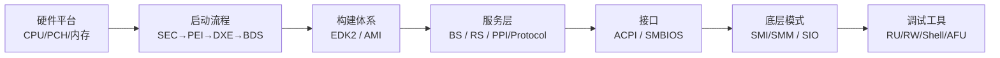

# 🌱 BIOS 学习笔记

> 一位 BIOS/UEFI 固件开发新人的公开学习笔记库。从 2026 年 7 月 16 日开始,系统记录固件开发的每天学习、实践与思考。

## 📊 站点速览

| 指标 | 数据 |
| --- | --- |
| 主题目录 | 26 个 |
| 笔记篇数 | 70+ |
| 起始日期 | 2026-07-16 |
| 最近更新 | 2026-08-19 |

> [!info] 关于本站
> 本站记录 BIOS/UEFI 固件开发的完整学习路径:从一块主板怎么工作,到固件怎么把它启动起来,再到固件怎么开发、怎么与操作系统对接、怎么调试排错。
>
> **浏览方式**:
> - **按主题** → 看下方「主题速查」分块索引
> - **按日期** → 看下方「最近 7 天」或展开「全部日期索引」
> - **完整概览** → [[BIOS知识体系总览|知识体系完整版(从硬件到 OS 的主线)]]

## 🗺️ 主线:从硬件到固件到 OS

## 📚 主题速查

> [!note] 启动流程(6 阶段)
> - [[SEC & PEI]]、[[PEI HOB]]、[[DXE]]、[[EFI Framework Overview]]、[[BDS]]、[[Boot Services]]、[[RunTime Services]]

> [!note] 硬件与平台
> - [[X86平台主板架构]]、[[CMOS、CPU、PCH 知识体系梳理]]、[[ACPI]]、[[SMBIOS]]
> - [[PCIe]]、[[USB]]、[[SMBus & SPD]]、[[Super IO]]、[[GOP & HDMI]]、[[SMI]]

> [!note] 构建体系
> - [[EDK2 DSC & FDF]]、[[INF & DEC文件详解]]、[[Library Mapping]]
> - [[Aptio V eModule_oem & Elink]]、[[Hook_List]]

> [!note] 工具与调试
> - [[BIOS 编译环境搭建]]、[[UEFI shell调试命令和APP]]、[[Git 使用]]

## 🆕 最近 7 天

> [!example] 2026-08-19
> - [[USB/2026-8-19 学习记录|USB 学习记录]] · [[USB/2026-8-19 实践记录|USB 实践记录]]

> [!example] 2026-08-18
> - [[SMBus & SPD/2026-8-17 实践记录|SMBus 实践记录]] · [[SMBus & SPD/2026-8-17 学习记录|SMBus 学习记录]]

> [!example] 2026-08-17
> - [[PCIe/2026-8-17 ECAM与PCIe配置空间|PCIe ECAM 与配置空间]]

> [!example] 2026-08-15
> - [[PCIe/2026-8-13 学习记录|PCIe 学习记录]]

> [!example] 2026-08-14
> - [[PCIe/2026-08-14-PciEnumAPP实践记录|PCIe PciEnumAPP 实践记录]]

> [!example] 2026-08-13
> - [[SMBIOS/2026-8-12 学习记录|SMBIOS 学习记录]]

> [!example] 2026-08-12
> - [[SMI/2026-8-10 学习记录|SMI 学习记录]] · [[Super IO/2026-8-11 学习记录|Super IO 学习记录]]

## 📂 全部主题(26 个目录)

- [[ACPI|ACPI]]
- [[Aptio V eModule_oem & Elink|Aptio V eModule & Elink]]
- [[BDS|BDS]]
- [[BIOS 编译环境搭建|BIOS 编译环境搭建]]
- [[BIOS知识体系总览|📖 知识体系完整版(265 行主线)]]
- [[Boot Services|Boot Services]]
- [[CMOS、CPU、PCH 知识体系梳理|CMOS / CPU / PCH]]
- [[DXE|DXE]]
- [[EDK2 DSC & FDF|EDK2 DSC & FDF]]
- [[EFI Framework Overview|EFI Framework Overview]]
- [[GOP & HDMI|GOP & HDMI]]
- [[Git 使用|Git 使用]]
- [[Hook_List|Hook_List]]
- [[INF & DEC文件详解|INF & DEC 文件详解]]
- [[Library Mapping|Library Mapping]]
- [[PCIe|PCIe]]
- [[PEI HOB|PEI HOB]]
- [[RunTime Services|RunTime Services]]
- [[SEC & PEI|SEC & PEI]]
- [[SMBIOS|SMBIOS]]
- [[SMBus & SPD|SMBus & SPD]]
- [[SMI|SMI]]
- [[Super IO|Super IO]]
- [[UEFI shell调试命令和APP|UEFI Shell 与 APP]]
- [[USB|USB]]
- [[X86平台主板架构|X86 平台主板架构]]

> [!info]- 📚 全部日期索引(共 43 篇,点击展开)
>
> ### 2026-08-19
> - [[USB/2026-8-19 学习记录|USB 学习记录]]
> - [[USB/2026-8-19 实践记录|USB 实践记录]]
>
> ### 2026-08-18
> - [[SMBus & SPD/2026-8-17 学习记录|SMBus 学习记录]]
> - [[SMBus & SPD/2026-8-17 实践记录|SMBus 实践记录]]
>
> ### 2026-08-17
> - [[PCIe/2026-8-17 ECAM与PCIe配置空间|PCIe ECAM 与配置空间]]
>
> ### 2026-08-15
> - [[PCIe/2026-8-13 学习记录|PCIe 学习记录]]
>
> ### 2026-08-14
> - [[PCIe/2026-08-14-PciEnumAPP实践记录|PCIe PciEnumAPP 实践记录]]
>
> ### 2026-08-12
> - [[SMBIOS/2026-8-12 学习记录|SMBIOS 学习记录]]
>
> ### 2026-08-11
> - [[Super IO/2026-8-11 学习记录|Super IO 学习记录]]
>
> ### 2026-08-10
> - [[SMI/2026-8-10 学习记录|SMI 学习记录]]
>
> ### 2026-08-07
> - [[ACPI/2026-8-7 学习记录|ACPI 学习记录]]
>
> ### 2026-08-06
> - [[UEFI shell调试命令和APP/2026-8-6 学习记录|UEFI Shell 学习记录]]
>
> ### 2026-08-03
> - [[Library Mapping/2026-8-3 实践记录|Library Mapping 实践记录]]
>
> ### 2026-07-31
> - [[Boot Services/2026-7-31 学习记录|Boot Services 学习记录]]
> - [[Boot Services/2026-7-31 实践记录|Boot Services 实践记录]]
>
> ### 2026-07-30
> - [[BDS/2026-07-30-学习记录|BDS 学习记录]]
> - [[BDS/2026-07-30-实践记录|BDS 实践记录]]
>
> ### 2026-07-28
> - [[DXE/2026-7-28 学习日报|DXE 学习日报]]
> - [[DXE/2026-7-28 实践记录|DXE 实践记录]]
>
> ### 2026-07-27
> - [[SEC & PEI/2026-7-27 学习记录|SEC & PEI 学习记录]]
>
> ### 2026-07-23
> - [[EDK2 DSC & FDF/2026-7-23 学习记录|EDK2 DSC & FDF 学习记录]]
>
> ### 2026-07-22
> - [[Aptio V eModule_oem & Elink/2026-7-22 学习记录|Aptio V eModule 学习记录]]
>
> ### 2026-07-21
> - [[BIOS 编译环境搭建/2026-7-21 学习记录|BIOS 编译环境搭建]]
> - [[Git 使用/2026-7-21 学习记录|Git 使用]]
>
> ### 2026-07-20
> - [[EFI Framework Overview/2026-7-20 学习记录|EFI Framework Overview 学习记录]]
> - [[EFI Framework Overview/日报_2026-07-20|EFI Framework 日报]]
>
> ### 2026-07-17
> - [[CMOS、CPU、PCH 知识体系梳理/2026-07-17 学习日报|CMOS 日报]]
> - [[CMOS、CPU、PCH 知识体系梳理/2026-07-17 学习记录|CMOS 学习记录]]

---

> [!tip] 反馈与建议
> 笔记持续更新中,欢迎反馈。
